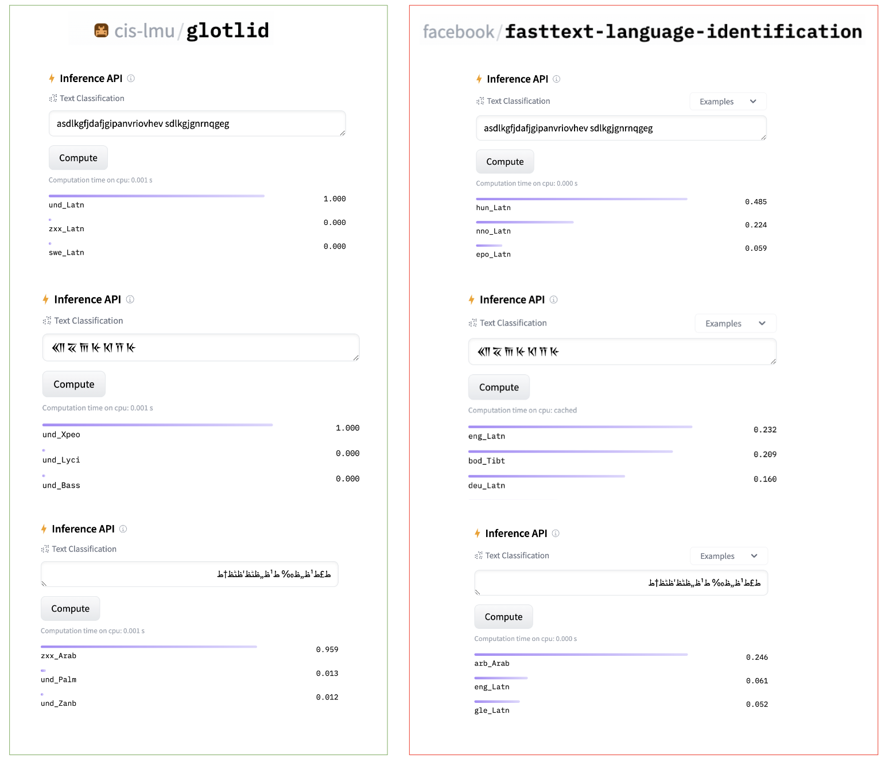

## GlotLID V3

**delete/merge labels**

The labels in v3 are designed to be more exclusive than v2 and v1.

In v2 and V1, we supported labels for macro languages while also supporting labels for individual languages. For example, we had "ara_Arab" as the macro language for Arabic, while also having "arb_Arab" and other varieties. In v3, we aimed to eliminate all possible macro languages. However, some exceptions still exist. Here, we outline the exceptions:

- "fas_Arab" serves as the macro language for "pes_Arab" and "prs_Arab". Due to the close relationship of Dari and Iranian Persian we decided to merge "prs_Arab" and "pes_Arab" under "fas_Arab".
- Both "srd_Latn" and "sdc_Latn" exist. However, "srd_Latn" only represents "sro_Latn" and "src_Latn", not "sdc_Latn". We have a separate label for "sdc_Latn". This decision is based on the glottolog tree and linguistic map of sardinia.
- We support "kpe_Latn" and "doi_Deva" without having individual languages for these two macro languages.
- We changed tgl_Latn to fil_Latn.
- The rest of the macro languages are deleted because we already support enough individual languages that constitute them, such as "zho_Hani", "aze_Latn", "est_Latn", etc.

**additional labels**

In GlotLID v2, we introduce "zxx" labels, which denote non-linguistic content on the web. We crawl sentences from the web, typically initiated due to OCR problems or poorly formatted PDFs. In V3, we continue to support them.

- zxx_Latn example: ïðàâèëà, ðàçâèòü õîðîøèé ëèòåðàòóðíûé
- zxx_Arab example: ط£ط¹ظ„ظ‰ ط¹ظ„ظٹظ'ظٹظ†ط
- zxx_Zzzz example: ����+)J���[�����;�U���Q

We also noticed GlotLID always has a response even for the unicodes that have not been seen before. This is because the GlotLID is based on the Fasttext model and uses a hash of n-grams instead of using the n-grams themselves to save and look up the embeddings. We decided to introduce "und" labels which denote the undetermined. We generated random sentences from different Unicode categories even for the writing systems we do not have data for. We obtained the ranges from GlotScript [code](https://github.com/cisnlp/GlotScript/blob/main/GlotScript/GlotScript.py) for each writing system and created random sample sentences based on different Unicode ranges.

- und_Xsux example: 𒐰𒔓𒑙𒉜𒀟𒇟𒒻𒂻𒐉𒄉𒀨𒃰𒓴
- und_Wcho example:  𞋚 𞋃𞋯𞋣𞋞 𞋰 𞋙𞋮𞋯𞋃𞋆𞋘𞋡𞋸𞋋𞋞𞋟𞋫𞋵

zxx-und difference in GlotLID V3 vs NLLB:

### Supported labels and performance

|      | label    |   f1_score |   precision_score |   recall_score |   false_positive_rate |   total number of sentences |   mean probability of true predictions |
|-----:|:---------|-----------:|------------------:|---------------:|----------------------:|------------:|----------------------:|
|    0 | aai_Latn |   0.9995   |          1        |       0.999    |           0           |       28918 |              0.998829 |
|    1 | aak_Latn |   1        |          1        |       1        |           0           |       28309 |              0.999906 |
|    2 | aau_Latn |   1        |          1        |       1        |           0           |       28807 |              0.999805 |
|    3 | aaz_Latn |   1        |          1        |       1        |           0           |       24444 |              0.999272 |
|    4 | aba_Latn |   0.978979 |          0.97996  |       0.978    |           1.06093e-05 |       21303 |              0.992333 |
|    5 | abi_Latn |   1        |          1        |       1        |           0           |        7924 |              0.999275 |
|    6 | abk_Cyrl |   0.997506 |          0.995025 |       1        |           2.65234e-06 |     1483583 |              0.999884 |
|    7 | abn_Latn |   0.988471 |          0.990955 |       0.986    |           4.77421e-06 |       55353 |              0.994354 |
|    8 | abq_Cyrl |   0.909091 |          1        |       0.833333 |           0           |         167 |              0.927614 |
|    9 | abs_Latn |   0.967742 |          0.986842 |       0.949367 |           1.06046e-06 |        1571 |              0.944721 |
|   10 | abt_Latn |   1        |          1        |       1        |           0           |       55083 |              0.99984  |
|   11 | abx_Latn |   0.9995   |          1        |       0.999    |           0           |       20849 |              0.997968 |
|   12 | aby_Latn |   0.9995   |          1        |       0.999    |           0           |       25752 |              0.998167 |
|   13 | abz_Latn |   0.98738  |          0.996942 |       0.978    |           1.5914e-06  |       15686 |              0.989211 |
|   14 | aca_Latn |   1        |          1        |       1        |           0           |        8816 |              0.999288 |
|   15 | acd_Latn |   1        |          1        |       1        |           0           |       20856 |              0.999697 |
|   16 | ace_Arab |   0.988842 |          0.991608 |       0.986092 |           3.18233e-06 |        7185 |              0.988113 |
|   17 | ace_Latn |   0.993471 |          0.997982 |       0.989    |           1.06093e-06 |       56397 |              0.991538 |
|   18 | acf_Latn |   0.988934 |          0.994939 |       0.983    |           2.65234e-06 |       40963 |              0.990936 |
|   19 | ach_Latn |   0.994995 |          0.995992 |       0.994    |           2.12187e-06 |       50448 |              0.995051 |
|   20 | acm_Arab |   0.808383 |          0.870968 |       0.75419  |           3.18202e-05 |        5372 |              0.866343 |
|   21 | acn_Latn |   1        |          1        |       1        |           0           |       20945 |              0.999688 |
|   22 | acr_Latn |   0.996994 |          0.998996 |       0.995    |           5.30467e-07 |       79971 |              0.995013 |
|   23 | acu_Latn |   1        |          1        |       1        |           0           |       28839 |              0.996612 |
|   24 | ada_Latn |   0.999001 |          0.998004 |       1        |           1.06093e-06 |      204463 |              0.999663 |
|   25 | ade_Latn |   1        |          1        |       1        |           0           |       15912 |              0.998965 |
|   26 | adh_Latn |   0.9995   |          1        |       0.999    |           0           |       27190 |              0.998488 |
|   27 | adi_Latn |   0.997003 |          0.996008 |       0.998    |           2.12187e-06 |       35886 |              0.996927 |
|   28 | adj_Latn |   0.9995   |          0.999001 |       1        |           5.30467e-07 |       20826 |              0.999689 |
|   29 | adl_Latn |   0.9995   |          1        |       0.999    |           0           |       13006 |              0.999345 |
|   30 | ady_Cyrl |   0.994965 |          0.99798  |       0.991968 |           5.30326e-07 |        4972 |              0.994487 |
|   31 | adz_Latn |   0.998331 |          0.996667 |       1        |           5.3027e-07  |        4467 |              0.99819  |
|   32 | aeb_Arab |   0.912371 |          0.941489 |       0.885    |           2.91757e-05 |       30401 |              0.939165 |
|   33 | aer_Latn |   1        |          1        |       1        |           0           |       14488 |              0.999082 |
|   34 | aeu_Latn |   1        |          1        |       1        |           0           |       20846 |              0.999965 |
|   35 | aey_Latn |   0.999    |          0.999    |       0.999    |           5.30467e-07 |       30579 |              0.99913  |
|   36 | afr_Latn |   0.992526 |          0.989076 |       0.996    |           5.83514e-06 |     1464970 |              0.997452 |
|   37 | agd_Latn |   0.9995   |          1        |       0.999    |           0           |       36662 |              0.999619 |
|   38 | agg_Latn |   1        |          1        |       1        |           0           |       28335 |              0.999823 |
|   39 | agm_Latn |   1        |          1        |       1        |           0           |       28683 |              0.999853 |
|   40 | agn_Latn |   0.9995   |          0.999001 |       1        |           5.30467e-07 |       20935 |              0.997975 |
|   41 | agr_Latn |   0.998498 |          1        |       0.997    |           0           |       37893 |              0.997815 |
|   42 | agt_Latn |   0.9995   |          1        |       0.999    |           0           |       19997 |              0.998955 |
|   43 | agu_Latn |   1        |          1        |       1        |           0           |       25951 |              0.999218 |
|   44 | agw_Latn |   0.998    |          0.998    |       0.998    |           1.06093e-06 |       46086 |              0.997586 |
|   45 | agx_Cyrl |   0.997831 |          1        |       0.995671 |           0           |        2304 |              0.996409 |
|   46 | aha_Latn |   0.9995   |          1        |       0.999    |           0           |       17804 |              0.999565 |
|   47 | ahk_Latn |   1        |          1        |       1        |           0           |      155160 |              0.999988 |
|   48 | aia_Latn |   1        |          1        |       1        |           0           |       20643 |              0.999616 |
|   49 | aii_Syrc |   1        |          1        |       1        |           0           |       28753 |              0.999889 |
|   50 | aim_Latn |   1        |          1        |       1        |           0           |       12998 |              0.996423 |
|   51 | ain_Latn |   0.99811  |          1        |       0.996226 |           0           |        5303 |              0.99616  |
|   52 | ajg_Latn |   0.993464 |          0.998989 |       0.988    |           5.30467e-07 |       34373 |              0.997674 |
|   53 | aji_Latn |   1        |          1        |       1        |           0           |       14872 |              0.999712 |
|   54 | ajp_Arab |   0.800839 |          0.84141  |       0.764    |           7.63873e-05 |       27368 |              0.837987 |
|   55 | ajz_Latn |   1        |          1        |       1        |           0           |       13017 |              0.996927 |
|   56 | akb_Latn |   0.992958 |          0.998988 |       0.987    |           5.30467e-07 |       15889 |              0.990811 |
|   57 | ake_Latn |   1        |          1        |       1        |           0           |       20931 |              0.999532 |
|   58 | akh_Latn |   1        |          1        |       1        |           0           |       28250 |              0.999531 |
|   59 | akp_Latn |   0.9995   |          0.999001 |       1        |           5.30467e-07 |       20924 |              0.999421 |
|   60 | ald_Latn |   0.9995   |          0.999001 |       1        |           5.30467e-07 |       12983 |              0.999171 |
|   61 | alj_Latn |   0.9995   |          1        |       0.999    |           0           |       15774 |              0.998438 |
|   62 | aln_Latn |   0.992958 |          0.998988 |       0.987    |           5.30467e-07 |       73579 |              0.989522 |
|   63 | alp_Latn |   1        |          1        |       1        |           0           |       20661 |              0.999466 |
|   64 | alq_Latn |   1        |          1        |       1        |           0           |       21021 |              0.999762 |
|   65 | als_Latn |   0.98656  |          0.982161 |       0.991    |           9.54841e-06 |      549828 |              0.991088 |
|   66 | alt_Cyrl |   0.997501 |          0.997003 |       0.998    |           1.5914e-06  |       99816 |              0.998183 |
|   67 | aly_Latn |   0.999327 |          0.998654 |       1        |           5.30395e-07 |        7432 |              0.999361 |
|   68 | alz_Latn |   0.998002 |          0.997006 |       0.999    |           1.5914e-06  |      109142 |              0.997413 |
|   69 | ame_Latn |   0.999    |          0.999    |       0.999    |           5.30467e-07 |       40038 |              0.999382 |
|   70 | amf_Latn |   0.9995   |          0.999001 |       1        |           5.30467e-07 |       15677 |              0.998884 |
|   71 | amh_Ethi |   0.997009 |          0.994036 |       1        |           3.1828e-06  |      694514 |              0.99928  |
|   72 | ami_Latn |   0.9995   |          0.999001 |       1        |           5.30467e-07 |      102992 |              0.9985   |
|   73 | amk_Latn |   1        |          1        |       1        |           0           |       20819 |              0.999532 |
|   74 | amm_Latn |   1        |          1        |       1        |           0           |       28749 |              0.999576 |
|   75 | amn_Latn |   1        |          1        |       1        |           0           |       44607 |              0.999805 |
|   76 | amp_Latn |   0.9995   |          0.999001 |       1        |           5.30467e-07 |       36146 |              0.999768 |
|   77 | amr_Latn |   1        |          1        |       1        |           0           |       27884 |              0.999292 |
|   78 | amu_Latn |   1        |          1        |       1        |           0           |       21059 |              0.999104 |
|   79 | amx_Latn |   0.997442 |          1        |       0.994898 |           0           |        1949 |              0.992654 |
|   80 | ang_Latn |   0.880734 |          0.96     |       0.813559 |           1.06041e-06 |         577 |              0.899666 |
|   81 | anm_Latn |   0.994497 |          0.994995 |       0.994    |           2.65234e-06 |       36158 |              0.994571 |
|   82 | ann_Latn |   1        |          1        |       1        |           0           |       26029 |              0.999601 |
|   83 | anp_Deva |   0.831063 |          0.968254 |       0.727924 |           5.30304e-06 |        5294 |              0.892574 |
|   84 | anv_Latn |   1        |          1        |       1        |           0           |       20938 |              0.999816 |
|   85 | any_Latn |   1        |          1        |       1        |           0           |       14088 |              0.999805 |
|   86 | aoi_Latn |   1        |          1        |       1        |           0           |        3815 |              0.999677 |
|   87 | aoj_Latn |   1        |          1        |       1        |           0           |       64753 |              0.999725 |
|   88 | aom_Latn |   1        |          1        |       1        |           0           |       20842 |              0.999707 |
|   89 | aoz_Latn |   0.9995   |          0.999001 |       1        |           5.30467e-07 |       15884 |              0.999191 |
|   90 | apb_Latn |   1        |          1        |       1        |           0           |       12810 |              0.99967  |
|   91 | apc_Arab |   0.826706 |          0.811958 |       0.842    |           0.000103441 |       65642 |              0.893405 |
|   92 | ape_Latn |   0.9995   |          1        |       0.999    |           0           |       69803 |              0.999262 |
|   93 | apn_Latn |   1        |          1        |       1        |           0           |       19174 |              0.999883 |
|   94 | apr_Latn |   1        |          1        |       1        |           0           |       28679 |              0.999722 |
|   95 | apt_Latn |   1        |          1        |       1        |           0           |       12999 |              0.999178 |
|   96 | apu_Latn |   0.997496 |          0.998997 |       0.996    |           5.30467e-07 |       13160 |              0.997961 |
|   97 | apw_Latn |   0.9995   |          1        |       0.999    |           0           |       13010 |              0.999675 |
|   98 | apy_Latn |   0.9995   |          0.999001 |       1        |           5.30467e-07 |       43499 |              0.999613 |
|   99 | apz_Latn |   1        |          1        |       1        |           0           |       28506 |              0.99976  |
|  100 | aqz_Latn |   0.95082  |          1        |       0.90625  |           0           |         319 |              0.957382 |
|  101 | arb_Arab |   0.845142 |          0.733972 |       0.996    |           0.000191499 |     7143881 |              0.995905 |
|  102 | arb_Latn |   1        |          1        |       1        |           0           |         997 |              0.994544 |
|  103 | are_Latn |   1        |          1        |       1        |           0           |        7851 |              0.999039 |
|  104 | arg_Latn |   0.980193 |          0.995872 |       0.965    |           2.12187e-06 |       30488 |              0.977229 |
|  105 | arl_Latn |   1        |          1        |       1        |           0           |       28762 |              0.999702 |
|  106 | arn_Latn |   0.984894 |          0.991886 |       0.978    |           4.24374e-06 |      160857 |              0.989306 |
|  107 | arp_Latn |   0.993464 |          1        |       0.987013 |           0           |        2310 |              0.992243 |
|  108 | arq_Arab |   0.920266 |          0.975352 |       0.871069 |           3.71193e-06 |        3191 |              0.946132 |
|  109 | arr_Latn |   0.953125 |          1        |       0.910448 |           0           |         674 |              0.975569 |
|  110 | ars_Arab |   0.795983 |          0.84417  |       0.753    |           7.3735e-05  |       21811 |              0.84348  |
|  111 | ary_Arab |   0.933876 |          0.950311 |       0.918    |           2.54624e-05 |      193484 |              0.953825 |
|  112 | arz_Arab |   0.896586 |          0.887365 |       0.906    |           6.10038e-05 |      196188 |              0.911884 |
|  113 | asg_Latn |   1        |          1        |       1        |           0           |       20847 |              0.999172 |
|  114 | asm_Beng |   0.998499 |          0.998999 |       0.998    |           5.30467e-07 |      280561 |              0.998045 |
|  115 | asm_Latn |   0.912621 |          0.979167 |       0.854545 |           5.30202e-07 |         536 |              0.905329 |
|  116 | aso_Latn |   1        |          1        |       1        |           0           |       28044 |              0.999786 |
|  117 | ast_Latn |   0.976447 |          0.958574 |       0.995    |           2.28101e-05 |     1035393 |              0.993016 |
|  118 | ata_Latn |   1        |          1        |       1        |           0           |       31771 |              0.999841 |
|  119 | atb_Latn |   1        |          1        |       1        |           0           |       29528 |              0.999796 |
|  120 | atd_Latn |   0.999001 |          0.998004 |       1        |           1.06093e-06 |       20703 |              0.997804 |
|  121 | atg_Latn |   1        |          1        |       1        |           0           |       20944 |              0.999615 |
|  122 | ati_Latn |   0.973165 |          0.985641 |       0.961    |           7.42654e-06 |       11947 |              0.9837   |
|  123 | atj_Latn |   0.989744 |          0.994845 |       0.984694 |           5.30241e-07 |        1956 |              0.990011 |
|  124 | atq_Latn |   0.998715 |          1        |       0.997433 |           0           |        7837 |              0.996798 |
|  125 | att_Latn |   1        |          1        |       1        |           0           |       20976 |              0.999942 |
|  126 | auc_Latn |   1        |          1        |       1        |           0           |       20962 |              0.999806 |
|  127 | aui_Latn |   0.99812  |          0.99812  |       0.99812  |           5.30336e-07 |        5390 |              0.997129 |
|  128 | auy_Latn |   0.998499 |          0.998999 |       0.998    |           5.30467e-07 |       28279 |              0.9961   |
|  129 | ava_Cyrl |   0.9995   |          1        |       0.999    |           0           |       20746 |              0.998124 |
|  130 | avk_Latn |   0.993026 |          1        |       0.98615  |           0           |        3596 |              0.976003 |
|  131 | avn_Latn |   0.9995   |          1        |       0.999    |           0           |       13016 |              0.998689 |
|  132 | avt_Latn |   0.9995   |          1        |       0.999    |           0           |       28636 |              0.999375 |
|  133 | avu_Latn |   1        |          1        |       1        |           0           |       20023 |              0.999927 |
|  134 | awa_Deva |   0.964451 |          0.994687 |       0.936    |           2.65234e-06 |       22001 |              0.977729 |
|  135 | awb_Latn |   1        |          1        |       1        |           0           |       28858 |              0.999393 |
|  136 | awi_Latn |   0.999358 |          1        |       0.998716 |           0           |        7790 |              0.998625 |
|  137 | awx_Latn |   0.998478 |          1        |       0.99696  |           0           |        4911 |              0.997488 |
|  138 | ayo_Latn |   1        |          1        |       1        |           0           |        7903 |              0.999569 |
|  139 | ayp_Arab |   0.999371 |          1        |       0.998744 |           0           |        7958 |              0.99762  |
|  140 | ayr_Latn |   0.995498 |          0.995996 |       0.995    |           2.12187e-06 |      581030 |              0.997668 |
|  141 | azb_Arab |   0.99351  |          0.992024 |       0.995    |           4.24374e-06 |      304379 |              0.996295 |
|  142 | azg_Latn |   1        |          1        |       1        |           0           |       20924 |              0.999819 |
|  143 | azj_Cyrl |   0.9995   |          1        |       0.999    |           0           |       31073 |              0.997917 |
|  144 | azj_Latn |   0.993042 |          0.987154 |       0.999    |           6.89608e-06 |     1536294 |              0.999146 |
|  145 | azz_Latn |   1        |          1        |       1        |           0           |       20940 |              0.9987   |
|  146 | bak_Cyrl |   0.991    |          0.991    |       0.991    |           4.77421e-06 |      335042 |              0.993827 |
|  147 | bam_Latn |   0.953595 |          0.972945 |       0.935    |           1.37922e-05 |       21997 |              0.953855 |
|  148 | ban_Latn |   0.994481 |          0.997986 |       0.991    |           1.06093e-06 |       49168 |              0.99126  |
|  149 | bao_Latn |   1        |          1        |       1        |           0           |       20997 |              0.998858 |
|  150 | bar_Latn |   0.987078 |          0.981225 |       0.993    |           1.00789e-05 |      131110 |              0.992338 |
|  151 | bas_Latn |   0.998002 |          0.997006 |       0.999    |           1.5914e-06  |      127706 |              0.998275 |
|  152 | bav_Latn |   1        |          1        |       1        |           0           |       20971 |              0.998685 |
|  153 | bba_Latn |   0.997506 |          0.995025 |       1        |           2.65234e-06 |       99904 |              0.999261 |
|  154 | bbb_Latn |   0.9995   |          0.999001 |       1        |           5.30467e-07 |       25261 |              0.998863 |
|  155 | bbc_Latn |   0.991538 |          0.987116 |       0.996    |           6.89608e-06 |      303790 |              0.997425 |
|  156 | bbj_Latn |   0.9995   |          1        |       0.999    |           0           |       13003 |              0.999532 |
|  157 | bbk_Latn |   0.99802  |          0.99802  |       0.99802  |           5.30328e-07 |        5043 |              0.999443 |
|  158 | bbo_Latn |   0.997459 |          0.998728 |       0.996193 |           5.30408e-07 |        7888 |              0.997305 |
|  159 | bbr_Latn |   1        |          1        |       1        |           0           |       28022 |              0.999193 |
|  160 | bcc_Arab |   0.98993  |          0.996957 |       0.983    |           1.5914e-06  |       45995 |              0.991055 |
|  161 | bch_Latn |   1        |          1        |       1        |           0           |       26337 |              0.999766 |
|  162 | bci_Latn |   1        |          1        |       1        |           0           |      377811 |              0.999986 |
|  163 | bcl_Latn |   0.995507 |          0.994018 |       0.997    |           3.1828e-06  |     1221980 |              0.997005 |
|  164 | bco_Latn |   1        |          1        |       1        |           0           |        4632 |              0.999914 |
|  165 | bcw_Latn |   1        |          1        |       1        |           0           |       20822 |              0.999744 |
|  166 | bdd_Latn |   1        |          1        |       1        |           0           |       36462 |              0.999014 |
|  167 | bdh_Latn |   0.9995   |          1        |       0.999    |           0           |       14542 |              0.999121 |
|  168 | bdq_Latn |   1        |          1        |       1        |           0           |        4989 |              0.999557 |
|  169 | bea_Latn |   1        |          1        |       1        |           0           |        1356 |              0.999673 |
|  170 | bef_Latn |   1        |          1        |       1        |           0           |       28563 |              0.999549 |
|  171 | bel_Cyrl |   0.99501  |          0.993028 |       0.997    |           3.71327e-06 |      846786 |              0.999027 |
|  172 | bem_Latn |   0.981318 |          0.965184 |       0.998    |           1.90968e-05 |     1467646 |              0.997127 |
|  173 | ben_Beng |   0.983284 |          0.967118 |       1        |           1.80359e-05 |     1903347 |              0.998964 |
|  174 | ben_Latn |   0.971429 |          0.982222 |       0.96087  |           4.24252e-06 |        4600 |              0.967765 |
|  175 | beq_Latn |   0.999    |          0.999    |       0.999    |           5.30467e-07 |       12988 |              0.996741 |
|  176 | bew_Latn |   0.981285 |          0.992835 |       0.97     |           3.71327e-06 |       19166 |              0.981942 |
|  177 | bex_Latn |   0.9995   |          0.999001 |       1        |           5.30467e-07 |       26213 |              0.99942  |
|  178 | bfd_Latn |   1        |          1        |       1        |           0           |       20965 |              0.999494 |
|  179 | bfo_Latn |   0.998502 |          0.997009 |       1        |           1.5914e-06  |       15819 |              0.999204 |
|  180 | bgr_Latn |   1        |          1        |       1        |           0           |       20719 |              0.99838  |
|  181 | bgs_Latn |   0.998    |          0.998    |       0.998    |           1.06093e-06 |       22973 |              0.9994   |
|  182 | bgt_Latn |   0.999    |          0.999    |       0.999    |           5.30467e-07 |       12852 |              0.998903 |
|  183 | bgz_Latn |   0.998501 |          0.998002 |       0.999    |           1.06093e-06 |       15723 |              0.998826 |
|  184 | bhg_Latn |   1        |          1        |       1        |           0           |        8361 |              0.998675 |
|  185 | bhl_Latn |   0.998501 |          0.998002 |       0.999    |           1.06093e-06 |       31848 |              0.999044 |
|  186 | bho_Deva |   0.961091 |          0.971399 |       0.951    |           1.48531e-05 |       65699 |              0.972919 |
|  187 | bhp_Latn |   0.993624 |          0.997866 |       0.989418 |           1.0609e-06  |        9454 |              0.990131 |
|  188 | bhw_Latn |   0.990447 |          0.995956 |       0.985    |           2.12187e-06 |      113972 |              0.996123 |
|  189 | bhz_Latn |   1        |          1        |       1        |           0           |        7915 |              0.998599 |
|  190 | bib_Latn |   1        |          1        |       1        |           0           |       20946 |              0.999864 |
|  191 | big_Latn |   1        |          1        |       1        |           0           |       28592 |              0.999691 |
|  192 | bim_Latn |   0.9995   |          0.999001 |       1        |           5.30467e-07 |       70688 |              0.999165 |
|  193 | bin_Latn |   0.9995   |          0.999001 |       1        |           5.30467e-07 |      128029 |              0.999414 |
|  194 | bis_Latn |   0.9995   |          1        |       0.999    |           0           |     1001520 |              0.998606 |
|  195 | biu_Latn |   1        |          1        |       1        |           0           |       12987 |              0.99689  |
|  196 | biv_Latn |   1        |          1        |       1        |           0           |       20931 |              0.999225 |
|  197 | bjn_Arab |   0.985407 |          0.986092 |       0.984722 |           5.30389e-06 |        7189 |              0.988886 |
|  198 | bjn_Latn |   0.94494  |          0.993385 |       0.901    |           3.1828e-06  |       32536 |              0.964023 |
|  199 | bjp_Latn |   1        |          1        |       1        |           0           |        4220 |              0.999111 |
|  200 | bjr_Latn |   1        |          1        |       1        |           0           |       31588 |              0.99991  |
|  201 | bjv_Latn |   1        |          1        |       1        |           0           |       33963 |              0.999671 |
|  202 | bkd_Latn |   0.9995   |          1        |       0.999    |           0           |       20739 |              0.99888  |
|  203 | bkl_Latn |   1        |          1        |       1        |           0           |        7848 |              0.997545 |
|  204 | bkq_Latn |   1        |          1        |       1        |           0           |       20600 |              0.999418 |
|  205 | bku_Latn |   1        |          1        |       1        |           0           |       15859 |              0.999105 |
|  206 | bkv_Latn |   0.9995   |          1        |       0.999    |           0           |       15876 |              0.998196 |
|  207 | bla_Latn |   1        |          1        |       1        |           0           |        1234 |              0.995937 |
|  208 | blh_Latn |   1        |          1        |       1        |           0           |        7902 |              0.999773 |
|  209 | blk_Mymr |   0.997494 |          1        |       0.995    |           0           |       30885 |              0.998563 |
|  210 | blt_Latn |   1        |          1        |       1        |           0           |        7864 |              0.999962 |
|  211 | blw_Latn |   1        |          1        |       1        |           0           |       20154 |              0.999566 |
|  212 | blz_Latn |   0.999001 |          0.998004 |       1        |           1.06093e-06 |       20967 |              0.998087 |
|  213 | bmh_Latn |   1        |          1        |       1        |           0           |       28002 |              0.999212 |
|  214 | bmk_Latn |   0.984733 |          1        |       0.969925 |           0           |        1950 |              0.984577 |
|  215 | bmq_Latn |   1        |          1        |       1        |           0           |       15911 |              0.997972 |
|  216 | bmr_Latn |   1        |          1        |       1        |           0           |       20908 |              0.9997   |
|  217 | bmu_Latn |   0.999    |          0.999    |       0.999    |           5.30467e-07 |       32166 |              0.998891 |
|  218 | bmv_Latn |   1        |          1        |       1        |           0           |       12962 |              0.999814 |
|  219 | bnj_Latn |   0.990973 |          0.993964 |       0.988    |           3.1828e-06  |       15885 |              0.993406 |
|  220 | bno_Latn |   1        |          1        |       1        |           0           |        5016 |              0.995547 |
|  221 | bnp_Latn |   0.998999 |          1        |       0.998    |           0           |       41769 |              0.998548 |
|  222 | boa_Latn |   1        |          1        |       1        |           0           |       20193 |              0.999879 |
|  223 | bod_Tibt |   0.993516 |          0.991045 |       0.996    |           4.77421e-06 |       53502 |              0.994004 |
|  224 | boj_Latn |   1        |          1        |       1        |           0           |       48543 |              0.999916 |
|  225 | bom_Latn |   0.998498 |          1        |       0.997    |           0           |       13038 |              0.998532 |
|  226 | bon_Latn |   1        |          1        |       1        |           0           |       28768 |              0.99903  |
|  227 | bor_Latn |   0.882353 |          1        |       0.789474 |           0           |         184 |              0.955087 |
|  228 | bos_Latn |   0.723404 |          0.85115  |       0.629    |           5.83514e-05 |      731623 |              0.772415 |
|  229 | bov_Latn |   1        |          1        |       1        |           0           |       20858 |              0.999771 |
|  230 | box_Latn |   1        |          1        |       1        |           0           |       20787 |              0.998627 |
|  231 | bpr_Latn |   0.980847 |          0.988821 |       0.973    |           5.83514e-06 |       20852 |              0.982247 |
|  232 | bps_Latn |   0.980664 |          0.972468 |       0.989    |           1.48531e-05 |       20820 |              0.985908 |
|  233 | bpy_Beng |   0.988878 |          1        |       0.978    |           0           |       29998 |              0.995089 |
|  234 | bqc_Latn |   0.998002 |          0.997006 |       0.999    |           1.5914e-06  |       66871 |              0.997987 |
|  235 | bqj_Latn |   0.9995   |          0.999001 |       1        |           5.30467e-07 |       12982 |              0.999323 |
|  236 | bqp_Latn |   0.994481 |          0.997986 |       0.991    |           1.06093e-06 |       15859 |              0.995402 |
|  237 | bre_Latn |   0.994492 |          0.995988 |       0.993    |           2.12187e-06 |       39269 |              0.994902 |
|  238 | brh_Arab |   0.992958 |          0.998988 |       0.987    |           5.30467e-07 |       13664 |              0.991667 |
|  239 | bru_Latn |   1        |          1        |       1        |           0           |       20863 |              0.999897 |
|  240 | brx_Deva |   0.992537 |          1        |       0.985185 |           0           |        4048 |              0.99153  |
|  241 | brx_Latn |   1        |          1        |       1        |           0           |         440 |              0.983503 |
|  242 | bsc_Latn |   0.999    |          0.999    |       0.999    |           5.30467e-07 |       13006 |              0.998979 |
|  243 | bsn_Latn |   1        |          1        |       1        |           0           |       19998 |              0.999294 |
|  244 | bsp_Latn |   0.995565 |          1        |       0.99117  |           0           |        9057 |              0.992346 |
|  245 | bsq_Latn |   0.998654 |          1        |       0.997312 |           0           |        3740 |              0.997467 |
|  246 | bss_Latn |   1        |          1        |       1        |           0           |       20910 |              0.99952  |
|  247 | btd_Latn |   0.998499 |          0.998999 |       0.998    |           5.30467e-07 |       17330 |              0.997178 |
|  248 | bth_Latn |   0.9995   |          1        |       0.999    |           0           |       12934 |              0.998749 |
|  249 | bts_Latn |   0.998499 |          0.998999 |       0.998    |           5.30467e-07 |       47394 |              0.996194 |
|  250 | btt_Latn |   1        |          1        |       1        |           0           |       15772 |              0.99961  |
|  251 | btx_Latn |   0.982403 |          0.987867 |       0.977    |           6.36561e-06 |      199332 |              0.993391 |
|  252 | bud_Latn |   1        |          1        |       1        |           0           |       15863 |              0.999729 |
|  253 | bug_Latn |   0.982776 |          0.995893 |       0.97     |           2.12187e-06 |       17367 |              0.988268 |
|  254 | buk_Latn |   0.999    |          0.999    |       0.999    |           5.30467e-07 |       28321 |              0.999217 |
|  255 | bul_Cyrl |   0.991054 |          0.985178 |       0.997    |           7.95701e-06 |     1874972 |              0.995726 |
|  256 | bum_Latn |   0.996509 |          0.99403  |       0.999    |           3.1828e-06  |      141909 |              0.998019 |
|  257 | bus_Latn |   0.996502 |          0.996004 |       0.997    |           2.12187e-06 |       27314 |              0.997123 |
|  258 | bvc_Latn |   0.997468 |          0.994949 |       1        |           2.12163e-06 |        7876 |              0.998924 |
|  259 | bvd_Latn |   0.995015 |          1        |       0.990079 |           0           |        5028 |              0.991809 |
|  260 | bvr_Latn |   1        |          1        |       1        |           0           |       20862 |              0.99983  |
|  261 | bvz_Latn |   1        |          1        |       1        |           0           |       15124 |              0.999555 |
|  262 | bwd_Latn |   0.996732 |          0.996732 |       0.996732 |           5.30272e-07 |        4556 |              0.994292 |
|  263 | bwi_Latn |   0.961538 |          0.961538 |       0.961538 |           5.30193e-07 |         261 |              0.986484 |
|  264 | bwq_Latn |   1        |          1        |       1        |           0           |       15891 |              0.999559 |
|  265 | bwu_Latn |   0.9995   |          0.999001 |       1        |           5.30467e-07 |       20656 |              0.999364 |
|  266 | bxh_Latn |   1        |          1        |       1        |           0           |        8398 |              0.997935 |
|  267 | bxr_Cyrl |   0.993457 |          1        |       0.987    |           0           |       32989 |              0.994142 |
|  268 | byr_Latn |   1        |          1        |       1        |           0           |       21525 |              0.999909 |
|  269 | byv_Latn |   0.995025 |          1        |       0.990099 |           0           |        2042 |              0.993148 |
|  270 | byx_Latn |   1        |          1        |       1        |           0           |       20598 |              0.999779 |
|  271 | bzd_Latn |   0.995484 |          0.998993 |       0.992    |           5.30467e-07 |       29765 |              0.998612 |
|  272 | bzh_Latn |   0.9995   |          0.999001 |       1        |           5.30467e-07 |       28883 |              0.99899  |
|  273 | bzi_Thai |   1        |          1        |       1        |           0           |       12964 |              0.999872 |
|  274 | bzj_Latn |   0.99349  |          0.994985 |       0.992    |           2.65234e-06 |      127628 |              0.99656  |
|  275 | caa_Latn |   1        |          1        |       1        |           0           |       20968 |              0.999806 |
|  276 | cab_Latn |   0.997996 |          1        |       0.996    |           0           |      236766 |              0.998776 |
|  277 | cac_Latn |   1        |          1        |       1        |           0           |       64274 |              0.999767 |
|  278 | caf_Latn |   0.996509 |          0.99403  |       0.999    |           3.1828e-06  |       20945 |              0.997042 |
|  279 | cag_Latn |   0.998999 |          1        |       0.998    |           0           |       14201 |              0.997919 |
|  280 | cak_Latn |   0.996997 |          0.997996 |       0.996    |           1.06093e-06 |      281166 |              0.99768  |
|  281 | cao_Latn |   1        |          1        |       1        |           0           |       20844 |              0.999055 |
|  282 | cap_Latn |   1        |          1        |       1        |           0           |       33919 |              0.9997   |
|  283 | caq_Latn |   0.998999 |          1        |       0.998    |           0           |       37222 |              0.998567 |
|  284 | car_Latn |   0.9995   |          1        |       0.999    |           0           |       22338 |              0.99844  |
|  285 | cas_Latn |   0.999364 |          1        |       0.998729 |           0           |        7878 |              0.999033 |
|  286 | cat_Latn |   0.976972 |          0.957733 |       0.997    |           2.33406e-05 |     2103768 |              0.995484 |
|  287 | cav_Latn |   1        |          1        |       1        |           0           |       20643 |              0.999487 |
|  288 | cax_Latn |   1        |          1        |       1        |           0           |       33951 |              0.999237 |
|  289 | cbc_Latn |   1        |          1        |       1        |           0           |       20629 |              0.999609 |
|  290 | cbi_Latn |   1        |          1        |       1        |           0           |       12913 |              0.999375 |
|  291 | cbk_Latn |   0.987393 |          0.995931 |       0.979    |           2.12187e-06 |      120570 |              0.988911 |
|  292 | cbr_Latn |   1        |          1        |       1        |           0           |       28570 |              0.999785 |
|  293 | cbs_Latn |   0.9995   |          1        |       0.999    |           0           |       32132 |              0.998788 |
|  294 | cbt_Latn |   0.9995   |          0.999001 |       1        |           5.30467e-07 |       12804 |              0.99954  |
|  295 | cbu_Latn |   1        |          1        |       1        |           0           |       19980 |              0.999413 |
|  296 | cbv_Latn |   1        |          1        |       1        |           0           |       32889 |              0.999813 |
|  297 | cce_Latn |   0.991    |          0.991    |       0.991    |           4.77421e-06 |      118765 |              0.994289 |
|  298 | cco_Latn |   1        |          1        |       1        |           0           |       20811 |              0.999953 |
|  299 | ccp_Latn |   0.998107 |          0.998737 |       0.997478 |           5.30409e-07 |        7957 |              0.995679 |
|  300 | cdf_Latn |   0.99937  |          1        |       0.998741 |           0           |        7957 |              0.997739 |
|  301 | ceb_Latn |   0.989578 |          0.982266 |       0.997    |           9.54841e-06 |     2266139 |              0.997099 |
|  302 | ceg_Latn |   1        |          1        |       1        |           0           |       15911 |              0.999097 |
|  303 | cek_Latn |   0.997003 |          0.996008 |       0.998    |           2.12187e-06 |       51879 |              0.9984   |
|  304 | ces_Latn |   0.991546 |          0.986152 |       0.997    |           7.42654e-06 |     1863677 |              0.996721 |
|  305 | cfm_Latn |   0.993497 |          0.993994 |       0.993    |           3.1828e-06  |       94985 |              0.993514 |
|  306 | cgc_Latn |   0.997998 |          0.998998 |       0.997    |           5.30467e-07 |       21016 |              0.996486 |
|  307 | cgg_Latn |   0.990495 |          0.990991 |       0.99     |           4.77421e-06 |       40675 |              0.985496 |
|  308 | cha_Latn |   0.998499 |          0.998999 |       0.998    |           5.30467e-07 |       22719 |              0.995706 |
|  309 | chd_Latn |   0.9995   |          1        |       0.999    |           0           |       21221 |              0.997678 |
|  310 | che_Cyrl |   0.998002 |          0.997006 |       0.999    |           1.5914e-06  |       66169 |              0.996684 |
|  311 | chf_Latn |   0.9995   |          1        |       0.999    |           0           |       21189 |              0.998989 |
|  312 | chj_Latn |   1        |          1        |       1        |           0           |        5043 |              0.999838 |
|  313 | chk_Latn |   0.998999 |          1        |       0.998    |           0           |      375518 |              0.99865  |
|  314 | cho_Latn |   1        |          1        |       1        |           0           |        1213 |              0.997342 |
|  315 | chq_Latn |   1        |          1        |       1        |           0           |       12900 |              0.999886 |
|  316 | chr_Cher |   0.998759 |          0.998759 |       0.998759 |           5.30413e-07 |       13015 |              0.999483 |
|  317 | chr_Latn |   1        |          1        |       1        |           0           |        7963 |              0.998625 |
|  318 | chu_Cyrl |   0.957949 |          0.983158 |       0.934    |           8.48748e-06 |       30487 |              0.924445 |
|  319 | chv_Cyrl |   0.993497 |          0.993994 |       0.993    |           3.1828e-06  |       56256 |              0.994409 |
|  320 | chw_Latn |   0.992511 |          0.991027 |       0.994    |           4.77421e-06 |      117497 |              0.992601 |
|  321 | chz_Latn |   1        |          1        |       1        |           0           |       20973 |              0.999928 |
|  322 | cjk_Latn |   0.999    |          0.999    |       0.999    |           5.30467e-07 |      193070 |              0.995815 |
|  323 | cjo_Latn |   0.996004 |          0.99501  |       0.997    |           2.65234e-06 |       20445 |              0.998048 |
|  324 | cjp_Latn |   1        |          1        |       1        |           0           |       15904 |              0.999748 |
|  325 | cjs_Cyrl |   0.993548 |          1        |       0.987179 |           0           |        1553 |              0.99233  |
|  326 | cjv_Latn |   1        |          1        |       1        |           0           |       28558 |              0.999257 |
|  327 | ckb_Arab |   0.969072 |          0.951784 |       0.987    |           2.65234e-05 |      199107 |              0.983412 |
|  328 | ckm_Latn |   0.887591 |          0.921212 |       0.856338 |           1.37874e-05 |        3538 |              0.924876 |
|  329 | cko_Latn |   0.9995   |          0.999001 |       1        |           5.30467e-07 |       20851 |              0.999059 |
|  330 | ckt_Cyrl |   0.990403 |          1        |       0.980989 |           0           |        2670 |              0.991611 |
|  331 | cle_Latn |   1        |          1        |       1        |           0           |       20976 |              0.99992  |
|  332 | clu_Latn |   0.998    |          0.998    |       0.998    |           1.06093e-06 |       12877 |              0.996239 |
|  333 | cly_Latn |   0.895258 |          0.934712 |       0.859    |           3.1828e-05  |       15898 |              0.946527 |
|  334 | cme_Latn |   0.9995   |          0.999001 |       1        |           5.30467e-07 |       20867 |              0.999753 |
|  335 | cmn_Hani |   0.826432 |          0.71028  |       0.988    |           0.000213778 |     1138828 |              0.978307 |
|  336 | cmo_Khmr |   1        |          1        |       1        |           0           |       13015 |              0.999941 |
|  337 | cmo_Latn |   0.9995   |          0.999001 |       1        |           5.30467e-07 |       21164 |              0.999544 |
|  338 | cmr_Latn |   1        |          1        |       1        |           0           |        7870 |              0.999751 |
|  339 | cnh_Latn |   0.995511 |          0.993035 |       0.998    |           3.71327e-06 |      419551 |              0.997566 |
|  340 | cni_Latn |   0.996502 |          0.996004 |       0.997    |           2.12187e-06 |       38457 |              0.99569  |
|  341 | cnk_Latn |   0.998999 |          1        |       0.998    |           0           |       13021 |              0.995218 |
|  342 | cnl_Latn |   1        |          1        |       1        |           0           |       20946 |              0.999529 |
|  343 | cnr_Latn |   0.762238 |          0.893443 |       0.664634 |           6.89302e-06 |        1631 |              0.815741 |
|  344 | cnt_Latn |   1        |          1        |       1        |           0           |       20951 |              0.999898 |
|  345 | cnw_Latn |   0.99937  |          1        |       0.998741 |           0           |        7930 |              0.996223 |
|  346 | coe_Latn |   1        |          1        |       1        |           0           |       20452 |              0.999813 |
|  347 | cof_Latn |   0.9995   |          1        |       0.999    |           0           |       19901 |              0.998039 |
|  348 | cok_Latn |   0.996505 |          0.995015 |       0.998    |           2.65234e-06 |       33636 |              0.994007 |
|  349 | con_Latn |   1        |          1        |       1        |           0           |       20819 |              0.998934 |
|  350 | cop_Copt |   1        |          1        |       1        |           0           |       32357 |              0.99987  |
|  351 | cor_Latn |   0.998    |          0.998    |       0.998    |           1.06093e-06 |       48753 |              0.997631 |
|  352 | cos_Latn |   0.980769 |          0.992828 |       0.969    |           3.71327e-06 |       11087 |              0.971323 |
|  353 | cot_Latn |   1        |          1        |       1        |           0           |       20863 |              0.998614 |
|  354 | cou_Latn |   1        |          1        |       1        |           0           |        7936 |              0.999426 |
|  355 | cpa_Latn |   1        |          1        |       1        |           0           |       20974 |              0.99989  |
|  356 | cpb_Latn |   0.994    |          0.994    |       0.994    |           3.1828e-06  |       20970 |              0.992854 |
|  357 | cpc_Latn |   0.997003 |          0.996008 |       0.998    |           2.12187e-06 |       20971 |              0.996957 |
|  358 | cpu_Latn |   0.995498 |          0.995996 |       0.995    |           2.12187e-06 |       20971 |              0.991097 |
|  359 | cpy_Latn |   0.997501 |          0.997003 |       0.998    |           1.5914e-06  |       17313 |              0.993825 |
|  360 | crh_Cyrl |   0.999    |          0.999    |       0.999    |           5.30467e-07 |       45841 |              0.998014 |
|  361 | crh_Latn |   0.970256 |          0.995789 |       0.946    |           2.12187e-06 |       20281 |              0.972205 |
|  362 | cri_Latn |   0.967742 |          0.991189 |       0.945378 |           1.06051e-06 |        2423 |              0.966916 |
|  363 | crj_Cans |   0.99802  |          1        |       0.996047 |           0           |        5054 |              0.998272 |
|  364 | crk_Cans |   0.996176 |          1        |       0.992381 |           0           |        5241 |              0.997018 |
|  365 | crk_Latn |   0.999314 |          1        |       0.998628 |           0           |        7280 |              0.998141 |
|  366 | crl_Cans |   1        |          1        |       1        |           0           |        5053 |              0.99928  |
|  367 | crm_Cans |   1        |          1        |       1        |           0           |       13010 |              0.99957  |
|  368 | crn_Latn |   0.995996 |          0.996994 |       0.995    |           1.5914e-06  |       43731 |              0.994724 |
|  369 | crs_Latn |   0.993516 |          0.991045 |       0.996    |           4.77421e-06 |      506817 |              0.993166 |
|  370 | crt_Latn |   1        |          1        |       1        |           0           |       12791 |              0.999246 |
|  371 | crx_Latn |   0.996491 |          0.998995 |       0.994    |           5.30467e-07 |       12994 |              0.995513 |
|  372 | csb_Latn |   0.983257 |          0.99794  |       0.969    |           1.06093e-06 |       10984 |              0.985682 |
|  373 | csk_Latn |   0.9995   |          1        |       0.999    |           0           |       20960 |              0.998399 |
|  374 | cso_Latn |   1        |          1        |       1        |           0           |       20971 |              0.999936 |
|  375 | csw_Cans |   0.848485 |          0.777778 |       0.933333 |           2.12076e-06 |         146 |              0.939024 |
|  376 | csw_Latn |   0.983051 |          0.966667 |       1        |           5.30194e-07 |         291 |              0.996599 |
|  377 | csy_Latn |   0.99147  |          0.994965 |       0.988    |           2.65234e-06 |       43182 |              0.989773 |
|  378 | cta_Latn |   1        |          1        |       1        |           0           |       20853 |              0.999896 |
|  379 | ctd_Latn |   0.938958 |          0.93202  |       0.946    |           3.66023e-05 |       78148 |              0.940577 |
|  380 | cto_Latn |   0.978702 |          0.992798 |       0.965    |           3.71327e-06 |       19535 |              0.977648 |
|  381 | ctp_Latn |   1        |          1        |       1        |           0           |       29611 |              0.99981  |
|  382 | ctu_Latn |   0.998999 |          1        |       0.998    |           0           |      223272 |              0.998411 |
|  383 | cub_Latn |   1        |          1        |       1        |           0           |       20785 |              0.999891 |
|  384 | cuc_Latn |   1        |          1        |       1        |           0           |       20947 |              0.999762 |
|  385 | cui_Latn |   1        |          1        |       1        |           0           |       20806 |              0.999609 |
|  386 | cuk_Latn |   1        |          1        |       1        |           0           |       52053 |              0.999188 |
|  387 | cul_Latn |   1        |          1        |       1        |           0           |       20718 |              0.999658 |
|  388 | cut_Latn |   1        |          1        |       1        |           0           |       20684 |              0.999738 |
|  389 | cux_Latn |   1        |          1        |       1        |           0           |       13011 |              0.999948 |
|  390 | cwd_Cans |   0.925926 |          0.925926 |       0.925926 |           1.06039e-06 |         272 |              0.971582 |
|  391 | cwe_Latn |   0.994995 |          0.995992 |       0.994    |           2.12187e-06 |       20962 |              0.989964 |
|  392 | cwt_Latn |   1        |          1        |       1        |           0           |       15821 |              0.9988   |
|  393 | cya_Latn |   0.903412 |          0.869565 |       0.94     |           7.47959e-05 |       20974 |              0.887249 |
|  394 | cym_Latn |   0.997504 |          0.996012 |       0.999    |           2.12187e-06 |      335333 |              0.996461 |
|  395 | czt_Latn |   0.9995   |          1        |       0.999    |           0           |       22426 |              0.998272 |
|  396 | daa_Latn |   0.9995   |          1        |       0.999    |           0           |       20849 |              0.999394 |
|  397 | dad_Latn |   0.9995   |          0.999001 |       1        |           5.30467e-07 |       28670 |              0.998161 |
|  398 | daf_Latn |   0.998999 |          1        |       0.998    |           0           |       12334 |              0.998645 |
|  399 | dag_Latn |   0.991444 |          0.997974 |       0.985    |           1.06093e-06 |       14289 |              0.990244 |
|  400 | dah_Latn |   1        |          1        |       1        |           0           |       28057 |              0.999773 |
|  401 | dak_Latn |   1        |          1        |       1        |           0           |        2376 |              0.999424 |
|  402 | dan_Latn |   0.97769  |          0.969518 |       0.986    |           1.64445e-05 |     3897373 |              0.984631 |
|  403 | dar_Cyrl |   0.997732 |          0.995475 |       1        |           5.30248e-07 |        2200 |              0.99683  |
|  404 | dbq_Latn |   0.999358 |          1        |       0.998716 |           0           |        7831 |              0.999284 |
|  405 | ddg_Latn |   0.974843 |          0.962733 |       0.987261 |           3.18138e-06 |        1594 |              0.984924 |
|  406 | ddn_Latn |   1        |          1        |       1        |           0           |        7959 |              0.998487 |
|  407 | ded_Latn |   0.9995   |          1        |       0.999    |           0           |       40782 |              0.998338 |
|  408 | des_Latn |   1        |          1        |       1        |           0           |       20391 |              0.999452 |
|  409 | deu_Latn |   0.956355 |          0.918894 |       0.997    |           4.66811e-05 |     2838653 |              0.994395 |
|  410 | dga_Latn |   0.9995   |          1        |       0.999    |           0           |       20163 |              0.998236 |
|  411 | dgc_Latn |   0.999    |          0.999    |       0.999    |           5.30467e-07 |       20690 |              0.998101 |
|  412 | dgi_Latn |   0.998498 |          1        |       0.997    |           0           |       15903 |              0.9984   |
|  413 | dgr_Latn |   1        |          1        |       1        |           0           |       22328 |              0.999906 |
|  414 | dgz_Latn |   1        |          1        |       1        |           0           |       28566 |              0.998647 |
|  415 | dhg_Latn |   1        |          1        |       1        |           0           |        1891 |              0.999004 |
|  416 | dhm_Latn |   0.996991 |          1        |       0.994    |           0           |       13014 |              0.995172 |
|  417 | dhv_Latn |   0.998002 |          0.997006 |       0.999    |           1.5914e-06  |      388700 |              0.99923  |
|  418 | did_Latn |   1        |          1        |       1        |           0           |        7386 |              0.999507 |
|  419 | dig_Latn |   0.999    |          0.999    |       0.999    |           5.30467e-07 |       15821 |              0.995471 |
|  420 | dik_Latn |   0.997496 |          0.998997 |       0.996    |           5.30467e-07 |       47587 |              0.995844 |
|  421 | dip_Latn |   0.989924 |          0.989924 |       0.989924 |           4.24328e-06 |        7942 |              0.992208 |
|  422 | diq_Latn |   0.986882 |          0.995927 |       0.978    |           2.12187e-06 |       32996 |              0.987793 |
|  423 | dis_Latn |   0.998999 |          1        |       0.998    |           0           |       13012 |              0.997856 |
|  424 | diu_Latn |   0.95     |          1        |       0.904762 |           0           |         196 |              0.958761 |
|  425 | div_Thaa |   1        |          1        |       1        |           0           |       39922 |              0.999919 |
|  426 | dje_Latn |   0.994336 |          0.998736 |       0.989975 |           5.30411e-07 |        8002 |              0.994389 |
|  427 | djk_Latn |   0.996    |          0.996    |       0.996    |           2.12187e-06 |      108245 |              0.997966 |
|  428 | djr_Latn |   1        |          1        |       1        |           0           |       12702 |              0.998887 |
|  429 | dks_Latn |   0.991504 |          0.991009 |       0.992    |           4.77421e-06 |       17959 |              0.995395 |
|  430 | dln_Latn |   0.997    |          0.997    |       0.997    |           1.5914e-06  |       31100 |              0.99595  |
|  431 | dng_Cyrl |   0.994709 |          1        |       0.989474 |           0           |         946 |              0.994217 |
|  432 | dnj_Latn |   1        |          1        |       1        |           0           |       25241 |              0.999896 |
|  433 | dnw_Latn |   0.99934  |          1        |       0.998681 |           0           |        7576 |              0.998447 |
|  434 | dob_Latn |   0.9995   |          0.999001 |       1        |           5.30467e-07 |       36508 |              0.999437 |
|  435 | doi_Deva |   0.984795 |          0.99763  |       0.972286 |           5.30308e-07 |        4323 |              0.984692 |
|  436 | dop_Latn |   1        |          1        |       1        |           0           |       39590 |              0.999737 |
|  437 | dos_Latn |   0.99937  |          0.998741 |       1        |           5.30409e-07 |        7932 |              0.998311 |
|  438 | dow_Latn |   0.9995   |          1        |       0.999    |           0           |       12964 |              0.998667 |
|  439 | drg_Latn |   0.909091 |          1        |       0.833333 |           0           |         237 |              0.945992 |
|  440 | dru_Latn |   0.9995   |          0.999001 |       1        |           5.30467e-07 |       35180 |              0.999338 |
|  441 | dsb_Latn |   0.977146 |          0.992776 |       0.962    |           3.71327e-06 |       10900 |              0.978624 |
|  442 | dsh_Latn |   1        |          1        |       1        |           0           |        7933 |              0.999764 |
|  443 | dtb_Latn |   0.998068 |          0.998711 |       0.997426 |           5.30405e-07 |        7783 |              0.996234 |
|  444 | dtp_Latn |   0.983639 |          0.975418 |       0.992    |           1.32617e-05 |       61805 |              0.992618 |
|  445 | dts_Latn |   1        |          1        |       1        |           0           |       15713 |              0.999233 |
|  446 | dty_Deva |   0.909091 |          1        |       0.833333 |           0           |         172 |              0.930698 |
|  447 | dua_Latn |   0.998    |          0.998    |       0.998    |           1.06093e-06 |       51613 |              0.997617 |
|  448 | due_Latn |   0.9995   |          1        |       0.999    |           0           |       20836 |              0.998739 |
|  449 | dug_Latn |   0.997496 |          0.998997 |       0.996    |           5.30467e-07 |       15762 |              0.994084 |
|  450 | duo_Latn |   1        |          1        |       1        |           0           |       20584 |              0.999206 |
|  451 | dur_Latn |   1        |          1        |       1        |           0           |       12969 |              0.999937 |
|  452 | dwr_Latn |   0.9995   |          0.999001 |       1        |           5.30467e-07 |       33301 |              0.997073 |
|  453 | dww_Latn |   0.9995   |          1        |       0.999    |           0           |       36536 |              0.99877  |
|  454 | dyi_Latn |   1        |          1        |       1        |           0           |       20944 |              0.999227 |
|  455 | dyo_Latn |   0.9995   |          1        |       0.999    |           0           |       17417 |              0.997417 |
|  456 | dyu_Latn |   0.97469  |          0.967488 |       0.982    |           1.75054e-05 |      264467 |              0.988527 |
|  457 | dzo_Tibt |   0.993484 |          0.99598  |       0.991    |           2.12187e-06 |       15774 |              0.995957 |
|  458 | ebk_Latn |   0.9995   |          0.999001 |       1        |           5.30467e-07 |       20940 |              0.998473 |
|  459 | efi_Latn |   0.999    |          0.999    |       0.999    |           5.30467e-07 |      957737 |              0.99891  |
|  460 | eka_Latn |   0.9995   |          1        |       0.999    |           0           |       20965 |              0.998702 |
|  461 | ekk_Latn |   0.974535 |          0.954894 |       0.995    |           2.4932e-05  |     3950075 |              0.991921 |
|  462 | eko_Latn |   1        |          1        |       1        |           0           |        3177 |              0.995887 |
|  463 | ell_Grek |   0.983768 |          0.968054 |       1        |           1.75054e-05 |     4407225 |              0.999126 |
|  464 | eme_Latn |   0.952381 |          0.972222 |       0.933333 |           1.06041e-06 |         759 |              0.96697  |
|  465 | emi_Latn |   1        |          1        |       1        |           0           |       21352 |              0.999008 |
|  466 | eml_Latn |   0.991968 |          0.995968 |       0.988    |           2.12187e-06 |       30000 |              0.991185 |
|  467 | emp_Latn |   0.999    |          0.999    |       0.999    |           5.30467e-07 |       21196 |              0.999174 |
|  468 | enb_Latn |   1        |          1        |       1        |           0           |       15811 |              0.99976  |
|  469 | eng_Latn |   0.884854 |          0.794118 |       0.999    |           0.000137391 |    13000776 |              0.994601 |
|  470 | enl_Latn |   1        |          1        |       1        |           0           |       12960 |              0.999758 |
|  471 | enm_Latn |   0.98374  |          1        |       0.968    |           0           |       40209 |              0.968633 |
|  472 | enq_Latn |   0.999488 |          1        |       0.998978 |           0           |       18974 |              0.997579 |
|  473 | enx_Latn |   0.99499  |          0.996988 |       0.993    |           1.5914e-06  |       30751 |              0.996481 |
|  474 | epo_Latn |   0.982266 |          0.967961 |       0.997    |           1.75054e-05 |     1537969 |              0.99748  |
|  475 | eri_Latn |   1        |          1        |       1        |           0           |       20839 |              0.998966 |
|  476 | ese_Latn |   0.999    |          0.999    |       0.999    |           5.30467e-07 |       28557 |              0.999671 |
|  477 | esi_Latn |   0.997996 |          1        |       0.996    |           0           |       12987 |              0.996461 |
|  478 | esk_Latn |   0.998004 |          0.996016 |       1        |           2.12187e-06 |       20890 |              0.99756  |
|  479 | ess_Latn |   0.99631  |          1        |       0.992647 |           0           |        8168 |              0.996521 |
|  480 | esu_Latn |   1        |          1        |       1        |           0           |       13009 |              0.999251 |
|  481 | eto_Latn |   0.971429 |          1        |       0.944444 |           0           |         180 |              0.917556 |
|  482 | etr_Latn |   1        |          1        |       1        |           0           |       11724 |              0.99967  |
|  483 | etu_Latn |   1        |          1        |       1        |           0           |       12970 |              0.999912 |
|  484 | eus_Latn |   0.994012 |          0.992032 |       0.996    |           4.24374e-06 |      992792 |              0.996285 |
|  485 | eve_Cyrl |   0.993464 |          1        |       0.987013 |           0           |        2298 |              0.986257 |
|  486 | ewe_Latn |   0.989599 |          0.980373 |       0.999    |           1.06093e-05 |     1691646 |              0.997946 |
|  487 | ewo_Latn |   0.996994 |          0.998996 |       0.995    |           5.30467e-07 |       13275 |              0.996225 |
|  488 | ext_Latn |   0.971311 |          0.995798 |       0.948    |           2.12187e-06 |       10227 |              0.968979 |
|  489 | eza_Latn |   0.995502 |          0.995005 |       0.996    |           2.65234e-06 |       36146 |              0.995395 |
|  490 | faa_Latn |   1        |          1        |       1        |           0           |       28575 |              0.999686 |
|  491 | fad_Latn |   1        |          1        |       1        |           0           |        2294 |              0.997854 |
|  492 | fai_Latn |   1        |          1        |       1        |           0           |       33942 |              0.999613 |
|  493 | fal_Latn |   0.998999 |          1        |       0.998    |           0           |       15901 |              0.999021 |
|  494 | fan_Latn |   0.996488 |          1        |       0.993    |           0           |       20508 |              0.993905 |
|  495 | fao_Latn |   0.994481 |          0.997986 |       0.991    |           1.06093e-06 |      111316 |              0.991768 |
|  496 | far_Latn |   0.998102 |          0.996212 |       1        |           1.59122e-06 |       12871 |              0.996406 |
|  497 | fas_Arab |   0.921587 |          0.855308 |       0.999    |           8.9649e-05  |     3845094 |              0.996161 |
|  498 | fat_Latn |   0.994475 |          0.998991 |       0.99     |           5.30467e-07 |       46906 |              0.993762 |
|  499 | ffm_Latn |   0.990964 |          0.99496  |       0.987    |           2.65234e-06 |       28800 |              0.991083 |
|  500 | fij_Latn |   0.997504 |          0.996012 |       0.999    |           2.12187e-06 |     1242638 |              0.999006 |
|  501 | fil_Latn |   0.991538 |          0.987116 |       0.996    |           6.89608e-06 |     1577636 |              0.993133 |
|  502 | fin_Latn |   0.933521 |          0.877641 |       0.997    |           7.3735e-05  |     3962503 |              0.995135 |
|  503 | fit_Latn |   0.852804 |          0.917085 |       0.796943 |           1.75004e-05 |        4567 |              0.942026 |
|  504 | fkv_Latn |   0.758294 |          0.80402  |       0.717489 |           2.06797e-05 |        2217 |              0.913118 |
|  505 | fmu_Deva |   1        |          1        |       1        |           0           |        1146 |              0.999395 |
|  506 | fon_Latn |   0.996491 |          0.998995 |       0.994    |           5.30467e-07 |      243423 |              0.997522 |
|  507 | for_Latn |   0.9995   |          0.999001 |       1        |           5.30467e-07 |       36646 |              0.99926  |
|  508 | fra_Latn |   0.930037 |          0.871503 |       0.997    |           7.79787e-05 |     3377502 |              0.995793 |
|  509 | frd_Latn |   1        |          1        |       1        |           0           |       12864 |              0.999298 |
|  510 | fro_Latn |   0.971838 |          0.995803 |       0.949    |           2.12187e-06 |       18582 |              0.97103  |
|  511 | frp_Latn |   0.971088 |          0.99651  |       0.946932 |           1.06071e-06 |        6090 |              0.974689 |
|  512 | frr_Latn |   0.987854 |          1        |       0.976    |           0           |       12699 |              0.987816 |
|  513 | fry_Latn |   0.990505 |          0.99001  |       0.991    |           5.30467e-06 |      141479 |              0.992638 |
|  514 | fub_Latn |   0.991487 |          0.992979 |       0.99     |           3.71327e-06 |       44998 |              0.990768 |
|  515 | fud_Latn |   0.992951 |          1        |       0.986    |           0           |       10961 |              0.991317 |
|  516 | fue_Latn |   0.996012 |          0.993042 |       0.999    |           3.71327e-06 |       12624 |              0.993698 |
|  517 | fuf_Latn |   0.996502 |          0.996004 |       0.997    |           2.12187e-06 |       25495 |              0.994086 |
|  518 | fuh_Latn |   0.987013 |          0.986028 |       0.988    |           7.42654e-06 |       28835 |              0.988592 |
|  519 | fuq_Latn |   0.994514 |          0.99204  |       0.997    |           4.24374e-06 |       20907 |              0.991078 |
|  520 | fur_Latn |   0.959877 |          0.988347 |       0.933    |           5.83514e-06 |       54322 |              0.958852 |
|  521 | fuv_Arab |   1        |          1        |       1        |           0           |        7945 |              0.999794 |
|  522 | fuv_Latn |   0.98542  |          0.9909   |       0.98     |           4.77421e-06 |       35975 |              0.984495 |
|  523 | gaa_Latn |   0.998501 |          0.998002 |       0.999    |           1.06093e-06 |     1169877 |              0.998677 |
|  524 | gag_Cyrl |   0.999    |          0.999    |       0.999    |           5.30467e-07 |       16553 |              0.998933 |
|  525 | gag_Latn |   0.998999 |          1        |       0.998    |           0           |       16853 |              0.997653 |
|  526 | gah_Latn |   1        |          1        |       1        |           0           |       28656 |              0.999771 |
|  527 | gai_Latn |   1        |          1        |       1        |           0           |       20743 |              0.999695 |
|  528 | gam_Latn |   1        |          1        |       1        |           0           |       28413 |              0.999657 |
|  529 | gaw_Latn |   1        |          1        |       1        |           0           |       28507 |              0.999644 |
|  530 | gaz_Latn |   0.990561 |          0.984205 |       0.997    |           8.48748e-06 |      823141 |              0.998191 |
|  531 | gbi_Latn |   1        |          1        |       1        |           0           |       15645 |              0.998238 |
|  532 | gbo_Latn |   0.998742 |          0.998742 |       0.998742 |           5.3041e-07  |        7958 |              0.998817 |
|  533 | gbr_Latn |   0.9995   |          0.999001 |       1        |           5.30467e-07 |       12598 |              0.998969 |
|  534 | gcf_Latn |   0.988563 |          0.983185 |       0.994    |           9.01795e-06 |       79282 |              0.996432 |
|  535 | gcr_Latn |   0.994497 |          0.994995 |       0.994    |           2.65234e-06 |       31613 |              0.99484  |
|  536 | gde_Latn |   1        |          1        |       1        |           0           |       20926 |              0.999901 |
|  537 | gdg_Latn |   1        |          1        |       1        |           0           |       12903 |              0.999189 |
|  538 | gdn_Latn |   1        |          1        |       1        |           0           |       28125 |              0.999638 |
|  539 | gdr_Latn |   1        |          1        |       1        |           0           |       28768 |              0.999878 |
|  540 | geb_Latn |   1        |          1        |       1        |           0           |       20621 |              0.999809 |
|  541 | gej_Latn |   0.999371 |          1        |       0.998744 |           0           |        7957 |              0.999243 |
|  542 | gfk_Latn |   1        |          1        |       1        |           0           |       27936 |              0.999349 |
|  543 | ghe_Deva |   1        |          1        |       1        |           0           |       13015 |              0.999665 |
|  544 | ghs_Latn |   1        |          1        |       1        |           0           |       34597 |              0.999125 |
|  545 | gid_Latn |   1        |          1        |       1        |           0           |       12981 |              0.999137 |
|  546 | gil_Latn |   0.998499 |          0.998999 |       0.998    |           5.30467e-07 |      428459 |              0.997797 |
|  547 | giz_Latn |   0.996997 |          0.997996 |       0.996    |           1.06093e-06 |       40404 |              0.996213 |
|  548 | gjn_Latn |   0.9995   |          0.999001 |       1        |           5.30467e-07 |       35520 |              0.999872 |
|  549 | gkn_Latn |   0.999    |          0.999    |       0.999    |           5.30467e-07 |       91200 |              0.998487 |
|  550 | gla_Latn |   0.994995 |          0.995992 |       0.994    |           2.12187e-06 |      132021 |              0.995233 |
|  551 | gle_Latn |   0.992496 |          0.992993 |       0.992    |           3.71327e-06 |      301989 |              0.995142 |
|  552 | glg_Latn |   0.978745 |          0.990779 |       0.967    |           4.77421e-06 |      361979 |              0.971551 |
|  553 | glk_Arab |   0.96827  |          0.991614 |       0.946    |           4.24374e-06 |       26192 |              0.977736 |
|  554 | glv_Latn |   0.9995   |          1        |       0.999    |           0           |       71730 |              0.997884 |
|  555 | gmh_Latn |   0.988796 |          0.994366 |       0.983287 |           1.06057e-06 |        3579 |              0.979295 |
|  556 | gmv_Ethi |   0.996491 |          0.998995 |       0.994    |           5.30467e-07 |       12843 |              0.995932 |
|  557 | gmv_Latn |   0.9995   |          0.999001 |       1        |           5.30467e-07 |       36362 |              0.997452 |
|  558 | gna_Latn |   0.999485 |          1        |       0.99897  |           0           |       12810 |              0.99859  |
|  559 | gnb_Latn |   0.996997 |          0.997996 |       0.996    |           1.06093e-06 |       13017 |              0.995338 |
|  560 | gnd_Latn |   0.9995   |          1        |       0.999    |           0           |       15736 |              0.998352 |
|  561 | gng_Latn |   1        |          1        |       1        |           0           |       20869 |              0.99909  |
|  562 | gnn_Latn |   1        |          1        |       1        |           0           |       17988 |              0.999594 |
|  563 | gnw_Latn |   0.998501 |          0.998002 |       0.999    |           1.06093e-06 |       43126 |              0.995903 |
|  564 | goa_Latn |   0.994624 |          1        |       0.989305 |           0           |        1881 |              0.994494 |
|  565 | gof_Ethi |   0.995595 |          0.992472 |       0.998737 |           3.18245e-06 |       12943 |              0.996556 |
|  566 | gof_Latn |   0.997996 |          1        |       0.996    |           0           |       20890 |              0.993542 |
|  567 | gog_Latn |   0.997496 |          0.998997 |       0.996    |           5.30467e-07 |       16591 |              0.995432 |
|  568 | goh_Latn |   0.875    |          1        |       0.777778 |           0           |         360 |              0.904993 |
|  569 | gom_Deva |   0.964417 |          0.972772 |       0.956204 |           5.83332e-06 |        4113 |              0.981134 |
|  570 | gom_Latn |   0.991504 |          0.991009 |       0.992    |           4.77421e-06 |       91365 |              0.994993 |
|  571 | gor_Latn |   0.9995   |          1        |       0.999    |           0           |       15810 |              0.999259 |
|  572 | gos_Latn |   0.976948 |          0.997758 |       0.956989 |           5.30317e-07 |        4643 |              0.97361  |
|  573 | got_Goth |   0.967742 |          1        |       0.9375   |           0           |         155 |              0.965661 |
|  574 | got_Latn |   0.990329 |          0.998051 |       0.982726 |           5.30333e-07 |        5479 |              0.989633 |
|  575 | gqr_Latn |   1        |          1        |       1        |           0           |       20961 |              0.999452 |
|  576 | grc_Grek |   0.987867 |          0.998978 |       0.977    |           5.30467e-07 |      215679 |              0.975389 |
|  577 | grt_Beng |   1        |          1        |       1        |           0           |       15846 |              0.998909 |
|  578 | gso_Latn |   0.998999 |          1        |       0.998    |           0           |       21892 |              0.998622 |
|  579 | gsw_Latn |   0.960199 |          0.955446 |       0.965    |           2.3871e-05  |      110020 |              0.980007 |
|  580 | gub_Latn |   1        |          1        |       1        |           0           |       66495 |              0.999416 |
|  581 | guc_Latn |   0.9995   |          0.999001 |       1        |           5.30467e-07 |      259266 |              0.999739 |
|  582 | gud_Latn |   1        |          1        |       1        |           0           |       12991 |              0.999279 |
|  583 | gug_Latn |   0.970426 |          0.972864 |       0.968    |           1.43226e-05 |      489288 |              0.989497 |
|  584 | guh_Latn |   1        |          1        |       1        |           0           |       20776 |              0.999548 |
|  585 | gui_Latn |   0.997496 |          0.998997 |       0.996    |           5.30467e-07 |       33116 |              0.994994 |
|  586 | guj_Gujr |   0.9995   |          0.999001 |       1        |           5.30467e-07 |     1102181 |              0.999986 |
|  587 | guj_Latn |   0.958555 |          0.97619  |       0.941545 |           5.83353e-06 |        4789 |              0.961424 |
|  588 | guk_Ethi |   0.9995   |          1        |       0.999    |           0           |       15899 |              0.997718 |
|  589 | gul_Latn |   0.999    |          0.999    |       0.999    |           5.30467e-07 |       20956 |              0.99769  |
|  590 | gum_Latn |   0.9995   |          0.999001 |       1        |           5.30467e-07 |       22492 |              0.999781 |
|  591 | gun_Latn |   0.996991 |          1        |       0.994    |           0           |       21068 |              0.995997 |
|  592 | guo_Latn |   1        |          1        |       1        |           0           |       20580 |              0.999758 |
|  593 | guq_Latn |   0.9995   |          1        |       0.999    |           0           |       15886 |              0.999802 |
|  594 | gur_Latn |   0.999    |          0.999    |       0.999    |           5.30467e-07 |       91122 |              0.99838  |
|  595 | guu_Latn |   0.999368 |          0.998737 |       1        |           5.30409e-07 |        7933 |              0.999744 |
|  596 | guw_Latn |   0.996505 |          0.995015 |       0.998    |           2.65234e-06 |      675427 |              0.997743 |
|  597 | gux_Latn |   0.998499 |          0.998999 |       0.998    |           5.30467e-07 |       31797 |              0.999311 |
|  598 | guz_Latn |   0.996528 |          0.99884  |       0.994226 |           5.3043e-07  |        8834 |              0.994484 |
|  599 | gvc_Latn |   1        |          1        |       1        |           0           |       28242 |              0.999635 |
|  600 | gvf_Latn |   1        |          1        |       1        |           0           |       28740 |              0.999455 |
|  601 | gvl_Latn |   1        |          1        |       1        |           0           |       20973 |              0.998853 |
|  602 | gvn_Latn |   1        |          1        |       1        |           0           |       13191 |              0.999758 |
|  603 | gwi_Latn |   1        |          1        |       1        |           0           |       20730 |              0.999753 |
|  604 | gwr_Latn |   0.997472 |          0.998734 |       0.996212 |           5.30409e-07 |        7941 |              0.993336 |
|  605 | gya_Latn |   0.9995   |          0.999001 |       1        |           5.30467e-07 |       45665 |              0.999364 |
|  606 | gym_Latn |   1        |          1        |       1        |           0           |      277844 |              0.999421 |
|  607 | gyr_Latn |   0.9995   |          1        |       0.999    |           0           |       54631 |              0.999578 |
|  608 | hac_Arab |   0.9818   |          0.992843 |       0.971    |           3.71327e-06 |       33785 |              0.987291 |
|  609 | hae_Latn |   0.99498  |          0.998992 |       0.991    |           5.30467e-07 |       15913 |              0.992346 |
|  610 | hag_Latn |   0.998498 |          1        |       0.997    |           0           |       16707 |              0.997853 |
|  611 | hak_Hani |   0.993964 |          1        |       0.988    |           0           |       34783 |              0.989107 |
|  612 | hak_Latn |   0.994975 |          1        |       0.99     |           0           |       16113 |              0.997107 |
|  613 | hat_Latn |   0.989505 |          0.989011 |       0.99     |           5.83514e-06 |      473532 |              0.993787 |
|  614 | hau_Latn |   0.989055 |          0.984158 |       0.994    |           8.48748e-06 |      453239 |              0.994376 |
|  615 | hav_Latn |   0.983169 |          0.991803 |       0.974684 |           3.71301e-06 |        8698 |              0.979322 |
|  616 | haw_Latn |   0.998012 |          1        |       0.996032 |           0           |        7587 |              0.997564 |
|  617 | hay_Latn |   0.926649 |          0.981006 |       0.878    |           9.01795e-06 |       16269 |              0.944939 |
|  618 | hbo_Hebr |   0.998499 |          0.998999 |       0.998    |           5.30467e-07 |      140822 |              0.996076 |
|  619 | hch_Latn |   0.995489 |          0.99799  |       0.993    |           1.06093e-06 |       36283 |              0.99562  |
|  620 | heb_Hebr |   0.99403  |          0.989109 |       0.999    |           5.83514e-06 |     2212126 |              0.998931 |
|  621 | heg_Latn |   0.9995   |          0.999001 |       1        |           5.30467e-07 |       21596 |              0.998703 |
|  622 | heh_Latn |   0.998999 |          1        |       0.998    |           0           |       21605 |              0.997086 |
|  623 | her_Latn |   0.998502 |          0.997009 |       1        |           1.5914e-06  |      152004 |              0.998208 |
|  624 | hif_Latn |   0.983903 |          0.989879 |       0.978    |           5.30467e-06 |       25765 |              0.991571 |
|  625 | hig_Latn |   0.999    |          0.999    |       0.999    |           5.30467e-07 |       15907 |              0.999698 |
|  626 | hil_Latn |   0.994018 |          0.991054 |       0.997    |           4.77421e-06 |     1753491 |              0.997222 |
|  627 | hin_Deva |   0.856038 |          0.750565 |       0.996    |           0.000175585 |     2207201 |              0.990818 |
|  628 | hin_Latn |   0.985579 |          0.980218 |       0.991    |           1.06093e-05 |       40756 |              0.990033 |
|  629 | hix_Latn |   1        |          1        |       1        |           0           |       20560 |              0.999858 |
|  630 | hla_Latn |   1        |          1        |       1        |           0           |       28103 |              0.999317 |
|  631 | hlt_Latn |   0.999369 |          0.998739 |       1        |           5.30409e-07 |        7917 |              0.995275 |
|  632 | hmo_Latn |   0.98275  |          0.968902 |       0.997    |           1.6975e-05  |     1064542 |              0.993404 |
|  633 | hmr_Latn |   0.999001 |          0.998004 |       1        |           1.06093e-06 |       72316 |              0.998176 |
|  634 | hne_Deva |   0.985901 |          0.992901 |       0.979    |           3.71327e-06 |       59421 |              0.985448 |
|  635 | hnj_Latn |   0.999    |          0.999    |       0.999    |           5.30467e-07 |       71879 |              0.99831  |
|  636 | hnn_Latn |   1        |          1        |       1        |           0           |       15884 |              0.999103 |
|  637 | hns_Latn |   0.997496 |          0.998997 |       0.996    |           5.30467e-07 |       22551 |              0.997868 |
|  638 | hoc_Latn |   0.989247 |          0.978723 |       1        |           5.30199e-07 |         448 |              0.963868 |
|  639 | hoc_Wara |   0.989011 |          1        |       0.978261 |           0           |         454 |              0.978724 |
|  640 | hop_Latn |   1        |          1        |       1        |           0           |       12964 |              0.99952  |
|  641 | hot_Latn |   0.999    |          0.999    |       0.999    |           5.30467e-07 |       27936 |              0.998713 |
|  642 | hra_Latn |   0.996994 |          0.998996 |       0.995    |           5.30467e-07 |       36019 |              0.995875 |
|  643 | hrv_Latn |   0.755341 |          0.632681 |       0.937    |           0.000288574 |     1945456 |              0.871892 |
|  644 | hrx_Latn |   0.975635 |          0.990722 |       0.961    |           4.77421e-06 |       44767 |              0.982206 |
|  645 | hsb_Latn |   0.981038 |          0.979084 |       0.983    |           1.11398e-05 |       33249 |              0.990614 |
|  646 | hto_Latn |   1        |          1        |       1        |           0           |       20887 |              0.999007 |
|  647 | hub_Latn |   0.999001 |          0.998004 |       1        |           1.06093e-06 |       28151 |              0.997415 |
|  648 | hui_Latn |   0.9995   |          1        |       0.999    |           0           |       76334 |              0.999126 |
|  649 | hun_Latn |   0.987531 |          0.985075 |       0.99     |           7.95701e-06 |     4393964 |              0.993944 |
|  650 | hus_Latn |   0.997494 |          1        |       0.995    |           0           |       67660 |              0.995792 |
|  651 | huu_Latn |   0.9995   |          1        |       0.999    |           0           |       28376 |              0.998644 |
|  652 | huv_Latn |   0.9995   |          1        |       0.999    |           0           |       23581 |              0.999473 |
|  653 | hvn_Latn |   1        |          1        |       1        |           0           |       16438 |              0.999082 |
|  654 | hwc_Latn |   0.998999 |          1        |       0.998    |           0           |       12460 |              0.997795 |
|  655 | hye_Armn |   0.994024 |          0.990079 |       0.998    |           5.30467e-06 |     1426827 |              0.997012 |
|  656 | hyw_Armn |   0.993976 |          0.997984 |       0.99     |           1.06093e-06 |      676252 |              0.985244 |
|  657 | ian_Latn |   1        |          1        |       1        |           0           |       35542 |              0.999834 |
|  658 | iba_Latn |   0.997    |          0.997    |       0.997    |           1.5914e-06  |      197687 |              0.997004 |
|  659 | ibg_Latn |   0.998501 |          0.998002 |       0.999    |           1.06093e-06 |      114688 |              0.997851 |
|  660 | ibo_Latn |   0.998004 |          0.996016 |       1        |           2.12187e-06 |      582527 |              0.999417 |
|  661 | icr_Latn |   0.9995   |          0.999001 |       1        |           5.30467e-07 |       20818 |              0.998541 |
|  662 | ido_Latn |   0.988945 |          0.993939 |       0.984    |           3.1828e-06  |       39606 |              0.984907 |
|  663 | idu_Latn |   0.993988 |          0.995984 |       0.992    |           2.12187e-06 |       70391 |              0.996794 |
|  664 | ifa_Latn |   0.9995   |          0.999001 |       1        |           5.30467e-07 |       67222 |              0.998079 |
|  665 | ifb_Latn |   0.999    |          0.999    |       0.999    |           5.30467e-07 |       38940 |              0.997016 |
|  666 | ife_Latn |   1        |          1        |       1        |           0           |       20860 |              0.999354 |
|  667 | ifk_Latn |   1        |          1        |       1        |           0           |       20456 |              0.997124 |
|  668 | ifu_Latn |   0.9995   |          1        |       0.999    |           0           |       20791 |              0.998941 |
|  669 | ify_Latn |   0.998999 |          1        |       0.998    |           0           |       64803 |              0.997964 |
|  670 | ige_Latn |   0.9995   |          1        |       0.999    |           0           |       74808 |              0.999174 |
|  671 | ign_Latn |   1        |          1        |       1        |           0           |       33169 |              0.999657 |
|  672 | ike_Cans |   0.9995   |          1        |       0.999    |           0           |       36148 |              0.999546 |
|  673 | ikk_Latn |   1        |          1        |       1        |           0           |       52054 |              0.999572 |
|  674 | ikt_Latn |   1        |          1        |       1        |           0           |        1884 |              0.997621 |
|  675 | ikw_Latn |   1        |          1        |       1        |           0           |       20976 |              0.999287 |
|  676 | ilb_Latn |   0.996991 |          1        |       0.994    |           0           |       11865 |              0.995011 |
|  677 | ile_Latn |   0.977755 |          0.988753 |       0.967    |           5.83514e-06 |       16958 |              0.976664 |
|  678 | ilo_Latn |   0.99502  |          0.991071 |       0.999    |           4.77421e-06 |     1156497 |              0.996148 |
|  679 | imo_Latn |   1        |          1        |       1        |           0           |       28074 |              0.998579 |
|  680 | ina_Latn |   0.976512 |          0.976024 |       0.977    |           1.27312e-05 |       66216 |              0.975826 |
|  681 | inb_Latn |   1        |          1        |       1        |           0           |       21082 |              0.99927  |
|  682 | ind_Latn |   0.827731 |          0.713768 |       0.985    |           0.000209535 |     2962966 |              0.969707 |
|  683 | inh_Cyrl |   0.942857 |          1        |       0.891892 |           0           |        2967 |              0.975918 |
|  684 | ino_Latn |   1        |          1        |       1        |           0           |       27206 |              0.999615 |
|  685 | iou_Latn |   1        |          1        |       1        |           0           |       37758 |              0.999858 |
|  686 | ipi_Latn |   1        |          1        |       1        |           0           |       22419 |              0.999774 |
|  687 | iqw_Latn |   0.992459 |          0.997978 |       0.987    |           1.06093e-06 |       13011 |              0.990823 |
|  688 | iri_Latn |   1        |          1        |       1        |           0           |       20974 |              0.999614 |
|  689 | irk_Latn |   0.999    |          0.999    |       0.999    |           5.30467e-07 |       15900 |              0.998562 |
|  690 | iry_Latn |   0.998999 |          1        |       0.998    |           0           |       15823 |              0.998701 |
|  691 | isd_Latn |   0.9995   |          1        |       0.999    |           0           |       12908 |              0.998774 |
|  692 | ish_Latn |   0.996997 |          0.997996 |       0.996    |           1.06093e-06 |      104640 |              0.997787 |
|  693 | isl_Latn |   0.993523 |          0.99007  |       0.997    |           5.30467e-06 |      240817 |              0.996213 |
|  694 | iso_Latn |   1        |          1        |       1        |           0           |      629427 |              0.999971 |
|  695 | ita_Latn |   0.911253 |          0.839798 |       0.996    |           0.000100789 |     2767998 |              0.990659 |
|  696 | itl_Cyrl |   0.995671 |          1        |       0.991379 |           0           |        1151 |              0.99454  |
|  697 | itv_Latn |   0.999    |          0.999    |       0.999    |           5.30467e-07 |       15897 |              0.998372 |
|  698 | ium_Latn |   0.9995   |          1        |       0.999    |           0           |       49560 |              0.999262 |
|  699 | ivb_Latn |   0.9995   |          0.999001 |       1        |           5.30467e-07 |       12986 |              0.998503 |
|  700 | ivv_Latn |   0.9995   |          1        |       0.999    |           0           |       12978 |              0.997978 |
|  701 | iws_Latn |   1        |          1        |       1        |           0           |       28927 |              0.999905 |
|  702 | ixl_Latn |   1        |          1        |       1        |           0           |       63610 |              0.999815 |
|  703 | izr_Latn |   0.9995   |          1        |       0.999    |           0           |       20992 |              0.999347 |
|  704 | izz_Latn |   0.992032 |          0.988095 |       0.996    |           6.36561e-06 |       44111 |              0.997013 |
|  705 | jaa_Latn |   0.999013 |          1        |       0.998028 |           0           |        5068 |              0.997362 |
|  706 | jac_Latn |   0.999    |          0.999    |       0.999    |           5.30467e-07 |       28795 |              0.999061 |
|  707 | jae_Latn |   1        |          1        |       1        |           0           |       25755 |              0.999755 |
|  708 | jam_Latn |   0.983887 |          0.990872 |       0.977    |           4.77421e-06 |       37988 |              0.989742 |
|  709 | jav_Java |   1        |          1        |       1        |           0           |         294 |              0.987267 |
|  710 | jav_Latn |   0.978958 |          0.980924 |       0.977    |           1.00789e-05 |      269206 |              0.98755  |
|  711 | jbo_Latn |   0.996491 |          0.998995 |       0.994    |           5.30467e-07 |       14635 |              0.994634 |
|  712 | jbu_Latn |   0.998999 |          1        |       0.998    |           0           |       15883 |              0.998273 |
|  713 | jic_Latn |   1        |          1        |       1        |           0           |       20871 |              0.999929 |
|  714 | jiv_Latn |   1        |          1        |       1        |           0           |       20601 |              0.998685 |
|  715 | jmc_Latn |   0.998498 |          1        |       0.997    |           0           |       15916 |              0.996661 |
|  716 | jpn_Jpan |   0.994508 |          0.993021 |       0.996    |           3.71327e-06 |     2025234 |              0.997302 |
|  717 | jra_Latn |   1        |          1        |       1        |           0           |       23239 |              0.99966  |
|  718 | jun_Orya |   0.999369 |          1        |       0.998739 |           0           |        7931 |              0.999165 |
|  719 | jvn_Latn |   0.997496 |          0.998997 |       0.996    |           5.30467e-07 |       28162 |              0.995304 |
|  720 | kaa_Cyrl |   0.999    |          0.999    |       0.999    |           5.30467e-07 |       44952 |              0.997524 |
|  721 | kaa_Latn |   0.995996 |          0.996994 |       0.995    |           1.5914e-06  |       23889 |              0.995709 |
|  722 | kab_Latn |   0.981336 |          0.964286 |       0.999    |           1.96273e-05 |      864832 |              0.998211 |
|  723 | kac_Latn |   0.9995   |          1        |       0.999    |           0           |      245017 |              0.998969 |
|  724 | kak_Latn |   1        |          1        |       1        |           0           |         195 |              0.915676 |
|  725 | kal_Latn |   0.997499 |          0.997998 |       0.997    |           1.06093e-06 |      245503 |              0.998173 |
|  726 | kam_Latn |   0.996997 |          0.997996 |       0.996    |           1.06093e-06 |      357891 |              0.998294 |
|  727 | kan_Knda |   0.989609 |          0.979432 |       1        |           1.11398e-05 |      797473 |              0.999794 |
|  728 | kan_Latn |   0.969886 |          0.979036 |       0.960905 |           5.30323e-06 |        4849 |              0.977888 |
|  729 | kao_Latn |   0.998501 |          0.998002 |       0.999    |           1.06093e-06 |       15891 |              0.998869 |
|  730 | kap_Cyrl |   1        |          1        |       1        |           0           |         913 |              0.998411 |
|  731 | kaq_Latn |   1        |          1        |       1        |           0           |       28808 |              0.998697 |
|  732 | kas_Arab |   0.993471 |          0.997982 |       0.989    |           1.06093e-06 |       12245 |              0.995012 |
|  733 | kas_Deva |   0.988095 |          1        |       0.976471 |           0           |        8502 |              0.98453  |
|  734 | kas_Latn |   0.979592 |          0.979592 |       0.979592 |           5.302e-07   |         477 |              0.971736 |
|  735 | kat_Geor |   0.998502 |          0.997009 |       1        |           1.5914e-06  |      737067 |              0.999215 |
|  736 | kaz_Cyrl |   0.996505 |          0.995015 |       0.998    |           2.65234e-06 |      427514 |              0.998766 |
|  737 | kbc_Latn |   1        |          1        |       1        |           0           |       20717 |              0.999787 |
|  738 | kbd_Cyrl |   0.998002 |          0.997006 |       0.999    |           1.5914e-06  |       54434 |              0.997756 |
|  739 | kbh_Latn |   1        |          1        |       1        |           0           |       20839 |              0.999698 |
|  740 | kbm_Latn |   0.999    |          0.999    |       0.999    |           5.30467e-07 |       28376 |              0.999312 |
|  741 | kbo_Latn |   1        |          1        |       1        |           0           |        5059 |              0.999788 |
|  742 | kbp_Latn |   0.998    |          0.998    |       0.998    |           1.06093e-06 |      269926 |              0.997785 |
|  743 | kbq_Latn |   0.9995   |          0.999001 |       1        |           5.30467e-07 |       34065 |              0.999356 |
|  744 | kbr_Latn |   1        |          1        |       1        |           0           |       15163 |              0.999107 |
|  745 | kby_Latn |   0.984615 |          0.984615 |       0.984615 |           1.06045e-06 |        1294 |              0.988379 |
|  746 | kca_Cyrl |   0.991071 |          1        |       0.982301 |           0           |        1119 |              0.988363 |
|  747 | kcg_Latn |   1        |          1        |       1        |           0           |       12995 |              0.999929 |
|  748 | kck_Latn |   0.954758 |          0.994583 |       0.918    |           2.65234e-06 |       30922 |              0.973821 |
|  749 | kdc_Latn |   0.995507 |          0.994018 |       0.997    |           3.1828e-06  |       20973 |              0.994451 |
|  750 | kde_Latn |   0.995996 |          0.996994 |       0.995    |           1.5914e-06  |       31679 |              0.99718  |
|  751 | kdh_Latn |   1        |          1        |       1        |           0           |        2142 |              0.999605 |
|  752 | kdi_Latn |   0.998499 |          0.998999 |       0.998    |           5.30467e-07 |       20962 |              0.998311 |
|  753 | kdj_Latn |   1        |          1        |       1        |           0           |       15905 |              0.998652 |
|  754 | kdl_Latn |   0.9995   |          0.999001 |       1        |           5.30467e-07 |       20833 |              0.999123 |
|  755 | kdp_Latn |   0.999371 |          1        |       0.998742 |           0           |        7955 |              0.996432 |
|  756 | kdr_Latn |   0.952381 |          1        |       0.909091 |           0           |         101 |              0.922705 |
|  757 | kea_Latn |   0.966281 |          0.972644 |       0.96     |           1.43226e-05 |      153476 |              0.978067 |
|  758 | kei_Latn |   0.941176 |          0.96     |       0.923077 |           5.30193e-07 |         267 |              0.946208 |
|  759 | kek_Latn |   0.9995   |          1        |       0.999    |           0           |      231926 |              0.999699 |
|  760 | ken_Latn |   1        |          1        |       1        |           0           |       20948 |              0.999619 |
|  761 | keo_Latn |   1        |          1        |       1        |           0           |        8056 |              0.999087 |
|  762 | ker_Latn |   1        |          1        |       1        |           0           |        7931 |              0.999031 |
|  763 | kew_Latn |   0.996004 |          0.99501  |       0.997    |           2.65234e-06 |       31741 |              0.996925 |
|  764 | kex_Deva |   0.905882 |          0.939024 |       0.875    |           2.65105e-06 |         870 |              0.954193 |
|  765 | kez_Latn |   1        |          1        |       1        |           0           |       15869 |              0.999729 |
|  766 | kff_Telu |   0.998107 |          1        |       0.996222 |           0           |        7956 |              0.996934 |
|  767 | kgf_Latn |   1        |          1        |       1        |           0           |       33735 |              0.99957  |
|  768 | kgk_Latn |   0.999    |          0.999    |       0.999    |           5.30467e-07 |       20256 |              0.998543 |
|  769 | kgp_Latn |   0.9995   |          1        |       0.999    |           0           |       22588 |              0.99927  |
|  770 | kgr_Latn |   0.998731 |          1        |       0.997465 |           0           |        7924 |              0.998243 |
|  771 | kha_Latn |   0.99499  |          0.996988 |       0.993    |           1.5914e-06  |       40112 |              0.996355 |
|  772 | khk_Cyrl |   0.992548 |          0.98618  |       0.999    |           7.42654e-06 |      286007 |              0.997779 |
|  773 | khm_Khmr |   1        |          1        |       1        |           0           |      123159 |              0.999882 |
|  774 | khq_Latn |   0.995584 |          0.996212 |       0.994956 |           1.59123e-06 |        7956 |              0.99588  |
|  775 | khs_Latn |   1        |          1        |       1        |           0           |       20689 |              0.999743 |
|  776 | khy_Latn |   1        |          1        |       1        |           0           |       12966 |              0.99837  |
|  777 | khz_Latn |   1        |          1        |       1        |           0           |       28904 |              0.998005 |
|  778 | kia_Latn |   0.995996 |          0.996994 |       0.995    |           1.5914e-06  |       49207 |              0.995672 |
|  779 | kij_Latn |   0.999    |          0.999    |       0.999    |           5.30467e-07 |       38076 |              0.998895 |
|  780 | kik_Latn |   0.993529 |          0.989098 |       0.998    |           5.83514e-06 |      565588 |              0.997187 |
|  781 | kin_Latn |   0.955975 |          0.925961 |       0.988    |           4.19069e-05 |     2624013 |              0.968852 |
|  782 | kir_Cyrl |   0.996012 |          0.993042 |       0.999    |           3.71327e-06 |      747351 |              0.999102 |
|  783 | kiu_Latn |   0.98607  |          0.981188 |       0.991    |           1.00789e-05 |      162403 |              0.992497 |
|  784 | kix_Latn |   1        |          1        |       1        |           0           |       12987 |              0.998348 |
|  785 | kjb_Latn |   0.994492 |          0.995988 |       0.993    |           2.12187e-06 |       43689 |              0.994036 |
|  786 | kje_Latn |   0.9995   |          0.999001 |       1        |           5.30467e-07 |       20677 |              0.999213 |
|  787 | kjh_Cyrl |   0.978659 |          0.994835 |       0.963    |           2.65234e-06 |       46505 |              0.989128 |
|  788 | kjs_Latn |   0.995996 |          0.996994 |       0.995    |           1.5914e-06  |       28788 |              0.995189 |
|  789 | kkc_Latn |   1        |          1        |       1        |           0           |       17250 |              0.999793 |
|  790 | kki_Latn |   0.996505 |          0.995015 |       0.998    |           2.65234e-06 |       20973 |              0.996911 |
|  791 | kkj_Latn |   0.9995   |          1        |       0.999    |           0           |       20938 |              0.998569 |
|  792 | kkl_Latn |   0.998586 |          0.997175 |       1        |           5.30285e-07 |        3524 |              0.996222 |
|  793 | kle_Deva |   0.998745 |          0.998745 |       0.998745 |           5.3041e-07  |        7959 |              0.99861  |
|  794 | klt_Latn |   1        |          1        |       1        |           0           |        4382 |              0.999278 |
|  795 | klv_Latn |   0.9995   |          1        |       0.999    |           0           |       25882 |              0.998455 |
|  796 | kma_Latn |   0.99811  |          1        |       0.996226 |           0           |        7947 |              0.992771 |
|  797 | kmb_Latn |   0.991496 |          0.991992 |       0.991    |           4.24374e-06 |      380793 |              0.995334 |
|  798 | kmd_Latn |   1        |          1        |       1        |           0           |        7886 |              0.998835 |
|  799 | kmg_Latn |   0.998498 |          1        |       0.997    |           0           |       12350 |              0.998235 |
|  800 | kmh_Latn |   0.999    |          0.999    |       0.999    |           5.30467e-07 |       54842 |              0.99908  |
|  801 | kmk_Latn |   1        |          1        |       1        |           0           |       20853 |              0.998089 |
|  802 | kmm_Latn |   0.995015 |          0.992048 |       0.998    |           4.24374e-06 |       35209 |              0.996387 |
|  803 | kmo_Latn |   1        |          1        |       1        |           0           |       28520 |              0.999615 |
|  804 | kmr_Cyrl |   1        |          1        |       1        |           0           |        7939 |              0.998333 |
|  805 | kmr_Latn |   0.996502 |          0.996004 |       0.997    |           2.12187e-06 |      281051 |              0.997826 |
|  806 | kms_Latn |   1        |          1        |       1        |           0           |       28613 |              0.998835 |
|  807 | kmu_Latn |   0.999001 |          0.998004 |       1        |           1.06093e-06 |       27471 |              0.999442 |
|  808 | kmy_Latn |   0.998502 |          0.997009 |       1        |           1.5914e-06  |       12998 |              0.997676 |
|  809 | knc_Arab |   0.992324 |          0.997195 |       0.9875   |           1.06078e-06 |        7192 |              0.9907   |
|  810 | knc_Latn |   0.993477 |          0.996979 |       0.99     |           1.5914e-06  |       11008 |              0.98835  |
|  811 | kne_Latn |   0.9995   |          1        |       0.999    |           0           |       20612 |              0.998025 |
|  812 | knf_Latn |   1        |          1        |       1        |           0           |       22441 |              0.999007 |
|  813 | kng_Latn |   0.97549  |          0.956731 |       0.995    |           2.3871e-05  |      884403 |              0.995546 |
|  814 | knj_Latn |   0.997998 |          0.998998 |       0.997    |           5.30467e-07 |       28799 |              0.997445 |
|  815 | knk_Latn |   0.9995   |          1        |       0.999    |           0           |       15797 |              0.998145 |
|  816 | kno_Latn |   1        |          1        |       1        |           0           |       15753 |              0.999903 |
|  817 | knv_Latn |   1        |          1        |       1        |           0           |       64455 |              0.999791 |
|  818 | knx_Latn |   0.97561  |          1        |       0.952381 |           0           |         414 |              0.978173 |
|  819 | kny_Latn |   1        |          1        |       1        |           0           |        4126 |              0.99587  |
|  820 | kog_Latn |   1        |          1        |       1        |           0           |       20927 |              0.999822 |
|  821 | koi_Cyrl |   0.94889  |          0.98079  |       0.919    |           9.54841e-06 |       15926 |              0.973282 |
|  822 | koo_Latn |   0.991546 |          0.986152 |       0.997    |           7.42654e-06 |      205835 |              0.992299 |
|  823 | kor_Hang |   0.998004 |          0.996016 |       1        |           2.12187e-06 |     2805383 |              1.00001  |
|  824 | kos_Latn |   0.998499 |          0.998999 |       0.998    |           5.30467e-07 |       84901 |              0.996683 |
|  825 | kpe_Latn |   0.992519 |          0.99005  |       0.995    |           5.30467e-06 |       92171 |              0.995988 |
|  826 | kpf_Latn |   0.9995   |          0.999001 |       1        |           5.30467e-07 |       41488 |              0.998986 |
|  827 | kpg_Latn |   0.996997 |          0.997996 |       0.996    |           1.06093e-06 |       78479 |              0.996644 |
|  828 | kpj_Latn |   0.998501 |          0.998002 |       0.999    |           1.06093e-06 |       20158 |              0.998044 |
|  829 | kpq_Latn |   1        |          1        |       1        |           0           |        7958 |              0.999627 |
|  830 | kpr_Latn |   0.9995   |          1        |       0.999    |           0           |       32622 |              0.999189 |
|  831 | kpv_Cyrl |   0.954568 |          0.933142 |       0.977    |           3.71327e-05 |       44140 |              0.981885 |
|  832 | kpw_Latn |   1        |          1        |       1        |           0           |       28126 |              0.999793 |
|  833 | kpx_Latn |   1        |          1        |       1        |           0           |       28420 |              0.999444 |
|  834 | kpz_Latn |   1        |          1        |       1        |           0           |       15941 |              0.999699 |
|  835 | kqa_Latn |   1        |          1        |       1        |           0           |        1046 |              0.999589 |
|  836 | kqc_Latn |   1        |          1        |       1        |           0           |       26219 |              0.998549 |
|  837 | kqe_Latn |   0.998999 |          1        |       0.998    |           0           |       20909 |              0.997329 |
|  838 | kqf_Latn |   1        |          1        |       1        |           0           |        5402 |              0.995166 |
|  839 | kql_Latn |   1        |          1        |       1        |           0           |        1334 |              0.999069 |
|  840 | kqn_Latn |   0.996004 |          0.99501  |       0.997    |           2.65234e-06 |      500409 |              0.997845 |
|  841 | kqo_Latn |   1        |          1        |       1        |           0           |       13015 |              0.999836 |
|  842 | kqp_Latn |   1        |          1        |       1        |           0           |       20934 |              0.999567 |
|  843 | kqs_Latn |   0.9995   |          1        |       0.999    |           0           |       12996 |              0.999079 |
|  844 | kqw_Latn |   0.999469 |          1        |       0.99894  |           0           |       16410 |              0.998761 |
|  845 | kqy_Ethi |   0.998999 |          1        |       0.998    |           0           |       15683 |              0.99872  |
|  846 | krc_Cyrl |   0.999001 |          0.998004 |       1        |           1.06093e-06 |       27551 |              0.996724 |
|  847 | kri_Latn |   0.996502 |          0.996004 |       0.997    |           2.12187e-06 |      194372 |              0.997745 |
|  848 | krj_Latn |   0.995992 |          0.997992 |       0.994    |           1.06093e-06 |       20971 |              0.991537 |
|  849 | krl_Latn |   0.967347 |          0.9875   |       0.948    |           6.36561e-06 |       10990 |              0.984343 |
|  850 | kru_Deva |   0.9995   |          1        |       0.999    |           0           |       20895 |              0.998985 |
|  851 | krx_Latn |   0.991304 |          0.991304 |       0.991304 |           5.30218e-07 |        1142 |              0.994648 |
|  852 | ksb_Latn |   0.997996 |          1        |       0.996    |           0           |       12986 |              0.994382 |
|  853 | ksc_Latn |   0.9995   |          0.999001 |       1        |           5.30467e-07 |       12915 |              0.999192 |
|  854 | ksd_Latn |   0.995502 |          0.995005 |       0.996    |           2.65234e-06 |       70132 |              0.996162 |
|  855 | ksf_Latn |   0.998498 |          1        |       0.997    |           0           |       13294 |              0.996922 |
|  856 | ksh_Latn |   0.981228 |          0.995881 |       0.967    |           2.12187e-06 |       13448 |              0.975648 |
|  857 | ksj_Latn |   1        |          1        |       1        |           0           |       12627 |              0.999441 |
|  858 | ksp_Latn |   1        |          1        |       1        |           0           |        9695 |              0.999415 |
|  859 | ksr_Latn |   0.9995   |          0.999001 |       1        |           5.30467e-07 |       32167 |              0.999772 |
|  860 | kss_Latn |   0.999001 |          0.998004 |       1        |           1.06093e-06 |      186150 |              0.999038 |
|  861 | ksw_Mymr |   0.9995   |          1        |       0.999    |           0           |      137505 |              0.999273 |
|  862 | ktb_Ethi |   1        |          1        |       1        |           0           |       15575 |              0.998174 |
|  863 | ktj_Latn |   0.9995   |          0.999001 |       1        |           5.30467e-07 |       20761 |              0.99882  |
|  864 | ktm_Latn |   0.997951 |          0.997951 |       0.997951 |           5.30323e-07 |        7272 |              0.997586 |
|  865 | kto_Latn |   1        |          1        |       1        |           0           |       36192 |              0.999026 |
|  866 | ktu_Latn |   0.969294 |          0.992662 |       0.947    |           3.71327e-06 |       25110 |              0.968393 |
|  867 | ktz_Latn |   1        |          1        |       1        |           0           |         420 |              0.989782 |
|  868 | kua_Latn |   0.937056 |          0.889488 |       0.99     |           6.52475e-05 |      474895 |              0.877091 |
|  869 | kub_Latn |   0.9995   |          1        |       0.999    |           0           |       20908 |              0.999394 |
|  870 | kud_Latn |   1        |          1        |       1        |           0           |       36616 |              0.999403 |
|  871 | kue_Latn |   1        |          1        |       1        |           0           |       28935 |              0.99939  |
|  872 | kuj_Latn |   0.9995   |          1        |       0.999    |           0           |       13013 |              0.998941 |
|  873 | kum_Cyrl |   0.998999 |          1        |       0.998    |           0           |       15625 |              0.997629 |
|  874 | kup_Latn |   1        |          1        |       1        |           0           |       27392 |              0.999786 |
|  875 | kus_Latn |   0.998499 |          0.998999 |       0.998    |           5.30467e-07 |       15869 |              0.998276 |
|  876 | kvg_Latn |   1        |          1        |       1        |           0           |       13113 |              0.999509 |
|  877 | kvj_Latn |   0.9995   |          1        |       0.999    |           0           |       13009 |              0.999097 |
|  878 | kvn_Latn |   1        |          1        |       1        |           0           |       20910 |              0.998629 |
|  879 | kwd_Latn |   1        |          1        |       1        |           0           |       20789 |              0.999742 |
|  880 | kwf_Latn |   0.998499 |          0.998999 |       0.998    |           5.30467e-07 |       21907 |              0.997838 |
|  881 | kwi_Latn |   1        |          1        |       1        |           0           |       20871 |              0.998475 |
|  882 | kwj_Latn |   1        |          1        |       1        |           0           |       28857 |              0.999788 |
|  883 | kwn_Latn |   0.998501 |          0.998002 |       0.999    |           1.06093e-06 |      301982 |              0.999566 |
|  884 | kwy_Latn |   0.997501 |          0.997003 |       0.998    |           1.5914e-06  |      465399 |              0.998279 |
|  885 | kxc_Ethi |   1        |          1        |       1        |           0           |       15844 |              0.999756 |
|  886 | kxm_Thai |   0.9995   |          1        |       0.999    |           0           |       15874 |              0.999626 |
|  887 | kxw_Latn |   1        |          1        |       1        |           0           |       12989 |              0.999898 |
|  888 | kyc_Latn |   0.9995   |          1        |       0.999    |           0           |       32848 |              0.998629 |
|  889 | kyf_Latn |   0.999    |          0.999    |       0.999    |           5.30467e-07 |       20738 |              0.999381 |
|  890 | kyg_Latn |   1        |          1        |       1        |           0           |       31861 |              0.999234 |
|  891 | kyq_Latn |   1        |          1        |       1        |           0           |       28841 |              0.999842 |
|  892 | kyu_Kali |   1        |          1        |       1        |           0           |        5036 |              0.999944 |
|  893 | kyu_Latn |   0.997038 |          1        |       0.994094 |           0           |        5067 |              0.999895 |
|  894 | kyu_Mymr |   1        |          1        |       1        |           0           |       15855 |              0.999881 |
|  895 | kyz_Latn |   1        |          1        |       1        |           0           |       19961 |              0.999466 |
|  896 | kze_Latn |   0.998501 |          0.998002 |       0.999    |           1.06093e-06 |       28282 |              0.99876  |
|  897 | kzf_Latn |   0.9995   |          1        |       0.999    |           0           |       14692 |              0.996903 |
|  898 | kzj_Latn |   0.967298 |          0.979094 |       0.955782 |           6.36422e-06 |        5878 |              0.968539 |
|  899 | kzn_Latn |   0.832941 |          0.972527 |       0.728395 |           2.65127e-06 |        2500 |              0.939635 |
|  900 | lac_Latn |   1        |          1        |       1        |           0           |       20887 |              0.999666 |
|  901 | lad_Hebr |   0.95     |          1        |       0.904762 |           0           |         202 |              0.911456 |
|  902 | lad_Latn |   0.957425 |          0.99568  |       0.922    |           2.12187e-06 |       11848 |              0.964761 |
|  903 | lai_Latn |   0.999    |          0.999    |       0.999    |           5.30467e-07 |       12966 |              0.997764 |
|  904 | laj_Latn |   0.997    |          0.997    |       0.997    |           1.5914e-06  |       26066 |              0.995453 |
|  905 | lam_Latn |   0.987903 |          0.995935 |       0.98     |           2.12187e-06 |       51252 |              0.988733 |
|  906 | lao_Laoo |   1        |          1        |       1        |           0           |       39979 |              0.999222 |
|  907 | lap_Latn |   0.999013 |          0.998028 |       1        |           5.30328e-07 |        5058 |              0.999036 |
|  908 | las_Latn |   0.999368 |          0.998737 |       1        |           5.30409e-07 |        7937 |              0.998648 |
|  909 | lat_Latn |   0.99006  |          0.98419  |       0.996    |           8.48748e-06 |      323566 |              0.986401 |
|  910 | law_Latn |   1        |          1        |       1        |           0           |        7695 |              0.999521 |
|  911 | lbb_Latn |   1        |          1        |       1        |           0           |        2001 |              0.998808 |
|  912 | lbe_Cyrl |   0.974359 |          1        |       0.95     |           0           |         215 |              0.962766 |
|  913 | lbj_Tibt |   0.9995   |          1        |       0.999    |           0           |       12212 |              0.999509 |
|  914 | lbk_Latn |   0.995992 |          0.997992 |       0.994    |           1.06093e-06 |       20707 |              0.995914 |
|  915 | lcm_Latn |   0.9995   |          1        |       0.999    |           0           |       32147 |              0.998157 |
|  916 | lcp_Thai |   0.999005 |          1        |       0.998012 |           0           |        5037 |              0.998858 |
|  917 | ldi_Latn |   0.996    |          0.996    |       0.996    |           2.12187e-06 |       60499 |              0.994912 |
|  918 | ldn_Latn |   1        |          1        |       1        |           0           |         125 |              0.994021 |
|  919 | lea_Latn |   0.966262 |          0.986226 |       0.94709  |           2.65146e-06 |        3785 |              0.968721 |
|  920 | led_Latn |   0.995392 |          0.995392 |       0.995392 |           1.06062e-06 |        4339 |              0.996151 |
|  921 | lee_Latn |   1        |          1        |       1        |           0           |       20861 |              0.999518 |
|  922 | lef_Latn |   1        |          1        |       1        |           0           |       15815 |              0.998654 |
|  923 | leh_Latn |   0.992993 |          0.993988 |       0.992    |           3.1828e-06  |       65701 |              0.993116 |
|  924 | lem_Latn |   1        |          1        |       1        |           0           |       20907 |              0.998844 |
|  925 | leu_Latn |   1        |          1        |       1        |           0           |       41513 |              0.999529 |
|  926 | lew_Latn |   1        |          1        |       1        |           0           |       15745 |              0.99747  |
|  927 | lex_Latn |   1        |          1        |       1        |           0           |       22567 |              0.998692 |
|  928 | lez_Cyrl |   0.987654 |          0.97561  |       1        |           5.30197e-07 |         397 |              0.959722 |
|  929 | lfn_Cyrl |   0.998496 |          1        |       0.996997 |           0           |        6653 |              0.995698 |
|  930 | lfn_Latn |   0.978702 |          0.992798 |       0.965    |           3.71327e-06 |       14344 |              0.969514 |
|  931 | lgg_Latn |   0.995988 |          0.998994 |       0.993    |           5.30467e-07 |       10899 |              0.993393 |
|  932 | lgl_Latn |   0.999367 |          0.998736 |       1        |           5.30408e-07 |       12884 |              0.999578 |
|  933 | lgm_Latn |   0.991054 |          0.985178 |       0.997    |           7.95701e-06 |       13011 |              0.994783 |
|  934 | lhi_Latn |   1        |          1        |       1        |           0           |       12877 |              0.999932 |
|  935 | lhu_Latn |   1        |          1        |       1        |           0           |       85188 |              0.999916 |
|  936 | lia_Latn |   1        |          1        |       1        |           0           |       15845 |              0.999223 |
|  937 | lid_Latn |   1        |          1        |       1        |           0           |       31983 |              0.999719 |
|  938 | lif_Deva |   1        |          1        |       1        |           0           |       28619 |              0.999917 |
|  939 | lif_Limb |   1        |          1        |       1        |           0           |       12883 |              0.999986 |
|  940 | lij_Latn |   0.980866 |          0.98783  |       0.974    |           6.36561e-06 |       41575 |              0.983654 |
|  941 | lim_Latn |   0.979    |          0.979    |       0.979    |           1.11398e-05 |      148824 |              0.983609 |
|  942 | lin_Latn |   0.986627 |          0.977429 |       0.996    |           1.22008e-05 |     1887324 |              0.997726 |
|  943 | lip_Latn |   1        |          1        |       1        |           0           |       20825 |              0.999797 |
|  944 | lis_Lisu |   1        |          1        |       1        |           0           |        7921 |              0.999821 |
|  945 | lit_Latn |   0.986111 |          0.978346 |       0.994    |           1.16703e-05 |     2787975 |              0.993619 |
|  946 | liv_Latn |   0.937063 |          0.985294 |       0.893333 |           5.30207e-07 |         736 |              0.961316 |
|  947 | ljp_Latn |   0.996491 |          0.998995 |       0.994    |           5.30467e-07 |       15808 |              0.992933 |
|  948 | lki_Arab |   0.8      |          0.947368 |       0.692308 |           5.30193e-07 |         249 |              0.888151 |
|  949 | llb_Latn |   0.991018 |          0.989044 |       0.993    |           5.83514e-06 |       29680 |              0.993962 |
|  950 | lld_Latn |   0.978495 |          1        |       0.957895 |           0           |         958 |              0.970096 |
|  951 | llg_Latn |   0.995502 |          0.995005 |       0.996    |           2.65234e-06 |       16742 |              0.991213 |
|  952 | lln_Latn |   0.994309 |          0.994824 |       0.993795 |           2.65229e-06 |        9700 |              0.99622  |
|  953 | lmk_Latn |   0.999    |          0.999    |       0.999    |           5.30467e-07 |       20966 |              0.998607 |
|  954 | lmo_Latn |   0.972596 |          0.969215 |       0.976    |           1.64445e-05 |       68867 |              0.980811 |
|  955 | lmp_Latn |   0.9995   |          1        |       0.999    |           0           |       12992 |              0.998272 |
|  956 | lnd_Latn |   0.996997 |          0.997996 |       0.996    |           1.06093e-06 |       30266 |              0.996524 |
|  957 | lob_Latn |   0.999    |          0.999    |       0.999    |           5.30467e-07 |       15917 |              0.998495 |
|  958 | loe_Latn |   0.996885 |          0.997506 |       0.996264 |           1.06082e-06 |        8036 |              0.996745 |
|  959 | log_Latn |   1        |          1        |       1        |           0           |       12963 |              0.999809 |
|  960 | lok_Latn |   1        |          1        |       1        |           0           |        7944 |              0.999038 |
|  961 | lol_Latn |   0.997998 |          0.998998 |       0.997    |           5.30467e-07 |       13012 |              0.997701 |
|  962 | lom_Latn |   1        |          1        |       1        |           0           |       12992 |              0.999803 |
|  963 | loq_Latn |   0.998864 |          1        |       0.99773  |           0           |        8802 |              0.99836  |
|  964 | loz_Latn |   0.998499 |          0.998999 |       0.998    |           5.30467e-07 |      945212 |              0.999102 |
|  965 | lrc_Arab |   0.909091 |          0.869565 |       0.952381 |           1.59058e-06 |         198 |              0.871964 |
|  966 | lsi_Latn |   1        |          1        |       1        |           0           |       12939 |              0.999261 |
|  967 | lsm_Latn |   1        |          1        |       1        |           0           |       15916 |              0.998632 |
|  968 | ltg_Latn |   0.984848 |          0.994898 |       0.975    |           2.65234e-06 |       17130 |              0.98507  |
|  969 | ltz_Latn |   0.991504 |          0.991009 |       0.992    |           4.77421e-06 |      146825 |              0.992185 |
|  970 | lua_Latn |   0.995516 |          0.992056 |       0.999    |           4.24374e-06 |     1134767 |              0.996844 |
|  971 | lub_Latn |   0.992016 |          0.99004  |       0.994    |           5.30467e-06 |      641207 |              0.996596 |
|  972 | luc_Latn |   0.999388 |          1        |       0.998776 |           0           |        8283 |              0.998763 |
|  973 | lud_Latn |   0.977099 |          0.984615 |       0.969697 |           5.30205e-07 |         652 |              0.943698 |
|  974 | lue_Latn |   0.999001 |          0.998004 |       1        |           1.06093e-06 |      592892 |              0.998937 |
|  975 | lug_Latn |   0.984691 |          0.972683 |       0.997    |           1.48531e-05 |      441738 |              0.988425 |
|  976 | lun_Latn |   0.9995   |          1        |       0.999    |           0           |      390811 |              0.998679 |
|  977 | luo_Latn |   0.996509 |          0.99403  |       0.999    |           3.1828e-06  |      601324 |              0.999281 |
|  978 | lus_Latn |   0.997003 |          0.996008 |       0.998    |           2.12187e-06 |      573900 |              0.997759 |
|  979 | lvs_Latn |   0.982249 |          0.968872 |       0.996    |           1.6975e-05  |     3095851 |              0.99542  |
|  980 | lwg_Latn |   0.98773  |          1        |       0.975758 |           0           |        1638 |              0.977679 |
|  981 | lwo_Latn |   1        |          1        |       1        |           0           |       20577 |              0.999753 |
|  982 | lww_Latn |   0.9995   |          1        |       0.999    |           0           |       20646 |              0.999321 |
|  983 | lzh_Hani |   0.941598 |          0.965336 |       0.919    |           1.75054e-05 |      115081 |              0.95905  |
|  984 | maa_Latn |   0.9995   |          1        |       0.999    |           0           |       44787 |              0.999675 |
|  985 | mad_Latn |   0.994995 |          0.995992 |       0.994    |           2.12187e-06 |       52424 |              0.993368 |
|  986 | maf_Latn |   1        |          1        |       1        |           0           |       13008 |              0.998399 |
|  987 | mag_Deva |   0.984848 |          0.994898 |       0.975    |           2.65234e-06 |       15115 |              0.981053 |
|  988 | mah_Latn |   0.997501 |          0.997003 |       0.998    |           1.5914e-06  |      533224 |              0.998555 |
|  989 | mai_Deva |   0.974072 |          0.990693 |       0.958    |           4.77421e-06 |       51270 |              0.978979 |
|  990 | maj_Latn |   1        |          1        |       1        |           0           |       20974 |              0.999709 |
|  991 | mak_Latn |   0.996498 |          0.996997 |       0.996    |           1.5914e-06  |       30646 |              0.995372 |
|  992 | mal_Latn |   0.988978 |          0.990964 |       0.987    |           4.77421e-06 |       12581 |              0.989935 |
|  993 | mal_Mlym |   1        |          1        |       1        |           0           |      793256 |              0.999997 |
|  994 | mam_Latn |   0.997501 |          0.997003 |       0.998    |           1.5914e-06  |      323464 |              0.997866 |
|  995 | maq_Latn |   1        |          1        |       1        |           0           |       20934 |              0.999322 |
|  996 | mar_Deva |   0.987103 |          0.979331 |       0.995    |           1.11398e-05 |     1450484 |              0.996987 |
|  997 | mar_Latn |   0.957377 |          0.964758 |       0.950108 |           8.48505e-06 |        4617 |              0.956101 |
|  998 | mas_Latn |   0.998002 |          0.997006 |       0.999    |           1.5914e-06  |       37586 |              0.998433 |
|  999 | mau_Latn |   0.9995   |          1        |       0.999    |           0           |      208493 |              0.999077 |
| 1000 | mav_Latn |   0.90844  |          0.929843 |       0.888    |           3.55413e-05 |       27910 |              0.9377   |
| 1001 | maw_Latn |   1        |          1        |       1        |           0           |       20832 |              0.998797 |
| 1002 | max_Latn |   0.906667 |          0.971429 |       0.85     |           5.30197e-07 |         392 |              0.95107  |
| 1003 | maz_Latn |   1        |          1        |       1        |           0           |       20692 |              0.999401 |
| 1004 | mbb_Latn |   0.998499 |          0.998999 |       0.998    |           5.30467e-07 |       65409 |              0.997203 |
| 1005 | mbc_Latn |   0.957179 |          0.964467 |       0.95     |           1.85664e-05 |       29967 |              0.971606 |
| 1006 | mbd_Latn |   0.999    |          0.999    |       0.999    |           5.30467e-07 |       12806 |              0.996308 |
| 1007 | mbf_Latn |   0.99937  |          1        |       0.998741 |           0           |        7939 |              0.9961   |
| 1008 | mbh_Latn |   1        |          1        |       1        |           0           |       28735 |              0.999193 |
| 1009 | mbi_Latn |   0.9995   |          0.999001 |       1        |           5.30467e-07 |       12944 |              0.999393 |
| 1010 | mbj_Latn |   1        |          1        |       1        |           0           |       20796 |              0.999767 |
| 1011 | mbl_Latn |   1        |          1        |       1        |           0           |       20838 |              0.999978 |
| 1012 | mbs_Latn |   0.998    |          0.998    |       0.998    |           1.06093e-06 |       22311 |              0.998459 |
| 1013 | mbt_Latn |   0.9995   |          0.999001 |       1        |           5.30467e-07 |       20883 |              0.99901  |
| 1014 | mca_Latn |   0.9995   |          0.999001 |       1        |           5.30467e-07 |       28931 |              0.999616 |
| 1015 | mcb_Latn |   1        |          1        |       1        |           0           |       20702 |              0.999463 |
| 1016 | mcd_Latn |   1        |          1        |       1        |           0           |       31249 |              0.998496 |
| 1017 | mcf_Latn |   1        |          1        |       1        |           0           |       20668 |              0.999677 |
| 1018 | mck_Latn |   0.998501 |          0.998002 |       0.999    |           1.06093e-06 |      160537 |              0.996773 |
| 1019 | mcn_Latn |   0.997499 |          0.997998 |       0.997    |           1.06093e-06 |       36214 |              0.997038 |
| 1020 | mco_Latn |   0.998499 |          0.998999 |       0.998    |           5.30467e-07 |      238702 |              0.998839 |
| 1021 | mcp_Latn |   0.999    |          0.999    |       0.999    |           5.30467e-07 |       25935 |              0.998902 |
| 1022 | mcq_Latn |   1        |          1        |       1        |           0           |       36783 |              0.99989  |
| 1023 | mcu_Latn |   1        |          1        |       1        |           0           |       15873 |              0.999141 |
| 1024 | mda_Latn |   1        |          1        |       1        |           0           |       20911 |              0.999962 |
| 1025 | mdf_Cyrl |   0.995484 |          0.998993 |       0.992    |           5.30467e-07 |       19253 |              0.986294 |
| 1026 | mdy_Ethi |   1        |          1        |       1        |           0           |       78924 |              0.999648 |
| 1027 | med_Latn |   1        |          1        |       1        |           0           |       27348 |              0.999806 |
| 1028 | mee_Latn |   1        |          1        |       1        |           0           |       28841 |              0.999674 |
| 1029 | mej_Latn |   1        |          1        |       1        |           0           |       15696 |              0.99971  |
| 1030 | mek_Latn |   0.9995   |          1        |       0.999    |           0           |       28349 |              0.999635 |
| 1031 | men_Latn |   0.997996 |          1        |       0.996    |           0           |       19321 |              0.998891 |
| 1032 | meq_Latn |   1        |          1        |       1        |           0           |       20947 |              0.99902  |
| 1033 | mer_Latn |   0.961487 |          0.991781 |       0.93299  |           1.59089e-06 |        3913 |              0.968456 |
| 1034 | met_Latn |   0.999363 |          1        |       0.998726 |           0           |        7916 |              0.998347 |
| 1035 | meu_Latn |   0.981266 |          0.993846 |       0.969    |           3.1828e-06  |      154793 |              0.983262 |
| 1036 | mev_Latn |   0.96875  |          1        |       0.939394 |           0           |         326 |              0.967865 |
| 1037 | mfe_Latn |   0.99351  |          0.992024 |       0.995    |           4.24374e-06 |      443110 |              0.995199 |
| 1038 | mfg_Latn |   1        |          1        |       1        |           0           |        1881 |              0.994769 |
| 1039 | mfh_Latn |   1        |          1        |       1        |           0           |       15902 |              0.9999   |
| 1040 | mfi_Latn |   1        |          1        |       1        |           0           |       20937 |              0.99928  |
| 1041 | mfk_Latn |   0.9995   |          1        |       0.999    |           0           |       20926 |              0.997812 |
| 1042 | mfq_Latn |   0.998999 |          1        |       0.998    |           0           |       25358 |              0.998662 |
| 1043 | mfy_Latn |   1        |          1        |       1        |           0           |       23427 |              0.998522 |
| 1044 | mfz_Latn |   1        |          1        |       1        |           0           |       15768 |              0.999302 |
| 1045 | mgc_Latn |   0.999155 |          1        |       0.998311 |           0           |        5914 |              0.999113 |
| 1046 | mgh_Latn |   0.997    |          0.997    |       0.997    |           1.5914e-06  |       92859 |              0.997485 |
| 1047 | mgm_Latn |   0.820513 |          0.941176 |       0.727273 |           5.30192e-07 |         211 |              0.858787 |
| 1048 | mgo_Latn |   0.998911 |          0.998911 |       0.998911 |           5.30444e-07 |       13098 |              0.999574 |
| 1049 | mgr_Latn |   0.993503 |          0.993007 |       0.994    |           3.71327e-06 |      168063 |              0.992099 |
| 1050 | mhi_Latn |   1        |          1        |       1        |           0           |       15932 |              0.999267 |
| 1051 | mhl_Latn |   1        |          1        |       1        |           0           |       20044 |              0.999474 |
| 1052 | mhr_Cyrl |   0.99005  |          0.985149 |       0.995    |           7.95701e-06 |      221389 |              0.99275  |
| 1053 | mhw_Latn |   0.976    |          0.983871 |       0.968254 |           5.30204e-07 |         617 |              0.975208 |
| 1054 | mhx_Latn |   1        |          1        |       1        |           0           |       20626 |              0.999799 |
| 1055 | mhy_Latn |   0.997501 |          0.997003 |       0.998    |           1.5914e-06  |       15797 |              0.998379 |
| 1056 | mib_Latn |   0.9995   |          0.999001 |       1        |           5.30467e-07 |       28915 |              0.999733 |
| 1057 | mic_Latn |   1        |          1        |       1        |           0           |       20843 |              0.999845 |
| 1058 | mie_Latn |   0.9995   |          1        |       0.999    |           0           |       20968 |              0.999282 |
| 1059 | mif_Latn |   1        |          1        |       1        |           0           |       20837 |              0.999314 |
| 1060 | mig_Latn |   1        |          1        |       1        |           0           |       20971 |              0.99953  |
| 1061 | mih_Latn |   1        |          1        |       1        |           0           |       20892 |              0.99937  |
| 1062 | mil_Latn |   1        |          1        |       1        |           0           |       20848 |              0.999751 |
| 1063 | mim_Latn |   1        |          1        |       1        |           0           |        7952 |              0.999452 |
| 1064 | min_Arab |   0.984925 |          1        |       0.970297 |           0           |         997 |              0.980136 |
| 1065 | min_Latn |   0.987116 |          0.978389 |       0.996    |           1.16703e-05 |      166271 |              0.99602  |
| 1066 | mio_Latn |   1        |          1        |       1        |           0           |       20874 |              0.99932  |
| 1067 | mip_Latn |   0.996849 |          1        |       0.993719 |           0           |        7958 |              0.996117 |
| 1068 | miq_Latn |   0.997499 |          0.997998 |       0.997    |           1.06093e-06 |      101332 |              0.998031 |
| 1069 | mir_Latn |   1        |          1        |       1        |           0           |       19767 |              0.999423 |
| 1070 | mit_Latn |   1        |          1        |       1        |           0           |       20507 |              0.999901 |
| 1071 | miy_Latn |   1        |          1        |       1        |           0           |       20975 |              0.99993  |
| 1072 | miz_Latn |   0.9995   |          1        |       0.999    |           0           |       20968 |              0.998718 |
| 1073 | mjc_Latn |   1        |          1        |       1        |           0           |       20877 |              0.999489 |
| 1074 | mjw_Latn |   1        |          1        |       1        |           0           |       13045 |              0.999085 |
| 1075 | mkd_Cyrl |   0.992993 |          0.993988 |       0.992    |           3.1828e-06  |     1028228 |              0.993551 |
| 1076 | mkl_Latn |   1        |          1        |       1        |           0           |       20827 |              0.999333 |
| 1077 | mkn_Latn |   0.9995   |          1        |       0.999    |           0           |       21600 |              0.998205 |
| 1078 | mks_Latn |   1        |          1        |       1        |           0           |       20973 |              0.999684 |
| 1079 | mkz_Latn |   0.978979 |          0.981928 |       0.976048 |           1.5907e-06  |        1702 |              0.990274 |
| 1080 | mlh_Latn |   0.998502 |          0.997009 |       1        |           1.5914e-06  |       36790 |              0.998908 |
| 1081 | mlp_Latn |   0.9995   |          1        |       0.999    |           0           |       28280 |              0.998955 |
| 1082 | mlt_Latn |   0.987556 |          0.983152 |       0.992    |           9.01795e-06 |     2243598 |              0.99177  |
| 1083 | mlu_Latn |   1        |          1        |       1        |           0           |         959 |              0.996756 |
| 1084 | mmn_Latn |   1        |          1        |       1        |           0           |       12969 |              0.999059 |
| 1085 | mmo_Latn |   0.9995   |          1        |       0.999    |           0           |       28913 |              0.998232 |
| 1086 | mmx_Latn |   1        |          1        |       1        |           0           |       33805 |              0.998981 |
| 1087 | mna_Latn |   0.9995   |          1        |       0.999    |           0           |       38915 |              0.999044 |
| 1088 | mnb_Latn |   0.998999 |          1        |       0.998    |           0           |       15899 |              0.997177 |
| 1089 | mnf_Latn |   1        |          1        |       1        |           0           |       15844 |              0.999868 |
| 1090 | mni_Beng |   0.996991 |          1        |       0.994    |           0           |       49137 |              0.998398 |
| 1091 | mni_Latn |   0.990476 |          0.990476 |       0.990476 |           5.30216e-07 |        1047 |              0.969714 |
| 1092 | mni_Mtei |   0.997512 |          1        |       0.995037 |           0           |        4029 |              0.995054 |
| 1093 | mnk_Latn |   0.999    |          0.999    |       0.999    |           5.30467e-07 |       15926 |              0.999316 |
| 1094 | mns_Cyrl |   0.978166 |          0.982456 |       0.973913 |           1.06044e-06 |        1143 |              0.964489 |
| 1095 | mnw_Mymr |   0.985507 |          1        |       0.971429 |           0           |         343 |              0.999644 |
| 1096 | mnx_Latn |   1        |          1        |       1        |           0           |        7379 |              0.999775 |
| 1097 | mny_Latn |   0.962851 |          0.966734 |       0.959    |           1.75054e-05 |       49262 |              0.972354 |
| 1098 | moa_Latn |   1        |          1        |       1        |           0           |       20942 |              0.999674 |
| 1099 | moc_Latn |   0.999    |          0.999    |       0.999    |           5.30467e-07 |       21236 |              0.999407 |
| 1100 | mog_Latn |   1        |          1        |       1        |           0           |       15808 |              0.999681 |
| 1101 | moh_Latn |   1        |          1        |       1        |           0           |        1846 |              0.992734 |
| 1102 | mop_Latn |   1        |          1        |       1        |           0           |       21802 |              0.997919 |
| 1103 | mor_Latn |   1        |          1        |       1        |           0           |       15914 |              0.999881 |
| 1104 | mos_Latn |   0.996008 |          0.994024 |       0.998    |           3.1828e-06  |      628321 |              0.999857 |
| 1105 | mox_Latn |   0.9995   |          1        |       0.999    |           0           |       36296 |              0.999087 |
| 1106 | mpg_Latn |   0.999001 |          0.998004 |       1        |           1.06093e-06 |       20949 |              0.999324 |
| 1107 | mph_Latn |   1        |          1        |       1        |           0           |        1196 |              0.999564 |
| 1108 | mpm_Latn |   0.9995   |          0.999001 |       1        |           5.30467e-07 |       20835 |              0.999133 |
| 1109 | mpp_Latn |   1        |          1        |       1        |           0           |       15751 |              0.999356 |
| 1110 | mps_Latn |   0.998502 |          0.997009 |       1        |           1.5914e-06  |       73038 |              0.999782 |
| 1111 | mpt_Latn |   0.9995   |          1        |       0.999    |           0           |       35823 |              0.998475 |
| 1112 | mpx_Latn |   0.998499 |          0.998999 |       0.998    |           5.30467e-07 |       33132 |              0.99787  |
| 1113 | mqb_Latn |   0.9995   |          0.999001 |       1        |           5.30467e-07 |       20882 |              0.999832 |
| 1114 | mqj_Latn |   0.997003 |          0.996008 |       0.998    |           2.12187e-06 |       28872 |              0.994789 |
| 1115 | mqy_Latn |   0.999    |          0.999    |       0.999    |           5.30467e-07 |       13016 |              0.998263 |
| 1116 | mrg_Latn |   0.9995   |          1        |       0.999    |           0           |       11436 |              0.998582 |
| 1117 | mri_Latn |   0.994995 |          0.995992 |       0.994    |           2.12187e-06 |       85918 |              0.993927 |
| 1118 | mrj_Cyrl |   0.990438 |          0.99696  |       0.984    |           1.5914e-06  |       38639 |              0.990962 |
| 1119 | mrq_Latn |   0.989691 |          1        |       0.979592 |           0           |         973 |              0.993047 |
| 1120 | mrv_Latn |   0.764706 |          0.764706 |       0.764706 |           2.12076e-06 |         162 |              0.922114 |
| 1121 | mrw_Latn |   0.997998 |          0.998998 |       0.997    |           5.30467e-07 |       38654 |              0.998442 |
| 1122 | msb_Latn |   0.997494 |          1        |       0.995    |           0           |       20895 |              0.993291 |
| 1123 | msc_Latn |   0.996812 |          1        |       0.993644 |           0           |        4714 |              0.993269 |
| 1124 | mse_Latn |   0.9995   |          1        |       0.999    |           0           |       12993 |              0.998718 |
| 1125 | msk_Latn |   0.998501 |          0.998002 |       0.999    |           1.06093e-06 |       20543 |              0.996741 |
| 1126 | msm_Latn |   0.998501 |          0.998002 |       0.999    |           1.06093e-06 |       20618 |              0.997163 |
| 1127 | msy_Latn |   1        |          1        |       1        |           0           |       28095 |              0.999833 |
| 1128 | mta_Latn |   1        |          1        |       1        |           0           |       20832 |              0.999492 |
| 1129 | mtg_Latn |   1        |          1        |       1        |           0           |       12836 |              0.999772 |
| 1130 | mti_Latn |   1        |          1        |       1        |           0           |       44596 |              0.999502 |
| 1131 | mtj_Latn |   1        |          1        |       1        |           0           |       15696 |              0.999709 |
| 1132 | mto_Latn |   1        |          1        |       1        |           0           |       28904 |              0.999915 |
| 1133 | mtp_Latn |   1        |          1        |       1        |           0           |       20972 |              0.999866 |
| 1134 | mua_Latn |   0.9995   |          1        |       0.999    |           0           |       12995 |              0.999483 |
| 1135 | mug_Latn |   0.996502 |          0.996004 |       0.997    |           2.12187e-06 |       35982 |              0.998094 |
| 1136 | muh_Latn |   0.9995   |          1        |       0.999    |           0           |       21091 |              0.999047 |
| 1137 | mui_Latn |   0.966555 |          0.989726 |       0.944444 |           1.59082e-06 |        3048 |              0.965352 |
| 1138 | mup_Deva |   0.998741 |          1        |       0.997484 |           0           |        7947 |              0.998632 |
| 1139 | mur_Latn |   1        |          1        |       1        |           0           |       15654 |              0.999631 |
| 1140 | mus_Latn |   0.968421 |          1        |       0.938776 |           0           |         478 |              0.952752 |
| 1141 | mux_Latn |   0.9995   |          1        |       0.999    |           0           |       35740 |              0.99934  |
| 1142 | muy_Latn |   1        |          1        |       1        |           0           |       20923 |              0.999583 |
| 1143 | mva_Latn |   1        |          1        |       1        |           0           |       36871 |              0.999448 |
| 1144 | mvn_Latn |   1        |          1        |       1        |           0           |       20626 |              0.999624 |
| 1145 | mvp_Latn |   1        |          1        |       1        |           0           |       15749 |              0.997935 |
| 1146 | mwc_Latn |   1        |          1        |       1        |           0           |        6708 |              0.997197 |
| 1147 | mwf_Latn |   1        |          1        |       1        |           0           |         316 |              0.999208 |
| 1148 | mwl_Latn |   0.993464 |          0.998989 |       0.988    |           5.30467e-07 |       34703 |              0.990242 |
| 1149 | mwm_Latn |   0.999001 |          0.998004 |       1        |           1.06093e-06 |       40901 |              0.999925 |
| 1150 | mwn_Latn |   0.992972 |          0.996976 |       0.989    |           1.5914e-06  |       53737 |              0.991055 |
| 1151 | mwp_Latn |   1        |          1        |       1        |           0           |        5801 |              0.999628 |
| 1152 | mwq_Latn |   0.9995   |          0.999001 |       1        |           5.30467e-07 |       15859 |              0.99941  |
| 1153 | mwv_Latn |   0.998999 |          1        |       0.998    |           0           |       15859 |              0.998444 |
| 1154 | mww_Latn |   0.9995   |          0.999001 |       1        |           5.30467e-07 |      185592 |              0.999055 |
| 1155 | mxb_Latn |   1        |          1        |       1        |           0           |       20974 |              0.99886  |
| 1156 | mxp_Latn |   1        |          1        |       1        |           0           |       20900 |              0.999145 |
| 1157 | mxq_Latn |   1        |          1        |       1        |           0           |       20968 |              0.999265 |
| 1158 | mxt_Latn |   1        |          1        |       1        |           0           |       20869 |              0.99914  |
| 1159 | mxv_Latn |   0.9995   |          0.999001 |       1        |           5.30467e-07 |      151898 |              0.999656 |
| 1160 | mya_Mymr |   0.996512 |          0.993049 |       1        |           3.71327e-06 |      571261 |              0.999723 |
| 1161 | myb_Latn |   0.9995   |          1        |       0.999    |           0           |       20935 |              0.999483 |
| 1162 | myk_Latn |   0.9995   |          1        |       0.999    |           0           |       21140 |              0.998891 |
| 1163 | myu_Latn |   0.998999 |          1        |       0.998    |           0           |       20362 |              0.998579 |
| 1164 | myv_Cyrl |   0.995507 |          0.994018 |       0.997    |           3.1828e-06  |       54810 |              0.995814 |
| 1165 | myw_Latn |   1        |          1        |       1        |           0           |       24507 |              0.999631 |
| 1166 | myx_Latn |   0.999    |          0.999    |       0.999    |           5.30467e-07 |       28363 |              0.99748  |
| 1167 | myy_Latn |   1        |          1        |       1        |           0           |       20674 |              0.999286 |
| 1168 | mza_Latn |   1        |          1        |       1        |           0           |       20949 |              0.999784 |
| 1169 | mzh_Latn |   0.998501 |          0.998002 |       0.999    |           1.06093e-06 |       35406 |              0.999053 |
| 1170 | mzk_Latn |   1        |          1        |       1        |           0           |       15904 |              0.999836 |
| 1171 | mzl_Latn |   1        |          1        |       1        |           0           |       12996 |              0.999938 |
| 1172 | mzm_Latn |   1        |          1        |       1        |           0           |       20952 |              0.999789 |
| 1173 | mzn_Arab |   0.957878 |          0.997833 |       0.921    |           1.06093e-06 |       29898 |              0.978613 |
| 1174 | mzw_Latn |   1        |          1        |       1        |           0           |       20870 |              0.998177 |
| 1175 | mzz_Latn |   1        |          1        |       1        |           0           |        1956 |              0.998208 |
| 1176 | nab_Latn |   1        |          1        |       1        |           0           |       20061 |              0.999948 |
| 1177 | naf_Latn |   0.9995   |          0.999001 |       1        |           5.30467e-07 |       35693 |              0.999832 |
| 1178 | nah_Latn |   0.979716 |          0.993827 |       0.966    |           3.1828e-06  |       16922 |              0.976152 |
| 1179 | nak_Latn |   1        |          1        |       1        |           0           |       28708 |              0.999547 |
| 1180 | nan_Hani |   0.867257 |          1        |       0.765625 |           0           |         640 |              0.9157   |
| 1181 | nan_Latn |   0.997998 |          0.998998 |       0.997    |           5.30467e-07 |       48996 |              0.998647 |
| 1182 | nap_Latn |   0.97771  |          0.99076  |       0.965    |           4.77421e-06 |       30717 |              0.983096 |
| 1183 | naq_Latn |   0.999    |          0.999    |       0.999    |           5.30467e-07 |      108892 |              0.998321 |
| 1184 | nas_Latn |   1        |          1        |       1        |           0           |       28949 |              0.999864 |
| 1185 | nav_Latn |   0.999001 |          0.998004 |       1        |           1.06093e-06 |       95441 |              0.999656 |
| 1186 | naw_Latn |   0.9995   |          0.999001 |       1        |           5.30467e-07 |       20973 |              0.999786 |
| 1187 | nba_Latn |   0.995502 |          0.995005 |       0.996    |           2.65234e-06 |      159522 |              0.996829 |
| 1188 | nbc_Latn |   0.9995   |          0.999001 |       1        |           5.30467e-07 |       12921 |              0.99933  |
| 1189 | nbe_Latn |   1        |          1        |       1        |           0           |       13015 |              0.999181 |
| 1190 | nbl_Latn |   0.969819 |          0.975709 |       0.964    |           1.27312e-05 |      244285 |              0.960292 |
| 1191 | nbq_Latn |   1        |          1        |       1        |           0           |        3715 |              0.999591 |
| 1192 | nbu_Latn |   0.997998 |          0.998998 |       0.997    |           5.30467e-07 |       35944 |              0.99783  |
| 1193 | nca_Latn |   1        |          1        |       1        |           0           |       28783 |              0.999549 |
| 1194 | nch_Latn |   0.990486 |          0.991976 |       0.989    |           4.24374e-06 |      203396 |              0.990539 |
| 1195 | ncj_Latn |   0.992016 |          0.99004  |       0.994    |           5.30467e-06 |      202806 |              0.996577 |
| 1196 | ncl_Latn |   1        |          1        |       1        |           0           |       20904 |              0.999361 |
| 1197 | ncq_Laoo |   1        |          1        |       1        |           0           |        5023 |              0.999604 |
| 1198 | nct_Latn |   1        |          1        |       1        |           0           |       12974 |              0.998089 |
| 1199 | ncu_Latn |   1        |          1        |       1        |           0           |       20257 |              0.999754 |
| 1200 | ncx_Latn |   0.967099 |          0.964215 |       0.97     |           1.90968e-05 |      157792 |              0.978618 |
| 1201 | ndc_Latn |   0.990495 |          0.990991 |       0.99     |           4.77421e-06 |      199869 |              0.989057 |
| 1202 | nde_Latn |   0.946557 |          0.973573 |       0.921    |           1.32617e-05 |      267775 |              0.940179 |
| 1203 | ndh_Latn |   0.972603 |          0.986111 |       0.959459 |           5.30207e-07 |         736 |              0.977137 |
| 1204 | ndi_Latn |   1        |          1        |       1        |           0           |       12977 |              0.999826 |
| 1205 | ndj_Latn |   0.998501 |          0.998002 |       0.999    |           1.06093e-06 |       20973 |              0.997898 |
| 1206 | ndo_Latn |   0.930724 |          0.987654 |       0.88     |           5.83514e-06 |      482709 |              0.964272 |
| 1207 | ndp_Latn |   1        |          1        |       1        |           0           |        7955 |              0.996412 |
| 1208 | nds_Latn |   0.990524 |          0.98806  |       0.993    |           6.36561e-06 |      128159 |              0.99105  |
| 1209 | ndy_Latn |   0.998741 |          1        |       0.997484 |           0           |        7957 |              0.996724 |
| 1210 | ndz_Latn |   1        |          1        |       1        |           0           |       20922 |              0.999543 |
| 1211 | neb_Latn |   1        |          1        |       1        |           0           |       15761 |              0.999889 |
| 1212 | new_Deva |   0.976081 |          0.993782 |       0.959    |           3.1828e-06  |       30149 |              0.994195 |
| 1213 | nfa_Latn |   1        |          1        |       1        |           0           |       20169 |              0.999336 |
| 1214 | nfr_Latn |   1        |          1        |       1        |           0           |       15859 |              0.999459 |
| 1215 | ngb_Latn |   0.992228 |          1        |       0.984576 |           0           |        3887 |              0.994228 |
| 1216 | ngc_Latn |   1        |          1        |       1        |           0           |       12999 |              0.997404 |
| 1217 | ngl_Latn |   0.981964 |          0.983936 |       0.98     |           8.48748e-06 |      175167 |              0.988564 |
| 1218 | ngp_Latn |   0.996498 |          0.996997 |       0.996    |           1.5914e-06  |       20973 |              0.99015  |
| 1219 | ngu_Latn |   0.991496 |          0.991992 |       0.991    |           4.24374e-06 |      136015 |              0.991888 |
| 1220 | nhd_Latn |   0.979632 |          0.973346 |       0.986    |           1.43226e-05 |       15866 |              0.923812 |
| 1221 | nhe_Latn |   0.964938 |          0.953171 |       0.977    |           2.54624e-05 |       33967 |              0.975209 |
| 1222 | nhg_Latn |   1        |          1        |       1        |           0           |       19888 |              0.999644 |
| 1223 | nhi_Latn |   0.994975 |          1        |       0.99     |           0           |       21883 |              0.993243 |
| 1224 | nhk_Latn |   0.955466 |          0.961957 |       0.949062 |           7.42407e-06 |        3786 |              0.972426 |
| 1225 | nho_Latn |   1        |          1        |       1        |           0           |       28827 |              0.999239 |
| 1226 | nhr_Latn |   1        |          1        |       1        |           0           |       20884 |              0.999321 |
| 1227 | nhu_Latn |   1        |          1        |       1        |           0           |       20949 |              0.999607 |
| 1228 | nhw_Latn |   0.962588 |          0.973415 |       0.952    |           1.37922e-05 |       20960 |              0.960863 |
| 1229 | nhx_Latn |   0.997501 |          0.997003 |       0.998    |           1.5914e-06  |       41932 |              0.998486 |
| 1230 | nhy_Latn |   0.997006 |          0.99502  |       0.999    |           2.65234e-06 |       20954 |              0.996083 |
| 1231 | nia_Latn |   0.999    |          0.999    |       0.999    |           5.30467e-07 |      242065 |              0.998791 |
| 1232 | nif_Latn |   1        |          1        |       1        |           0           |       12011 |              0.999629 |
| 1233 | nii_Latn |   0.9995   |          1        |       0.999    |           0           |       36112 |              0.999166 |
| 1234 | nij_Latn |   0.998004 |          0.996016 |       1        |           2.12187e-06 |       15787 |              0.998431 |
| 1235 | nim_Latn |   0.999    |          0.999    |       0.999    |           5.30467e-07 |       20995 |              0.998392 |
| 1236 | nin_Latn |   0.999001 |          0.998004 |       1        |           1.06093e-06 |       28890 |              0.999659 |
| 1237 | nio_Cyrl |   1        |          1        |       1        |           0           |         107 |              0.983203 |
| 1238 | niq_Latn |   0.997501 |          0.997003 |       0.998    |           1.5914e-06  |       35398 |              0.995083 |
| 1239 | niu_Latn |   0.999001 |          0.998004 |       1        |           1.06093e-06 |      553917 |              0.999383 |
| 1240 | niy_Latn |   1        |          1        |       1        |           0           |       13015 |              0.999869 |
| 1241 | njb_Latn |   0.9995   |          1        |       0.999    |           0           |       12922 |              0.998979 |
| 1242 | njm_Latn |   0.994995 |          0.995992 |       0.994    |           2.12187e-06 |       36154 |              0.995734 |
| 1243 | njn_Latn |   0.995005 |          0.994012 |       0.996    |           3.1828e-06  |       35191 |              0.997592 |
| 1244 | njo_Latn |   0.998501 |          0.998002 |       0.999    |           1.06093e-06 |       36155 |              0.999421 |
| 1245 | njz_Latn |   0.9995   |          1        |       0.999    |           0           |       12986 |              0.999014 |
| 1246 | nkf_Latn |   0.999371 |          1        |       0.998742 |           0           |        7956 |              0.998571 |
| 1247 | nki_Latn |   0.994486 |          0.996985 |       0.992    |           1.5914e-06  |       13013 |              0.989298 |
| 1248 | nko_Latn |   0.9995   |          1        |       0.999    |           0           |       20770 |              0.998601 |
| 1249 | nla_Latn |   0.981818 |          1        |       0.964286 |           0           |         275 |              0.975685 |
| 1250 | nlc_Latn |   1        |          1        |       1        |           0           |       15769 |              0.999439 |
| 1251 | nld_Latn |   0.922434 |          0.861232 |       0.993    |           8.48748e-05 |     4300549 |              0.991573 |
| 1252 | nlg_Latn |   0.993988 |          0.995984 |       0.992    |           2.12187e-06 |       19638 |              0.99426  |
| 1253 | nma_Latn |   1        |          1        |       1        |           0           |       12987 |              0.998855 |
| 1254 | nmf_Latn |   0.998501 |          0.998002 |       0.999    |           1.06093e-06 |       36157 |              0.997726 |
| 1255 | nmh_Latn |   1        |          1        |       1        |           0           |       13008 |              0.999028 |
| 1256 | nmo_Latn |   1        |          1        |       1        |           0           |       13007 |              0.99874  |
| 1257 | nmw_Latn |   1        |          1        |       1        |           0           |        3663 |              0.996206 |
| 1258 | nmz_Latn |   1        |          1        |       1        |           0           |       15827 |              0.99928  |
| 1259 | nnb_Latn |   0.989463 |          0.992951 |       0.986    |           3.71327e-06 |       98683 |              0.988323 |
| 1260 | nng_Latn |   1        |          1        |       1        |           0           |       13000 |              0.999103 |
| 1261 | nnh_Latn |   0.998499 |          0.998999 |       0.998    |           5.30467e-07 |       12828 |              0.99886  |
| 1262 | nnl_Latn |   0.995992 |          0.997992 |       0.994    |           1.06093e-06 |       35218 |              0.996361 |
| 1263 | nno_Latn |   0.981398 |          0.986855 |       0.976    |           6.89608e-06 |      473105 |              0.98369  |
| 1264 | nnp_Latn |   0.9995   |          1        |       0.999    |           0           |       13000 |              0.998925 |
| 1265 | nnq_Latn |   1        |          1        |       1        |           0           |       20973 |              0.998619 |
| 1266 | nnw_Latn |   1        |          1        |       1        |           0           |       20795 |              0.999784 |
| 1267 | noa_Latn |   1        |          1        |       1        |           0           |       41558 |              0.999882 |
| 1268 | nob_Latn |   0.983118 |          0.976331 |       0.99     |           1.27312e-05 |     2892475 |              0.987127 |
| 1269 | nod_Thai |   0.9995   |          1        |       0.999    |           0           |       12987 |              0.998176 |
| 1270 | nog_Cyrl |   0.9995   |          1        |       0.999    |           0           |       22556 |              0.997127 |
| 1271 | non_Latn |   0.957265 |          0.982456 |       0.933333 |           5.30203e-07 |         591 |              0.968128 |
| 1272 | nop_Latn |   0.998502 |          0.997009 |       1        |           1.5914e-06  |       37382 |              0.999188 |
| 1273 | not_Latn |   1        |          1        |       1        |           0           |       28512 |              0.99956  |
| 1274 | nou_Latn |   0.9995   |          0.999001 |       1        |           5.30467e-07 |       35986 |              0.9995   |
| 1275 | nov_Latn |   0.956098 |          0.994924 |       0.920188 |           5.30246e-07 |        2133 |              0.95499  |
| 1276 | nph_Latn |   0.998498 |          1        |       0.997    |           0           |       13013 |              0.998428 |
| 1277 | npi_Deva |   0.990571 |          0.983251 |       0.998    |           9.01795e-06 |      292459 |              0.994399 |
| 1278 | npi_Latn |   0.963855 |          1        |       0.930233 |           0           |         423 |              0.944689 |
| 1279 | npl_Latn |   0.984508 |          0.984016 |       0.985    |           8.48748e-06 |       28914 |              0.961917 |
| 1280 | npo_Latn |   1        |          1        |       1        |           0           |       13014 |              0.999876 |
| 1281 | npy_Latn |   0.998999 |          1        |       0.998    |           0           |       15593 |              0.99755  |
| 1282 | nqo_Nkoo |   0.999481 |          1        |       0.998962 |           0           |        9966 |              0.999344 |
| 1283 | nre_Latn |   0.997998 |          0.998998 |       0.997    |           5.30467e-07 |       35297 |              0.996628 |
| 1284 | nrf_Latn |   1        |          1        |       1        |           0           |        2140 |              0.995818 |
| 1285 | nri_Latn |   0.9995   |          0.999001 |       1        |           5.30467e-07 |       13005 |              0.998708 |
| 1286 | nrm_Latn |   0.987061 |          0.996269 |       0.978022 |           1.06068e-06 |        5476 |              0.988946 |
| 1287 | nsa_Latn |   1        |          1        |       1        |           0           |       12994 |              0.999421 |
| 1288 | nse_Latn |   0.98583  |          0.997951 |       0.974    |           1.06093e-06 |      109866 |              0.98833  |
| 1289 | nsm_Latn |   0.997504 |          0.996012 |       0.999    |           2.12187e-06 |       35289 |              0.99881  |
| 1290 | nsn_Latn |   1        |          1        |       1        |           0           |       28667 |              0.999731 |
| 1291 | nso_Latn |   0.992519 |          0.99005  |       0.995    |           5.30467e-06 |     1986921 |              0.994603 |
| 1292 | nss_Latn |   0.99887  |          1        |       0.997743 |           0           |        6612 |              0.998654 |
| 1293 | nst_Latn |   0.998499 |          0.998999 |       0.998    |           5.30467e-07 |       36008 |              0.998997 |
| 1294 | nsu_Latn |   0.997998 |          0.998998 |       0.997    |           5.30467e-07 |       20930 |              0.996368 |
| 1295 | ntp_Latn |   1        |          1        |       1        |           0           |       20421 |              0.999848 |
| 1296 | ntr_Latn |   1        |          1        |       1        |           0           |       20899 |              0.99962  |
| 1297 | ntu_Latn |   0.999    |          0.999    |       0.999    |           5.30467e-07 |       14855 |              0.998775 |
| 1298 | nuj_Latn |   0.993724 |          0.995807 |       0.991649 |           2.12182e-06 |        9781 |              0.992191 |
| 1299 | nus_Latn |   0.997499 |          0.997998 |       0.997    |           1.06093e-06 |       16931 |              0.997699 |
| 1300 | nuy_Latn |   0.998999 |          1        |       0.998    |           0           |       13259 |              0.998441 |
| 1301 | nuz_Latn |   1        |          1        |       1        |           0           |        1881 |              0.991874 |
| 1302 | nvm_Latn |   1        |          1        |       1        |           0           |       26469 |              0.999522 |
| 1303 | nwb_Latn |   0.999    |          0.999    |       0.999    |           5.30467e-07 |       15489 |              0.999277 |
| 1304 | nwi_Latn |   1        |          1        |       1        |           0           |       20347 |              0.999543 |
| 1305 | nwx_Deva |   0.997998 |          0.998998 |       0.997    |           5.30467e-07 |       19733 |              0.998392 |
| 1306 | nxd_Latn |   0.998501 |          0.998002 |       0.999    |           1.06093e-06 |       13014 |              0.996666 |
| 1307 | nya_Latn |   0.948718 |          0.903255 |       0.999    |           5.676e-05   |     2597135 |              0.996135 |
| 1308 | nyf_Latn |   0.996    |          0.996    |       0.996    |           2.12187e-06 |       16085 |              0.992773 |
| 1309 | nyk_Latn |   0.988978 |          0.990964 |       0.987    |           4.77421e-06 |      294453 |              0.990545 |
| 1310 | nyn_Latn |   0.978532 |          0.977069 |       0.98     |           1.22008e-05 |      246438 |              0.988758 |
| 1311 | nyo_Latn |   0.984399 |          0.990881 |       0.978    |           4.77421e-06 |       15916 |              0.979592 |
| 1312 | nyu_Latn |   0.988083 |          0.981262 |       0.995    |           1.00789e-05 |      174824 |              0.991271 |
| 1313 | nyy_Latn |   0.996008 |          0.994024 |       0.998    |           3.1828e-06  |      116781 |              0.997986 |
| 1314 | nza_Latn |   1        |          1        |       1        |           0           |        5060 |              0.99884  |
| 1315 | nzi_Latn |   0.996502 |          0.996004 |       0.997    |           2.12187e-06 |      379966 |              0.998166 |
| 1316 | nzm_Latn |   0.9995   |          1        |       0.999    |           0           |       36143 |              0.998585 |
| 1317 | obo_Latn |   0.997494 |          1        |       0.995    |           0           |       20667 |              0.996161 |
| 1318 | oci_Latn |   0.980981 |          0.981964 |       0.98     |           9.54841e-06 |      143936 |              0.984378 |
| 1319 | ogo_Latn |   0.9995   |          1        |       0.999    |           0           |       58388 |              0.998997 |
| 1320 | ojb_Cans |   0.9995   |          0.999001 |       1        |           5.30467e-07 |       39672 |              0.999669 |
| 1321 | ojb_Latn |   1        |          1        |       1        |           0           |       31225 |              0.998851 |
| 1322 | oke_Latn |   0.997998 |          0.998998 |       0.997    |           5.30467e-07 |       60044 |              0.997359 |
| 1323 | oku_Latn |   0.999371 |          1        |       0.998742 |           0           |        7954 |              0.998991 |
| 1324 | okv_Latn |   0.9995   |          1        |       0.999    |           0           |       28284 |              0.999206 |
| 1325 | old_Latn |   0.996502 |          0.996004 |       0.997    |           2.12187e-06 |       15919 |              0.996002 |
| 1326 | olo_Latn |   0.973002 |          0.972487 |       0.973517 |           1.37917e-05 |        9427 |              0.972458 |
| 1327 | omb_Latn |   1        |          1        |       1        |           0           |        5019 |              0.997955 |
| 1328 | omw_Latn |   0.9995   |          1        |       0.999    |           0           |       32080 |              0.999328 |
| 1329 | ong_Latn |   0.9995   |          1        |       0.999    |           0           |       36565 |              0.998565 |
| 1330 | ons_Latn |   1        |          1        |       1        |           0           |       28870 |              0.999242 |
| 1331 | ood_Latn |   0.998498 |          1        |       0.997    |           0           |       19947 |              0.998922 |
| 1332 | opm_Latn |   1        |          1        |       1        |           0           |       27948 |              0.999759 |
| 1333 | orv_Cyrl |   0.976721 |          0.98873  |       0.965    |           5.83514e-06 |       32744 |              0.97651  |
| 1334 | ory_Latn |   0.952381 |          0.943396 |       0.961538 |           1.5906e-06  |         512 |              0.956516 |
| 1335 | ory_Orya |   0.999001 |          0.998004 |       1        |           1.06093e-06 |      285687 |              0.999886 |
| 1336 | oss_Cyrl |   0.9995   |          0.999001 |       1        |           5.30467e-07 |      629520 |              0.999971 |
| 1337 | ota_Arab |   0.918919 |          1        |       0.85     |           0           |         794 |              0.911013 |
| 1338 | otd_Latn |   0.996833 |          0.998731 |       0.994943 |           5.30409e-07 |        7905 |              0.993636 |
| 1339 | ote_Latn |   0.984399 |          0.990881 |       0.978    |           4.77421e-06 |       66476 |              0.98968  |
| 1340 | otm_Latn |   1        |          1        |       1        |           0           |       20779 |              0.999756 |
| 1341 | otn_Latn |   1        |          1        |       1        |           0           |       20925 |              0.999842 |
| 1342 | oto_Latn |   0.981378 |          0.99434  |       0.96875  |           1.59102e-06 |        5488 |              0.984653 |
| 1343 | otq_Latn |   0.9995   |          1        |       0.999    |           0           |       20942 |              0.998899 |
| 1344 | ots_Latn |   0.990438 |          0.99696  |       0.984    |           1.5914e-06  |       25263 |              0.990755 |
| 1345 | otw_Latn |   1        |          1        |       1        |           0           |         100 |              0.882471 |
| 1346 | oym_Latn |   1        |          1        |       1        |           0           |       12579 |              0.999767 |
| 1347 | ozm_Latn |   1        |          1        |       1        |           0           |       15825 |              0.999814 |
| 1348 | pab_Latn |   1        |          1        |       1        |           0           |       20970 |              0.9999   |
| 1349 | pad_Latn |   1        |          1        |       1        |           0           |       28345 |              0.999854 |
| 1350 | pag_Latn |   0.99552  |          0.99108  |       1        |           4.77421e-06 |     1271039 |              0.9993   |
| 1351 | pah_Latn |   1        |          1        |       1        |           0           |       20304 |              0.999458 |
| 1352 | pam_Latn |   0.994475 |          0.998991 |       0.99     |           5.30467e-07 |       40200 |              0.989739 |
| 1353 | pan_Guru |   1        |          1        |       1        |           0           |      761081 |              1.00001  |
| 1354 | pan_Latn |   0.963441 |          0.988962 |       0.939203 |           2.6516e-06  |        4782 |              0.973022 |
| 1355 | pao_Latn |   1        |          1        |       1        |           0           |       18447 |              0.999865 |
| 1356 | pap_Latn |   0.989098 |          0.980354 |       0.998    |           1.06093e-05 |     1577092 |              0.997745 |
| 1357 | pau_Latn |   1        |          1        |       1        |           0           |      168045 |              0.999706 |
| 1358 | pbb_Latn |   1        |          1        |       1        |           0           |       20879 |              0.99979  |
| 1359 | pbc_Latn |   1        |          1        |       1        |           0           |       15883 |              0.999871 |
| 1360 | pbi_Latn |   1        |          1        |       1        |           0           |       15731 |              0.999846 |
| 1361 | pbt_Arab |   0.990447 |          0.995956 |       0.985    |           2.12187e-06 |       94881 |              0.995349 |
| 1362 | pcd_Latn |   0.952191 |          0.991701 |       0.915709 |           1.06052e-06 |        2604 |              0.960527 |
| 1363 | pck_Latn |   0.981095 |          0.976238 |       0.986    |           1.27312e-05 |       44111 |              0.986582 |
| 1364 | pcm_Latn |   0.989463 |          0.992951 |       0.986    |           3.71327e-06 |       27681 |              0.99215  |
| 1365 | pdc_Latn |   0.994995 |          0.995992 |       0.994    |           2.12187e-06 |       15880 |              0.996517 |
| 1366 | pdt_Latn |   0.998502 |          0.997009 |       1        |           1.5914e-06  |      155991 |              0.996719 |
| 1367 | pem_Latn |   0.997416 |          1        |       0.994845 |           0           |        9816 |              0.993817 |
| 1368 | pfe_Latn |   1        |          1        |       1        |           0           |       17989 |              0.999416 |
| 1369 | pfl_Latn |   0.974722 |          0.985685 |       0.964    |           7.42654e-06 |       10000 |              0.966679 |
| 1370 | phm_Latn |   0.987367 |          0.997957 |       0.977    |           1.06093e-06 |       45078 |              0.984847 |
| 1371 | pib_Latn |   0.996994 |          0.998996 |       0.995    |           5.30467e-07 |       29540 |              0.996414 |
| 1372 | pio_Latn |   1        |          1        |       1        |           0           |       20552 |              0.999831 |
| 1373 | pir_Latn |   1        |          1        |       1        |           0           |       20418 |              0.999507 |
| 1374 | pis_Latn |   0.996008 |          0.994024 |       0.998    |           3.1828e-06  |      630073 |              0.998448 |
| 1375 | pjt_Latn |   1        |          1        |       1        |           0           |       23271 |              0.999803 |
| 1376 | pkb_Latn |   0.999    |          0.999    |       0.999    |           5.30467e-07 |       15799 |              0.997158 |
| 1377 | plg_Latn |   0.9995   |          1        |       0.999    |           0           |       18823 |              0.999394 |
| 1378 | pls_Latn |   1        |          1        |       1        |           0           |       43447 |              0.998939 |
| 1379 | plt_Latn |   0.998002 |          0.997006 |       0.999    |           1.5914e-06  |      295405 |              0.998398 |
| 1380 | plu_Latn |   0.999001 |          0.998004 |       1        |           1.06093e-06 |       26840 |              0.999369 |
| 1381 | plw_Latn |   0.999001 |          0.998004 |       1        |           1.06093e-06 |       21259 |              0.9989   |
| 1382 | pma_Latn |   1        |          1        |       1        |           0           |       36645 |              0.999383 |
| 1383 | pmf_Latn |   0.9995   |          1        |       0.999    |           0           |       15677 |              0.997799 |
| 1384 | pmq_Latn |   0.972973 |          1        |       0.947368 |           0           |         371 |              0.97209  |
| 1385 | pms_Latn |   0.991952 |          0.997976 |       0.986    |           1.06093e-06 |       30764 |              0.990543 |
| 1386 | pmx_Latn |   0.997499 |          0.997998 |       0.997    |           1.06093e-06 |       35333 |              0.996597 |
| 1387 | pnb_Arab |   0.975806 |          0.98374  |       0.968    |           8.48748e-06 |      299722 |              0.986997 |
| 1388 | pne_Latn |   1        |          1        |       1        |           0           |       20930 |              0.999699 |
| 1389 | pnt_Grek |   0.942408 |          1        |       0.891089 |           0           |         996 |              0.968888 |
| 1390 | pny_Latn |   1        |          1        |       1        |           0           |       13013 |              0.999627 |
| 1391 | poe_Latn |   0.9995   |          1        |       0.999    |           0           |       40732 |              0.999221 |
| 1392 | poh_Latn |   0.999    |          0.999    |       0.999    |           5.30467e-07 |       67364 |              0.999093 |
| 1393 | poi_Latn |   1        |          1        |       1        |           0           |       28916 |              0.999873 |
| 1394 | pol_Latn |   0.970229 |          0.947569 |       0.994    |           2.91757e-05 |     4642018 |              0.994943 |
| 1395 | pon_Latn |   0.998004 |          0.996016 |       1        |           2.12187e-06 |      443407 |              0.999906 |
| 1396 | por_Latn |   0.885435 |          0.796326 |       0.997    |           0.000135269 |     5666397 |              0.993577 |
| 1397 | pos_Latn |   0.999011 |          1        |       0.998024 |           0           |        5057 |              0.996503 |
| 1398 | pot_Latn |   0.996407 |          0.997602 |       0.995215 |           5.30304e-07 |        4169 |              0.99573  |
| 1399 | pov_Latn |   0.993976 |          0.997984 |       0.99     |           1.06093e-06 |       27546 |              0.989169 |
| 1400 | poy_Latn |   0.998498 |          1        |       0.997    |           0           |       13015 |              0.996364 |
| 1401 | ppk_Latn |   1        |          1        |       1        |           0           |       15587 |              0.999531 |
| 1402 | ppo_Latn |   1        |          1        |       1        |           0           |       27931 |              0.999882 |
| 1403 | pps_Latn |   1        |          1        |       1        |           0           |       13015 |              0.999134 |
| 1404 | prf_Latn |   0.9995   |          1        |       0.999    |           0           |       20863 |              0.998612 |
| 1405 | prg_Latn |   0.985646 |          1        |       0.971698 |           0           |        1049 |              0.972724 |
| 1406 | pri_Latn |   1        |          1        |       1        |           0           |       19382 |              0.999681 |
| 1407 | prq_Latn |   0.997027 |          1        |       0.994071 |           0           |        5057 |              0.991713 |
| 1408 | pse_Latn |   0.998498 |          1        |       0.997    |           0           |       15875 |              0.997113 |
| 1409 | pss_Latn |   0.999371 |          1        |       0.998742 |           0           |        7956 |              0.998906 |
| 1410 | ptp_Latn |   0.9995   |          1        |       0.999    |           0           |       28812 |              0.999619 |
| 1411 | ptu_Latn |   0.998499 |          0.998999 |       0.998    |           5.30467e-07 |       20762 |              0.996657 |
| 1412 | pua_Latn |   0.951444 |          0.930288 |       0.973585 |           3.07638e-05 |        7953 |              0.841925 |
| 1413 | pui_Latn |   0.998742 |          1        |       0.997487 |           0           |        7954 |              0.995841 |
| 1414 | pwg_Latn |   0.998004 |          0.996016 |       1        |           2.12187e-06 |       28793 |              0.998788 |
| 1415 | pwn_Latn |   0.96124  |          1        |       0.925373 |           0           |         661 |              0.990871 |
| 1416 | pww_Thai |   0.9995   |          1        |       0.999    |           0           |       44061 |              0.999683 |
| 1417 | pxm_Latn |   0.994006 |          0.993014 |       0.995    |           3.71327e-06 |       35812 |              0.997642 |
| 1418 | qub_Latn |   0.974026 |          0.973054 |       0.975    |           1.43226e-05 |      101638 |              0.981851 |
| 1419 | quc_Latn |   0.995516 |          0.992056 |       0.999    |           4.24374e-06 |      227920 |              0.997749 |
| 1420 | quf_Latn |   0.9995   |          1        |       0.999    |           0           |       20657 |              0.99815  |
| 1421 | qug_Latn |   0.966683 |          0.961424 |       0.972    |           2.06882e-05 |      164449 |              0.97916  |
| 1422 | quh_Latn |   0.884276 |          0.919094 |       0.852    |           3.97851e-05 |       59766 |              0.935046 |
| 1423 | qul_Latn |   0.894356 |          0.863933 |       0.927    |           7.74482e-05 |       33947 |              0.879569 |
| 1424 | qup_Latn |   0.998    |          0.998    |       0.998    |           1.06093e-06 |       28099 |              0.996718 |
| 1425 | qus_Latn |   0.997773 |          0.997033 |       0.998514 |           1.06075e-06 |        6744 |              0.992735 |
| 1426 | quw_Latn |   0.952429 |          0.964139 |       0.941    |           1.85664e-05 |       33574 |              0.960861 |
| 1427 | quy_Latn |   0.98006  |          0.977137 |       0.983    |           1.22008e-05 |      474755 |              0.989735 |
| 1428 | quz_Latn |   0.974129 |          0.969307 |       0.979    |           1.64445e-05 |      378194 |              0.979462 |
| 1429 | qva_Latn |   0.996997 |          0.997996 |       0.996    |           1.06093e-06 |       12907 |              0.990628 |
| 1430 | qvc_Latn |   1        |          1        |       1        |           0           |       20568 |              0.998493 |
| 1431 | qve_Latn |   0.990428 |          0.99797  |       0.983    |           1.06093e-06 |       20979 |              0.984076 |
| 1432 | qvh_Latn |   0.994    |          0.994    |       0.994    |           3.1828e-06  |       27045 |              0.993754 |
| 1433 | qvi_Latn |   0.988024 |          0.986056 |       0.99     |           7.42654e-06 |      230540 |              0.988446 |
| 1434 | qvm_Latn |   0.994503 |          0.994006 |       0.995    |           3.1828e-06  |       19589 |              0.990528 |
| 1435 | qvn_Latn |   0.9995   |          1        |       0.999    |           0           |       20953 |              0.995912 |
| 1436 | qvo_Latn |   0.999    |          0.999    |       0.999    |           5.30467e-07 |       15719 |              0.994885 |
| 1437 | qvs_Latn |   0.999    |          0.999    |       0.999    |           5.30467e-07 |       20784 |              0.997249 |
| 1438 | qvw_Latn |   0.9995   |          0.999001 |       1        |           5.30467e-07 |       27780 |              0.998342 |
| 1439 | qvz_Latn |   0.999    |          0.999    |       0.999    |           5.30467e-07 |       20616 |              0.9977   |
| 1440 | qwh_Latn |   1        |          1        |       1        |           0           |       20764 |              0.998126 |
| 1441 | qxh_Latn |   0.998499 |          0.998999 |       0.998    |           5.30467e-07 |       20525 |              0.992173 |
| 1442 | qxl_Latn |   1        |          1        |       1        |           0           |       12892 |              0.99924  |
| 1443 | qxn_Latn |   0.995    |          0.995    |       0.995    |           2.65234e-06 |       20948 |              0.992091 |
| 1444 | qxo_Latn |   0.990486 |          0.991976 |       0.989    |           4.24374e-06 |       27147 |              0.988843 |
| 1445 | qxr_Latn |   0.985873 |          0.994908 |       0.977    |           2.65234e-06 |       14698 |              0.983565 |
| 1446 | rad_Latn |   0.998498 |          1        |       0.997    |           0           |       36143 |              0.99795  |
| 1447 | rai_Latn |   1        |          1        |       1        |           0           |       28717 |              0.999058 |
| 1448 | rap_Latn |   0.998999 |          1        |       0.998    |           0           |       12929 |              0.998773 |
| 1449 | rar_Latn |   0.994018 |          0.991054 |       0.997    |           4.77421e-06 |      909317 |              0.997129 |
| 1450 | rav_Deva |   0.998117 |          0.997491 |       0.998744 |           1.06082e-06 |        7947 |              0.999078 |
| 1451 | raw_Latn |   1        |          1        |       1        |           0           |        7923 |              0.999446 |
| 1452 | rcf_Latn |   0.999    |          0.999    |       0.999    |           5.30467e-07 |       12597 |              0.996598 |
| 1453 | rej_Latn |   0.995484 |          0.998993 |       0.992    |           5.30467e-07 |       10704 |              0.993568 |
| 1454 | rel_Latn |   0.9981   |          1        |       0.996207 |           0           |        7942 |              0.996515 |
| 1455 | rgu_Latn |   0.994929 |          0.993921 |       0.995939 |           3.18278e-06 |       15042 |              0.995751 |
| 1456 | rhg_Latn |   0.989529 |          0.994737 |       0.984375 |           1.06059e-06 |        3827 |              0.988835 |
| 1457 | ria_Latn |   1        |          1        |       1        |           0           |       12992 |              0.998534 |
| 1458 | rim_Latn |   1        |          1        |       1        |           0           |       20965 |              0.999091 |
| 1459 | rjs_Deva |   0.998742 |          1        |       0.997487 |           0           |        7954 |              0.997331 |
| 1460 | rkb_Latn |   1        |          1        |       1        |           0           |       20468 |              0.999742 |
| 1461 | rmc_Latn |   0.998499 |          0.998999 |       0.998    |           5.30467e-07 |       46060 |              0.997814 |
| 1462 | rme_Latn |   0.988506 |          1        |       0.977273 |           0           |         431 |              0.992886 |
| 1463 | rml_Latn |   0.995261 |          0.995261 |       0.995261 |           5.30245e-07 |        2107 |              0.991055 |
| 1464 | rmn_Cyrl |   0.998499 |          0.998999 |       0.998    |           5.30467e-07 |       76389 |              0.999375 |
| 1465 | rmn_Grek |   0.9995   |          1        |       0.999    |           0           |       93130 |              0.999176 |
| 1466 | rmn_Latn |   0.995511 |          0.993035 |       0.998    |           3.71327e-06 |      164413 |              0.995152 |
| 1467 | rmo_Latn |   0.997499 |          0.997998 |       0.997    |           1.06093e-06 |       19635 |              0.997308 |
| 1468 | rmq_Latn |   1        |          1        |       1        |           0           |        4604 |              0.997853 |
| 1469 | rmy_Cyrl |   0.99499  |          0.996988 |       0.993    |           1.5914e-06  |       35395 |              0.996565 |
| 1470 | rmy_Latn |   0.971198 |          0.981614 |       0.961    |           9.54841e-06 |       83062 |              0.981467 |
| 1471 | rnd_Latn |   1        |          1        |       1        |           0           |       28834 |              0.99842  |
| 1472 | rng_Latn |   0.993471 |          0.997982 |       0.989    |           1.06093e-06 |       76522 |              0.990594 |
| 1473 | rnl_Latn |   0.9995   |          0.999001 |       1        |           5.30467e-07 |       25870 |              0.998392 |
| 1474 | roh_Latn |   0.990486 |          0.991976 |       0.989    |           4.24374e-06 |       35936 |              0.991985 |
| 1475 | ron_Cyrl |   0.998498 |          1        |       0.997    |           0           |       36044 |              0.996299 |
| 1476 | ron_Latn |   0.977517 |          0.956023 |       1        |           2.44015e-05 |     1662067 |              0.997068 |
| 1477 | roo_Latn |   1        |          1        |       1        |           0           |       28316 |              0.999664 |
| 1478 | rop_Latn |   0.997    |          0.997    |       0.997    |           1.5914e-06  |       64100 |              0.997118 |
| 1479 | row_Latn |   0.997998 |          0.998998 |       0.997    |           5.30467e-07 |       16736 |              0.995709 |
| 1480 | rro_Latn |   1        |          1        |       1        |           0           |       28918 |              0.999381 |
| 1481 | rtm_Latn |   0.998999 |          1        |       0.998    |           0           |       10574 |              0.997956 |
| 1482 | rub_Latn |   0.998498 |          1        |       0.997    |           0           |       12963 |              0.998438 |
| 1483 | rue_Cyrl |   0.958918 |          0.998917 |       0.922    |           5.30467e-07 |       10002 |              0.969554 |
| 1484 | ruf_Latn |   0.996495 |          0.997994 |       0.995    |           1.06093e-06 |       20968 |              0.996629 |
| 1485 | rug_Latn |   0.999    |          0.999    |       0.999    |           5.30467e-07 |       35365 |              0.998705 |
| 1486 | run_Latn |   0.97218  |          0.983623 |       0.961    |           8.48748e-06 |     1363383 |              0.964263 |
| 1487 | rup_Latn |   0.994073 |          0.998299 |       0.989882 |           5.30353e-07 |        5921 |              0.991263 |
| 1488 | rus_Cyrl |   0.918199 |          0.84949  |       0.999    |           9.38927e-05 |     9233930 |              0.998449 |
| 1489 | rwo_Latn |   1        |          1        |       1        |           0           |       60452 |              0.999853 |
| 1490 | sab_Latn |   1        |          1        |       1        |           0           |       19884 |              0.999839 |
| 1491 | sag_Latn |   0.996512 |          0.993049 |       1        |           3.71327e-06 |     1016236 |              0.999442 |
| 1492 | sah_Cyrl |   0.996495 |          0.997994 |       0.995    |           1.06093e-06 |      124649 |              0.997447 |
| 1493 | saj_Latn |   1        |          1        |       1        |           0           |        7854 |              0.999629 |
| 1494 | san_Deva |   0.987    |          0.987    |       0.987    |           6.89608e-06 |      159863 |              0.990019 |
| 1495 | san_Latn |   0.997506 |          0.995025 |       1        |           2.65234e-06 |       42750 |              0.998243 |
| 1496 | sas_Latn |   1        |          1        |       1        |           0           |       15817 |              0.999445 |
| 1497 | sat_Latn |   0.9995   |          1        |       0.999    |           0           |       12862 |              0.998626 |
| 1498 | sat_Olck |   1        |          1        |       1        |           0           |       19833 |              0.999947 |
| 1499 | say_Latn |   0.986301 |          1        |       0.972973 |           0           |         816 |              0.999643 |
| 1500 | sba_Latn |   0.998498 |          1        |       0.997    |           0           |       44159 |              0.99769  |
| 1501 | sbd_Latn |   0.9995   |          0.999001 |       1        |           5.30467e-07 |       15839 |              0.999467 |
| 1502 | sbe_Latn |   1        |          1        |       1        |           0           |       16795 |              0.999277 |
| 1503 | sbl_Latn |   0.999    |          0.999    |       0.999    |           5.30467e-07 |       20828 |              0.998176 |
| 1504 | sbs_Latn |   0.984615 |          1        |       0.969697 |           0           |         319 |              0.947285 |
| 1505 | sby_Latn |   0.894737 |          1        |       0.809524 |           0           |         203 |              0.878534 |
| 1506 | sck_Deva |   0.99875  |          1        |       0.997503 |           0           |        8000 |              0.997893 |
| 1507 | scn_Latn |   0.973817 |          0.98073  |       0.967    |           1.00789e-05 |       73164 |              0.979593 |
| 1508 | sco_Latn |   0.978162 |          0.993808 |       0.963    |           3.1828e-06  |      102892 |              0.981794 |
| 1509 | sda_Latn |   0.998499 |          0.998999 |       0.998    |           5.30467e-07 |       21829 |              0.996543 |
| 1510 | sdc_Latn |   0.955975 |          0.987013 |       0.926829 |           5.30209e-07 |         815 |              0.955563 |
| 1511 | sdh_Arab |   0.981855 |          0.989837 |       0.974    |           5.30467e-06 |      145019 |              0.983794 |
| 1512 | sdo_Latn |   0.979866 |          0.986486 |       0.973333 |           5.30207e-07 |         757 |              0.982954 |
| 1513 | sdq_Latn |   1        |          1        |       1        |           0           |       15092 |              0.999001 |
| 1514 | seh_Latn |   0.988048 |          0.984127 |       0.992    |           8.48748e-06 |      306616 |              0.994318 |
| 1515 | sel_Cyrl |   1        |          1        |       1        |           0           |         131 |              0.993848 |
| 1516 | ses_Latn |   0.995502 |          0.995005 |       0.996    |           2.65234e-06 |       25994 |              0.997184 |
| 1517 | sey_Latn |   0.9995   |          0.999001 |       1        |           5.30467e-07 |       20850 |              0.999056 |
| 1518 | sfw_Latn |   0.996275 |          0.997868 |       0.994687 |           1.0609e-06  |        9538 |              0.995203 |
| 1519 | sgb_Latn |   0.998498 |          1        |       0.997    |           0           |       20925 |              0.997507 |
| 1520 | sgc_Latn |   0.994947 |          0.997748 |       0.992161 |           1.06087e-06 |       13996 |              0.991338 |
| 1521 | sgh_Cyrl |   0.978723 |          0.985714 |       0.971831 |           5.30206e-07 |         723 |              0.99496  |
| 1522 | sgs_Latn |   0.992443 |          1        |       0.985    |           0           |       10022 |              0.991673 |
| 1523 | sgw_Ethi |   0.998999 |          1        |       0.998    |           0           |       15819 |              0.998635 |
| 1524 | sgz_Latn |   1        |          1        |       1        |           0           |       33355 |              0.999331 |
| 1525 | shi_Latn |   0.991952 |          0.997976 |       0.986    |           1.06093e-06 |       10430 |              0.992712 |
| 1526 | shk_Latn |   1        |          1        |       1        |           0           |        7922 |              0.999791 |
| 1527 | shn_Mymr |   1        |          1        |       1        |           0           |       38446 |              0.999989 |
| 1528 | shp_Latn |   0.997494 |          1        |       0.995    |           0           |       84339 |              0.996176 |
| 1529 | shr_Latn |   0.986042 |          0.983101 |       0.989    |           9.01795e-06 |       14765 |              0.984895 |
| 1530 | shu_Arab |   0.996024 |          1        |       0.992079 |           0           |        5057 |              0.997331 |
| 1531 | sid_Latn |   1        |          1        |       1        |           0           |      129234 |              0.999341 |
| 1532 | sig_Latn |   1        |          1        |       1        |           0           |       20828 |              0.999543 |
| 1533 | sil_Latn |   1        |          1        |       1        |           0           |       15824 |              0.999913 |
| 1534 | sim_Latn |   0.9995   |          1        |       0.999    |           0           |       28346 |              0.999698 |
| 1535 | sin_Sinh |   1        |          1        |       1        |           0           |      559444 |              0.999998 |
| 1536 | sja_Latn |   1        |          1        |       1        |           0           |       25945 |              0.999575 |
| 1537 | sjo_Mong |   1        |          1        |       1        |           0           |         810 |              0.999155 |
| 1538 | sju_Latn |   0.869565 |          1        |       0.769231 |           0           |         121 |              0.919145 |
| 1539 | skg_Latn |   0.996495 |          0.997994 |       0.995    |           1.06093e-06 |       52692 |              0.993254 |
| 1540 | skr_Arab |   0.965368 |          1        |       0.933054 |           0           |        2384 |              0.966126 |
| 1541 | sld_Latn |   1        |          1        |       1        |           0           |       15854 |              0.999401 |
| 1542 | slk_Latn |   0.989098 |          0.980354 |       0.998    |           1.06093e-05 |     3494664 |              0.996102 |
| 1543 | sll_Latn |   1        |          1        |       1        |           0           |       28634 |              0.999489 |
| 1544 | slv_Latn |   0.973451 |          0.957447 |       0.99     |           2.33406e-05 |     4033124 |              0.991904 |
| 1545 | sma_Latn |   0.996495 |          0.997994 |       0.995    |           1.06093e-06 |       13676 |              0.995411 |
| 1546 | sme_Latn |   0.983574 |          0.979187 |       0.988    |           1.11398e-05 |      211303 |              0.993378 |
| 1547 | smj_Latn |   0.994652 |          0.998926 |       0.990415 |           5.3045e-07  |        9390 |              0.985764 |
| 1548 | smk_Latn |   1        |          1        |       1        |           0           |       20821 |              0.99862  |
| 1549 | sml_Latn |   1        |          1        |       1        |           0           |       15807 |              0.998675 |
| 1550 | smn_Latn |   0.996495 |          0.997994 |       0.995    |           1.06093e-06 |       14273 |              0.992526 |
| 1551 | smo_Latn |   0.993042 |          0.987154 |       0.999    |           6.89608e-06 |     1633940 |              0.999636 |
| 1552 | sms_Latn |   0.995708 |          0.998565 |       0.992867 |           5.30383e-07 |        7002 |              0.991712 |
| 1553 | smt_Latn |   0.998502 |          0.997009 |       1        |           1.5914e-06  |       20970 |              0.997421 |
| 1554 | sna_Latn |   0.984737 |          0.969932 |       1        |           1.64445e-05 |     2150027 |              0.997623 |
| 1555 | snc_Latn |   0.9995   |          0.999001 |       1        |           5.30467e-07 |       28898 |              0.999386 |
| 1556 | snd_Arab |   0.997998 |          0.998998 |       0.997    |           5.30467e-07 |      145765 |              0.997201 |
| 1557 | snd_Deva |   0.977778 |          0.995885 |       0.960317 |           5.30257e-07 |        2527 |              0.981063 |
| 1558 | snd_Latn |   0.974147 |          0.985356 |       0.96319  |           3.71227e-06 |        4889 |              0.968001 |
| 1559 | snf_Latn |   0.999001 |          0.998004 |       1        |           1.06093e-06 |       12973 |              0.999542 |
| 1560 | snn_Latn |   1        |          1        |       1        |           0           |       20812 |              0.999726 |
| 1561 | snp_Latn |   0.9995   |          0.999001 |       1        |           5.30467e-07 |       57074 |              0.999617 |
| 1562 | snw_Latn |   1        |          1        |       1        |           0           |       20873 |              0.999585 |
| 1563 | sny_Latn |   1        |          1        |       1        |           0           |       28454 |              0.999902 |
| 1564 | soe_Latn |   0.976959 |          1        |       0.954955 |           0           |        1112 |              0.983695 |
| 1565 | som_Latn |   0.991992 |          0.992986 |       0.991    |           3.71327e-06 |      298220 |              0.996465 |
| 1566 | sop_Latn |   0.994995 |          0.995992 |       0.994    |           2.12187e-06 |      209908 |              0.9947   |
| 1567 | soq_Latn |   0.999    |          0.999    |       0.999    |           5.30467e-07 |       33727 |              0.999235 |
| 1568 | sot_Latn |   0.997496 |          0.998997 |       0.996    |           5.30467e-07 |       86267 |              0.994224 |
| 1569 | soy_Latn |   0.9995   |          0.999001 |       1        |           5.30467e-07 |       20942 |              0.999726 |
| 1570 | spa_Latn |   0.864606 |          0.765613 |       0.993    |           0.000161262 |     3661704 |              0.984798 |
| 1571 | spl_Latn |   1        |          1        |       1        |           0           |       25663 |              0.999605 |
| 1572 | spm_Latn |   0.998459 |          1        |       0.996923 |           0           |        3242 |              0.995961 |
| 1573 | spp_Latn |   1        |          1        |       1        |           0           |       20834 |              0.999726 |
| 1574 | sps_Latn |   0.9995   |          1        |       0.999    |           0           |       29318 |              0.999555 |
| 1575 | spy_Latn |   1        |          1        |       1        |           0           |       23424 |              0.999022 |
| 1576 | srd_Latn |   0.911734 |          0.948164 |       0.878    |           2.54624e-05 |       57315 |              0.928956 |
| 1577 | sri_Latn |   1        |          1        |       1        |           0           |       20632 |              0.999519 |
| 1578 | srm_Latn |   0.997996 |          1        |       0.996    |           0           |       76549 |              0.997407 |
| 1579 | srn_Latn |   0.99453  |          0.98912  |       1        |           5.83514e-06 |     1127101 |              0.999486 |
| 1580 | srp_Cyrl |   0.993523 |          0.99007  |       0.997    |           5.30467e-06 |     1348790 |              0.998283 |
| 1581 | srp_Latn |   0.884279 |          0.973558 |       0.81     |           1.16703e-05 |       92951 |              0.878046 |
| 1582 | srq_Latn |   0.998499 |          0.998999 |       0.998    |           5.30467e-07 |       12894 |              0.998456 |
| 1583 | srr_Latn |   0.995461 |          1        |       0.990964 |           0           |        3374 |              0.987716 |
| 1584 | ssd_Latn |   0.9995   |          1        |       0.999    |           0           |       34608 |              0.998668 |
| 1585 | ssg_Latn |   1        |          1        |       1        |           0           |       28854 |              0.999054 |
| 1586 | ssw_Latn |   0.977099 |          0.994819 |       0.96     |           2.65234e-06 |      431922 |              0.984145 |
| 1587 | ssx_Latn |   0.9995   |          0.999001 |       1        |           5.30467e-07 |       26071 |              0.999304 |
| 1588 | stn_Latn |   0.9995   |          0.999001 |       1        |           5.30467e-07 |       15783 |              0.999048 |
| 1589 | stp_Latn |   1        |          1        |       1        |           0           |       20883 |              0.999975 |
| 1590 | stq_Latn |   0.99499  |          0.996988 |       0.993    |           1.5914e-06  |       10549 |              0.996083 |
| 1591 | sua_Latn |   1        |          1        |       1        |           0           |       27617 |              0.999042 |
| 1592 | suc_Latn |   1        |          1        |       1        |           0           |       12971 |              0.999762 |
| 1593 | sue_Latn |   0.9995   |          0.999001 |       1        |           5.30467e-07 |       28720 |              0.999471 |
| 1594 | suk_Latn |   0.9995   |          1        |       0.999    |           0           |       26168 |              0.998938 |
| 1595 | sun_Latn |   0.978022 |          0.977046 |       0.979    |           1.22008e-05 |      143124 |              0.989133 |
| 1596 | sur_Latn |   0.998999 |          1        |       0.998    |           0           |       15917 |              0.999159 |
| 1597 | sus_Arab |   0.9995   |          1        |       0.999    |           0           |       36127 |              0.998948 |
| 1598 | sus_Latn |   0.998498 |          1        |       0.997    |           0           |       24774 |              0.99722  |
| 1599 | suz_Deva |   0.998999 |          1        |       0.998    |           0           |       67222 |              0.998596 |
| 1600 | swb_Latn |   0.98008  |          1        |       0.960938 |           0           |        1290 |              0.972487 |
| 1601 | swc_Latn |   0.907336 |          0.876866 |       0.94     |           7.00217e-05 |      446272 |              0.935687 |
| 1602 | swe_Latn |   0.983671 |          0.973555 |       0.994    |           1.43226e-05 |     4085464 |              0.991992 |
| 1603 | swg_Latn |   0.971606 |          0.992616 |       0.951466 |           3.71325e-06 |        9890 |              0.978524 |
| 1604 | swh_Latn |   0.930077 |          0.892463 |       0.971    |           6.20647e-05 |      640410 |              0.937169 |
| 1605 | swk_Latn |   0.991542 |          0.998689 |       0.984496 |           5.30404e-07 |        7738 |              0.985933 |
| 1606 | swp_Latn |   0.9995   |          1        |       0.999    |           0           |       30449 |              0.99711  |
| 1607 | sxb_Latn |   0.9995   |          1        |       0.999    |           0           |       20929 |              0.998172 |
| 1608 | sxn_Latn |   0.997996 |          1        |       0.996    |           0           |       58621 |              0.997705 |
| 1609 | syb_Latn |   0.998499 |          0.998999 |       0.998    |           5.30467e-07 |       12749 |              0.999469 |
| 1610 | syc_Syrc |   0.9988   |          1        |       0.997602 |           0           |        8357 |              0.999277 |
| 1611 | syl_Beng |   0.995893 |          1        |       0.99182  |           0           |        4898 |              0.994692 |
| 1612 | syl_Latn |   0.998498 |          1        |       0.997    |           0           |       10058 |              0.996831 |
| 1613 | szb_Latn |   0.99937  |          1        |       0.998741 |           0           |        7940 |              0.998717 |
| 1614 | szl_Latn |   0.984894 |          0.991886 |       0.978    |           4.24374e-06 |       65182 |              0.987854 |
| 1615 | szy_Latn |   0.996094 |          0.992218 |       1        |           1.06052e-06 |        2984 |              0.9936   |
| 1616 | tab_Cyrl |   0.9995   |          0.999001 |       1        |           5.30467e-07 |       20765 |              0.999428 |
| 1617 | tac_Latn |   1        |          1        |       1        |           0           |       24257 |              0.998711 |
| 1618 | tah_Latn |   0.997009 |          0.994036 |       1        |           3.1828e-06  |     1153926 |              0.998657 |
| 1619 | taj_Deva |   1        |          1        |       1        |           0           |       20886 |              0.999584 |
| 1620 | tam_Latn |   0.977871 |          0.985138 |       0.970711 |           3.71224e-06 |        4802 |              0.979687 |
| 1621 | tam_Taml |   1        |          1        |       1        |           0           |     1699235 |              1.00001  |
| 1622 | tap_Latn |   0.995056 |          1        |       0.99016  |           0           |        8143 |              0.991282 |
| 1623 | taq_Latn |   0.991504 |          0.991009 |       0.992    |           4.77421e-06 |       32174 |              0.989345 |
| 1624 | taq_Tfng |   0.96648  |          0.97191  |       0.961111 |           1.06078e-05 |        7192 |              0.983062 |
| 1625 | tar_Latn |   0.994492 |          0.995988 |       0.993    |           2.12187e-06 |       54979 |              0.994454 |
| 1626 | tat_Cyrl |   0.993007 |          0.992016 |       0.994    |           4.24374e-06 |      409434 |              0.993825 |
| 1627 | tat_Latn |   0.97561  |          1        |       0.952381 |           0           |        1042 |              0.966982 |
| 1628 | tav_Latn |   1        |          1        |       1        |           0           |       20160 |              0.999167 |
| 1629 | taw_Latn |   0.9995   |          1        |       0.999    |           0           |       20376 |              0.998618 |
| 1630 | tay_Latn |   1        |          1        |       1        |           0           |         875 |              0.994499 |
| 1631 | tbc_Latn |   0.9995   |          0.999001 |       1        |           5.30467e-07 |       28565 |              0.998614 |
| 1632 | tbg_Latn |   0.999    |          0.999    |       0.999    |           5.30467e-07 |       52754 |              0.99853  |
| 1633 | tbk_Latn |   1        |          1        |       1        |           0           |       12565 |              0.999649 |
| 1634 | tbl_Latn |   0.998999 |          1        |       0.998    |           0           |       13937 |              0.998693 |
| 1635 | tbo_Latn |   1        |          1        |       1        |           0           |       28805 |              0.997989 |
| 1636 | tbw_Latn |   0.999007 |          1        |       0.998016 |           0           |        5044 |              0.997825 |
| 1637 | tby_Latn |   0.9995   |          1        |       0.999    |           0           |       15791 |              0.998585 |
| 1638 | tbz_Latn |   1        |          1        |       1        |           0           |       61742 |              0.999753 |
| 1639 | tca_Latn |   1        |          1        |       1        |           0           |       20384 |              0.999969 |
| 1640 | tcc_Latn |   0.9995   |          1        |       0.999    |           0           |       20969 |              0.999512 |
| 1641 | tcf_Latn |   0.998501 |          0.998002 |       0.999    |           1.06093e-06 |      124032 |              0.998919 |
| 1642 | tcs_Latn |   0.997499 |          0.997998 |       0.997    |           1.06093e-06 |       26720 |              0.997734 |
| 1643 | tcy_Knda |   0.989335 |          1        |       0.978894 |           0           |        9950 |              0.990058 |
| 1644 | tcz_Latn |   0.99351  |          0.992024 |       0.995    |           4.24374e-06 |       80746 |              0.996324 |
| 1645 | tdt_Latn |   0.993529 |          0.989098 |       0.998    |           5.83514e-06 |      460672 |              0.997906 |
| 1646 | tdx_Latn |   0.997499 |          0.997998 |       0.997    |           1.06093e-06 |       65839 |              0.995611 |
| 1647 | ted_Latn |   0.9995   |          1        |       0.999    |           0           |       20761 |              0.999066 |
| 1648 | tee_Latn |   1        |          1        |       1        |           0           |       20950 |              0.999645 |
| 1649 | tel_Latn |   0.940919 |          0.979499 |       0.905263 |           4.77288e-06 |        4754 |              0.948834 |
| 1650 | tel_Telu |   0.998502 |          0.997009 |       1        |           1.5914e-06  |      687062 |              0.999679 |
| 1651 | tem_Latn |   1        |          1        |       1        |           0           |       15913 |              0.999696 |
| 1652 | teo_Latn |   0.997499 |          0.997998 |       0.997    |           1.06093e-06 |       49207 |              0.997185 |
| 1653 | ter_Latn |   1        |          1        |       1        |           0           |       21053 |              0.999795 |
| 1654 | tet_Latn |   0.990476 |          0.992965 |       0.988    |           3.71327e-06 |       23463 |              0.991193 |
| 1655 | tew_Latn |   1        |          1        |       1        |           0           |       12746 |              0.999642 |
| 1656 | tfr_Latn |   1        |          1        |       1        |           0           |       20099 |              0.99945  |
| 1657 | tgk_Cyrl |   0.995996 |          0.996994 |       0.995    |           1.5914e-06  |      259130 |              0.996982 |
| 1658 | tgo_Latn |   1        |          1        |       1        |           0           |       29079 |              0.999243 |
| 1659 | tgp_Latn |   1        |          1        |       1        |           0           |       20901 |              0.999363 |
| 1660 | tha_Thai |   0.998004 |          0.996016 |       1        |           2.12187e-06 |      984476 |              0.999963 |
| 1661 | thk_Latn |   0.998502 |          0.997009 |       1        |           1.5914e-06  |       15862 |              0.999358 |
| 1662 | thl_Deva |   0.997528 |          0.998762 |       0.996296 |           5.30414e-07 |        8136 |              0.995424 |
| 1663 | thv_Latn |   0.815789 |          1        |       0.688889 |           0           |         438 |              0.900944 |
| 1664 | tif_Latn |   1        |          1        |       1        |           0           |       27914 |              0.999235 |
| 1665 | tig_Ethi |   0.792642 |          1        |       0.65651  |           0           |        3605 |              0.912484 |
| 1666 | tih_Latn |   0.997499 |          0.997998 |       0.997    |           1.06093e-06 |       47470 |              0.997873 |
| 1667 | tik_Latn |   1        |          1        |       1        |           0           |       15841 |              0.999804 |
| 1668 | tim_Latn |   0.9995   |          1        |       0.999    |           0           |       36121 |              0.999421 |
| 1669 | tir_Ethi |   0.943396 |          0.892857 |       1        |           6.36561e-05 |      899958 |              0.999292 |
| 1670 | tiv_Latn |   0.999001 |          0.998004 |       1        |           1.06093e-06 |      467706 |              0.99994  |
| 1671 | tiy_Latn |   0.999    |          0.999    |       0.999    |           5.30467e-07 |       20843 |              0.998889 |
| 1672 | tke_Latn |   0.995988 |          0.998994 |       0.993    |           5.30467e-07 |       16869 |              0.99064  |
| 1673 | tkl_Latn |   0.918919 |          1        |       0.85     |           0           |         595 |              0.952133 |
| 1674 | tkr_Cyrl |   1        |          1        |       1        |           0           |         915 |              0.990477 |
| 1675 | tku_Latn |   0.998498 |          1        |       0.997    |           0           |       20966 |              0.997626 |
| 1676 | tlb_Latn |   1        |          1        |       1        |           0           |       15808 |              0.998537 |
| 1677 | tlf_Latn |   1        |          1        |       1        |           0           |       27971 |              0.999455 |
| 1678 | tlh_Latn |   0.996991 |          1        |       0.994    |           0           |       50362 |              0.996025 |
| 1679 | tlj_Latn |   1        |          1        |       1        |           0           |       20931 |              0.999085 |
| 1680 | tll_Latn |   0.996509 |          0.99403  |       0.999    |           3.1828e-06  |      577980 |              0.999672 |
| 1681 | tly_Latn |   0.993377 |          1        |       0.986842 |           0           |        4581 |              0.998041 |
| 1682 | tmc_Latn |   1        |          1        |       1        |           0           |        7959 |              0.999732 |
| 1683 | tmd_Latn |   1        |          1        |       1        |           0           |       20381 |              0.999198 |
| 1684 | tna_Latn |   1        |          1        |       1        |           0           |       28161 |              0.999812 |
| 1685 | tnc_Latn |   1        |          1        |       1        |           0           |        6055 |              0.999543 |
| 1686 | tnk_Latn |   1        |          1        |       1        |           0           |       20844 |              0.999694 |
| 1687 | tnn_Latn |   0.999    |          0.999    |       0.999    |           5.30467e-07 |       20783 |              0.998489 |
| 1688 | tnp_Latn |   0.999    |          0.999    |       0.999    |           5.30467e-07 |       12906 |              0.998904 |
| 1689 | tnr_Latn |   0.999348 |          1        |       0.998696 |           0           |        7666 |              0.998531 |
| 1690 | tob_Latn |   0.994497 |          0.994995 |       0.994    |           2.65234e-06 |       49414 |              0.996979 |
| 1691 | toc_Latn |   1        |          1        |       1        |           0           |       20874 |              0.999775 |
| 1692 | tod_Latn |   0.9995   |          0.999001 |       1        |           5.30467e-07 |       22413 |              0.999773 |
| 1693 | tog_Latn |   0.991952 |          0.997976 |       0.986    |           1.06093e-06 |      227552 |              0.996665 |
| 1694 | toh_Latn |   0.996994 |          0.998996 |       0.995    |           5.30467e-07 |      105783 |              0.998239 |
| 1695 | toi_Latn |   0.99453  |          0.98912  |       1        |           5.83514e-06 |      739221 |              0.999444 |
| 1696 | toj_Latn |   0.996491 |          0.998995 |       0.994    |           5.30467e-07 |      202111 |              0.996423 |
| 1697 | tok_Latn |   0.999    |          0.999    |       0.999    |           5.30467e-07 |       57474 |              0.999612 |
| 1698 | ton_Latn |   0.997504 |          0.996012 |       0.999    |           2.12187e-06 |     1261512 |              0.998642 |
| 1699 | too_Latn |   0.998502 |          0.997009 |       1        |           1.5914e-06  |       20966 |              0.998013 |
| 1700 | top_Latn |   0.998502 |          0.997009 |       1        |           1.5914e-06  |      256468 |              0.998999 |
| 1701 | tos_Latn |   0.9995   |          1        |       0.999    |           0           |       20848 |              0.999502 |
| 1702 | tpa_Latn |   0.985185 |          0.970803 |       1        |           2.12089e-06 |        1968 |              0.992366 |
| 1703 | tpi_Latn |   0.99552  |          0.99108  |       1        |           4.77421e-06 |     1811252 |              0.999138 |
| 1704 | tpm_Latn |   0.9995   |          0.999001 |       1        |           5.30467e-07 |       66612 |              0.999501 |
| 1705 | tpn_Latn |   0.973451 |          1        |       0.948276 |           0           |         581 |              0.976976 |
| 1706 | tpp_Latn |   1        |          1        |       1        |           0           |       20974 |              0.999673 |
| 1707 | tpt_Latn |   1        |          1        |       1        |           0           |       20971 |              0.999692 |
| 1708 | tpw_Latn |   0.926829 |          0.974359 |       0.883721 |           5.30198e-07 |         424 |              0.94557  |
| 1709 | tpz_Latn |   1        |          1        |       1        |           0           |       28614 |              0.999764 |
| 1710 | tqo_Latn |   0.996841 |          1        |       0.993703 |           0           |        7959 |              0.995025 |
| 1711 | trc_Latn |   1        |          1        |       1        |           0           |       12938 |              0.999809 |
| 1712 | trn_Latn |   1        |          1        |       1        |           0           |        7867 |              0.999716 |
| 1713 | tro_Latn |   0.9995   |          0.999001 |       1        |           5.30467e-07 |       13015 |              0.998811 |
| 1714 | trp_Latn |   0.996502 |          0.996004 |       0.997    |           2.12187e-06 |       36020 |              0.99659  |
| 1715 | trq_Latn |   1        |          1        |       1        |           0           |        7946 |              0.999831 |
| 1716 | trs_Latn |   1        |          1        |       1        |           0           |        7957 |              0.999612 |
| 1717 | trv_Latn |   0.999194 |          1        |       0.99839  |           0           |        6228 |              0.995797 |
| 1718 | tsc_Latn |   0.99501  |          0.993028 |       0.997    |           3.71327e-06 |      291714 |              0.994639 |
| 1719 | tsg_Latn |   1        |          1        |       1        |           0           |       12933 |              0.999482 |
| 1720 | tsn_Latn |   0.957733 |          0.921442 |       0.997    |           4.50897e-05 |      860926 |              0.982995 |
| 1721 | tso_Latn |   0.993523 |          0.99007  |       0.997    |           5.30467e-06 |      873733 |              0.994727 |
| 1722 | tsw_Latn |   1        |          1        |       1        |           0           |       20824 |              0.999052 |
| 1723 | tsz_Latn |   0.958248 |          0.976141 |       0.941    |           1.22008e-05 |      136733 |              0.98693  |
| 1724 | ttc_Latn |   1        |          1        |       1        |           0           |       20974 |              0.998888 |
| 1725 | tte_Latn |   0.9995   |          0.999001 |       1        |           5.30467e-07 |       35893 |              0.998183 |
| 1726 | ttj_Latn |   0.979592 |          0.975223 |       0.984    |           1.32617e-05 |      104939 |              0.984283 |
| 1727 | ttq_Latn |   0.994865 |          0.997426 |       0.992318 |           1.06081e-06 |        7800 |              0.990384 |
| 1728 | ttq_Tfng |   1        |          1        |       1        |           0           |        5032 |              0.998905 |
| 1729 | tuc_Latn |   1        |          1        |       1        |           0           |       49647 |              0.999801 |
| 1730 | tue_Latn |   1        |          1        |       1        |           0           |       20744 |              0.999549 |
| 1731 | tuf_Latn |   1        |          1        |       1        |           0           |       20810 |              0.999672 |
| 1732 | tui_Latn |   0.999    |          0.999    |       0.999    |           5.30467e-07 |       36215 |              0.999609 |
| 1733 | tuk_Arab |   1        |          1        |       1        |           0           |        5628 |              0.999402 |
| 1734 | tuk_Cyrl |   0.9995   |          0.999001 |       1        |           5.30467e-07 |      173363 |              0.999127 |
| 1735 | tuk_Latn |   0.997003 |          0.996008 |       0.998    |           2.12187e-06 |      571426 |              0.999097 |
| 1736 | tul_Latn |   0.998024 |          1        |       0.996055 |           0           |        5058 |              0.998477 |
| 1737 | tum_Latn |   0.996498 |          0.996997 |       0.996    |           1.5914e-06  |      812409 |              0.997936 |
| 1738 | tuo_Latn |   1        |          1        |       1        |           0           |       33222 |              0.99932  |
| 1739 | tur_Latn |   0.972209 |          0.94862  |       0.997    |           2.86452e-05 |     2787795 |              0.995462 |
| 1740 | tuv_Latn |   0.990099 |          1        |       0.980392 |           0           |         626 |              0.95276  |
| 1741 | tvk_Latn |   0.998999 |          1        |       0.998    |           0           |       26723 |              0.998687 |
| 1742 | tvl_Latn |   0.994508 |          0.993021 |       0.996    |           3.71327e-06 |      506593 |              0.996699 |
| 1743 | twb_Latn |   0.986801 |          0.983709 |       0.989912 |           6.89532e-06 |        7945 |              0.987468 |
| 1744 | twi_Latn |   0.992056 |          0.985207 |       0.999    |           7.95701e-06 |     1969907 |              0.999747 |
| 1745 | twu_Latn |   0.996498 |          0.996997 |       0.996    |           1.5914e-06  |       15809 |              0.996761 |
| 1746 | twx_Latn |   0.985844 |          0.996933 |       0.975    |           1.5914e-06  |       31263 |              0.984649 |
| 1747 | txq_Latn |   0.995493 |          0.996991 |       0.994    |           1.5914e-06  |       21589 |              0.994491 |
| 1748 | txu_Latn |   0.9995   |          0.999001 |       1        |           5.30467e-07 |       20252 |              0.999457 |
| 1749 | tyv_Cyrl |   0.997496 |          0.998997 |       0.996    |           5.30467e-07 |      149956 |              0.997916 |
| 1750 | tzh_Latn |   0.999    |          0.999    |       0.999    |           5.30467e-07 |      234895 |              0.998676 |
| 1751 | tzj_Latn |   1        |          1        |       1        |           0           |       66697 |              0.998314 |
| 1752 | tzl_Latn |   0.878049 |          1        |       0.782609 |           0           |         224 |              0.928364 |
| 1753 | tzm_Tfng |   0.888298 |          0.888298 |       0.888298 |           1.1135e-05  |        1871 |              0.951272 |
| 1754 | tzo_Latn |   0.9995   |          0.999001 |       1        |           5.30467e-07 |      572860 |              0.999736 |
| 1755 | ubr_Latn |   0.9995   |          1        |       0.999    |           0           |       31822 |              0.999364 |
| 1756 | ubu_Latn |   1        |          1        |       1        |           0           |       68811 |              0.998872 |
| 1757 | udm_Cyrl |   0.993523 |          0.99007  |       0.997    |           5.30467e-06 |      145682 |              0.996275 |
| 1758 | udu_Latn |   1        |          1        |       1        |           0           |       20974 |              0.999916 |
| 1759 | uig_Arab |   0.999    |          0.999    |       0.999    |           5.30467e-07 |      152931 |              0.999873 |
| 1760 | uig_Cyrl |   0.998999 |          1        |       0.998    |           0           |       46368 |              0.998307 |
| 1761 | uig_Latn |   0.9995   |          1        |       0.999    |           0           |       69996 |              0.99779  |
| 1762 | ukr_Cyrl |   0.970374 |          0.943343 |       0.999    |           3.1828e-05  |     2464563 |              0.999189 |
| 1763 | umb_Latn |   0.997504 |          0.996012 |       0.999    |           2.12187e-06 |      644461 |              0.99949  |
| 1764 | und_Adlm |   1        |          1        |       1        |           0           |      100000 |              0.999356 |
| 1765 | und_Aghb |   1        |          1        |       1        |           0           |      100000 |              0.999817 |
| 1766 | und_Ahom |   1        |          1        |       1        |           0           |      100000 |              0.999521 |
| 1767 | und_Armi |   1        |          1        |       1        |           0           |      100000 |              0.999483 |
| 1768 | und_Armn |   0.9995   |          1        |       0.999    |           0           |      100000 |              0.998348 |
| 1769 | und_Avst |   1        |          1        |       1        |           0           |      100000 |              0.999031 |
| 1770 | und_Bali |   0.9995   |          1        |       0.999    |           0           |      100000 |              0.997919 |
| 1771 | und_Bamu |   0.986384 |          0.994914 |       0.978    |           2.65234e-06 |      100000 |              0.97405  |
| 1772 | und_Bass |   1        |          1        |       1        |           0           |      100000 |              0.999893 |
| 1773 | und_Batk |   1        |          1        |       1        |           0           |      100000 |              0.999661 |
| 1774 | und_Beng |   0.999    |          0.999    |       0.999    |           5.30467e-07 |      100000 |              0.99883  |
| 1775 | und_Bhks |   1        |          1        |       1        |           0           |      100000 |              0.999666 |
| 1776 | und_Bopo |   1        |          1        |       1        |           0           |      100000 |              0.999431 |
| 1777 | und_Brah |   0.9995   |          0.999001 |       1        |           5.30467e-07 |      100000 |              0.997869 |
| 1778 | und_Brai |   0.998501 |          0.998002 |       0.999    |           1.06093e-06 |      100000 |              0.990083 |
| 1779 | und_Bugi |   1        |          1        |       1        |           0           |      100000 |              0.999931 |
| 1780 | und_Buhd |   1        |          1        |       1        |           0           |      100000 |              0.99997  |
| 1781 | und_Cakm |   1        |          1        |       1        |           0           |      100000 |              0.999604 |
| 1782 | und_Cans |   0.982846 |          0.991853 |       0.974    |           4.24374e-06 |      100000 |              0.96191  |
| 1783 | und_Cari |   1        |          1        |       1        |           0           |      100000 |              0.999786 |
| 1784 | und_Cham |   0.9995   |          1        |       0.999    |           0           |      100000 |              0.999338 |
| 1785 | und_Cher |   0.998501 |          0.998002 |       0.999    |           1.06093e-06 |      100000 |              0.995578 |
| 1786 | und_Chrs |   1        |          1        |       1        |           0           |      100000 |              0.99987  |
| 1787 | und_Copt |   0.999    |          0.999    |       0.999    |           5.30467e-07 |      100000 |              0.998058 |
| 1788 | und_Cpmn |   1        |          1        |       1        |           0           |      100000 |              0.999328 |
| 1789 | und_Cprt |   1        |          1        |       1        |           0           |      100000 |              0.999395 |
| 1790 | und_Cyrl |   0.983135 |          0.975394 |       0.991    |           1.32617e-05 |      300000 |              0.985231 |
| 1791 | und_Deva |   1        |          1        |       1        |           0           |      200000 |              0.996161 |
| 1792 | und_Diak |   0.999001 |          0.998004 |       1        |           1.06093e-06 |      100000 |              0.999541 |
| 1793 | und_Dogr |   0.998999 |          1        |       0.998    |           0           |      100000 |              0.999016 |
| 1794 | und_Dsrt |   0.9995   |          1        |       0.999    |           0           |      100000 |              0.999169 |
| 1795 | und_Dupl |   0.9995   |          1        |       0.999    |           0           |      100000 |              0.996114 |
| 1796 | und_Egyp |   0.975806 |          0.98374  |       0.968    |           8.48748e-06 |      100000 |              0.957217 |
| 1797 | und_Elba |   0.9995   |          1        |       0.999    |           0           |      100000 |              0.999236 |
| 1798 | und_Elym |   1        |          1        |       1        |           0           |      100000 |              0.999919 |
| 1799 | und_Ethi |   0.987915 |          0.994929 |       0.981    |           2.65234e-06 |      100000 |              0.973048 |
| 1800 | und_Geor |   0.998499 |          0.998999 |       0.998    |           5.30467e-07 |      100000 |              0.995071 |
| 1801 | und_Glag |   0.9995   |          0.999001 |       1        |           5.30467e-07 |      100000 |              0.99861  |
| 1802 | und_Gong |   1        |          1        |       1        |           0           |      100000 |              0.99947  |
| 1803 | und_Gonm |   0.9995   |          0.999001 |       1        |           5.30467e-07 |      100000 |              0.999014 |
| 1804 | und_Goth |   0.9995   |          0.999001 |       1        |           5.30467e-07 |      100000 |              0.999929 |
| 1805 | und_Gran |   0.999    |          0.999    |       0.999    |           5.30467e-07 |      100000 |              0.999208 |
| 1806 | und_Grek |   0.98999  |          0.990982 |       0.989    |           4.77421e-06 |      200000 |              0.984959 |
| 1807 | und_Gujr |   0.9995   |          1        |       0.999    |           0           |      100000 |              0.997965 |
| 1808 | und_Guru |   1        |          1        |       1        |           0           |      100000 |              0.999331 |
| 1809 | und_Hano |   1        |          1        |       1        |           0           |      100000 |              0.999982 |
| 1810 | und_Hatr |   1        |          1        |       1        |           0           |      100000 |              0.999626 |
| 1811 | und_Hebr |   0.9995   |          0.999001 |       1        |           5.30467e-07 |      100000 |              0.998071 |
| 1812 | und_Hira |   0.991453 |          0.996967 |       0.986    |           1.5914e-06  |      100000 |              0.980474 |
| 1813 | und_Hluw |   0.986425 |          0.991911 |       0.981    |           4.24374e-06 |      100000 |              0.972902 |
| 1814 | und_Hmng |   1        |          1        |       1        |           0           |      100000 |              0.996492 |
| 1815 | und_Hmnp |   0.9995   |          1        |       0.999    |           0           |      100000 |              0.999631 |
| 1816 | und_Hung |   0.9995   |          0.999001 |       1        |           5.30467e-07 |      100000 |              0.998648 |
| 1817 | und_Ital |   1        |          1        |       1        |           0           |      100000 |              0.999903 |
| 1818 | und_Java |   0.9995   |          0.999001 |       1        |           5.30467e-07 |      100000 |              0.998479 |
| 1819 | und_Kali |   1        |          1        |       1        |           0           |      100000 |              0.999485 |
| 1820 | und_Kana |   0.998    |          0.998    |       0.998    |           1.06093e-06 |      100000 |              0.989334 |
| 1821 | und_Kawi |   1        |          1        |       1        |           0           |      100000 |              0.999414 |
| 1822 | und_Khar |   1        |          1        |       1        |           0           |      100000 |              0.99938  |
| 1823 | und_Khmr |   0.9995   |          1        |       0.999    |           0           |      100000 |              0.996499 |
| 1824 | und_Khoj |   1        |          1        |       1        |           0           |      100000 |              0.999618 |
| 1825 | und_Kits |   0.990937 |          0.997972 |       0.984    |           1.06093e-06 |      100000 |              0.971377 |
| 1826 | und_Knda |   1        |          1        |       1        |           0           |      100000 |              0.998555 |
| 1827 | und_Kthi |   1        |          1        |       1        |           0           |      100000 |              0.999235 |
| 1828 | und_Lana |   0.998999 |          1        |       0.998    |           0           |      100000 |              0.997169 |
| 1829 | und_Laoo |   1        |          1        |       1        |           0           |      100000 |              0.998685 |
| 1830 | und_Lepc |   1        |          1        |       1        |           0           |      100000 |              0.99948  |
| 1831 | und_Limb |   0.9995   |          1        |       0.999    |           0           |      100000 |              0.999024 |
| 1832 | und_Lina |   0.99196  |          0.99697  |       0.987    |           1.5914e-06  |      100000 |              0.98074  |
| 1833 | und_Linb |   0.998499 |          0.998999 |       0.998    |           5.30467e-07 |      100000 |              0.995929 |
| 1834 | und_Lisu |   1        |          1        |       1        |           0           |      100000 |              0.999732 |
| 1835 | und_Lyci |   0.9995   |          0.999001 |       1        |           5.30467e-07 |      100000 |              0.999858 |
| 1836 | und_Lydi |   1        |          1        |       1        |           0           |      100000 |              0.999974 |
| 1837 | und_Mahj |   1        |          1        |       1        |           0           |      100000 |              0.999924 |
| 1838 | und_Maka |   1        |          1        |       1        |           0           |      100000 |              0.99996  |
| 1839 | und_Mand |   1        |          1        |       1        |           0           |      100000 |              0.99996  |
| 1840 | und_Mani |   1        |          1        |       1        |           0           |      100000 |              0.999597 |
| 1841 | und_Marc |   0.9995   |          0.999001 |       1        |           5.30467e-07 |      100000 |              0.999676 |
| 1842 | und_Medf |   0.9995   |          0.999001 |       1        |           5.30467e-07 |      100000 |              0.999345 |
| 1843 | und_Mend |   0.997996 |          1        |       0.996    |           0           |      100000 |              0.992651 |
| 1844 | und_Merc |   0.9995   |          1        |       0.999    |           0           |      100000 |              0.998864 |
| 1845 | und_Mero |   0.9995   |          0.999001 |       1        |           5.30467e-07 |      100000 |              0.999944 |
| 1846 | und_Mlym |   0.999001 |          0.998004 |       1        |           1.06093e-06 |      100000 |              0.997898 |
| 1847 | und_Modi |   1        |          1        |       1        |           0           |      100000 |              0.999353 |
| 1848 | und_Mong |   1        |          1        |       1        |           0           |      100000 |              0.996888 |
| 1849 | und_Mroo |   1        |          1        |       1        |           0           |      100000 |              0.999861 |
| 1850 | und_Mtei |   0.9995   |          0.999001 |       1        |           5.30467e-07 |      100000 |              0.999328 |
| 1851 | und_Mult |   1        |          1        |       1        |           0           |      100000 |              0.999904 |
| 1852 | und_Mymr |   0.997496 |          0.998997 |       0.996    |           5.30467e-07 |      100000 |              0.992867 |
| 1853 | und_Nagm |   0.998999 |          1        |       0.998    |           0           |      100000 |              0.999022 |
| 1854 | und_Nand |   1        |          1        |       1        |           0           |      100000 |              0.999475 |
| 1855 | und_Narb |   1        |          1        |       1        |           0           |      100000 |              0.999399 |
| 1856 | und_Nbat |   1        |          1        |       1        |           0           |      100000 |              0.999938 |
| 1857 | und_Newa |   1        |          1        |       1        |           0           |      100000 |              0.998723 |
| 1858 | und_Nkoo |   0.9995   |          0.999001 |       1        |           5.30467e-07 |      100000 |              0.999434 |
| 1859 | und_Nshu |   0.99147  |          0.994965 |       0.988    |           2.65234e-06 |      100000 |              0.985031 |
| 1860 | und_Ogam |   0.999001 |          0.998004 |       1        |           1.06093e-06 |      100000 |              0.9999   |
| 1861 | und_Olck |   1        |          1        |       1        |           0           |      100000 |              0.999746 |
| 1862 | und_Orkh |   0.9995   |          1        |       0.999    |           0           |      100000 |              0.999157 |
| 1863 | und_Orya |   1        |          1        |       1        |           0           |      100000 |              0.998462 |
| 1864 | und_Osge |   1        |          1        |       1        |           0           |      100000 |              0.999334 |
| 1865 | und_Osma |   1        |          1        |       1        |           0           |      100000 |              0.999798 |
| 1866 | und_Ougr |   0.9995   |          1        |       0.999    |           0           |      100000 |              0.99985  |
| 1867 | und_Palm |   0.999    |          0.999    |       0.999    |           5.30467e-07 |      100000 |              0.999495 |
| 1868 | und_Pauc |   1        |          1        |       1        |           0           |      100000 |              0.99933  |
| 1869 | und_Perm |   0.998999 |          1        |       0.998    |           0           |      100000 |              0.999447 |
| 1870 | und_Phag |   1        |          1        |       1        |           0           |      100000 |              0.999829 |
| 1871 | und_Phli |   1        |          1        |       1        |           0           |      100000 |              0.999916 |
| 1872 | und_Phlp |   1        |          1        |       1        |           0           |      100000 |              0.999937 |
| 1873 | und_Phnx |   0.998999 |          1        |       0.998    |           0           |      100000 |              0.999812 |
| 1874 | und_Plrd |   0.9995   |          1        |       0.999    |           0           |      100000 |              0.996575 |
| 1875 | und_Prti |   1        |          1        |       1        |           0           |      100000 |              0.999903 |
| 1876 | und_Rjng |   1        |          1        |       1        |           0           |      100000 |              0.999839 |
| 1877 | und_Rohg |   1        |          1        |       1        |           0           |      100000 |              0.999273 |
| 1878 | und_Runr |   1        |          1        |       1        |           0           |      100000 |              0.999545 |
| 1879 | und_Samr |   1        |          1        |       1        |           0           |      100000 |              0.999358 |
| 1880 | und_Sarb |   0.999    |          0.999    |       0.999    |           5.30467e-07 |      100000 |              0.99993  |
| 1881 | und_Saur |   1        |          1        |       1        |           0           |      100000 |              0.999103 |
| 1882 | und_Sgnw |   0.980789 |          0.99182  |       0.97     |           4.24374e-06 |      100000 |              0.966294 |
| 1883 | und_Shaw |   1        |          1        |       1        |           0           |      100000 |              0.999545 |
| 1884 | und_Shrd |   1        |          1        |       1        |           0           |      100000 |              0.999071 |
| 1885 | und_Sidd |   1        |          1        |       1        |           0           |      100000 |              0.999332 |
| 1886 | und_Sind |   1        |          1        |       1        |           0           |      100000 |              0.999267 |
| 1887 | und_Sinh |   0.9995   |          1        |       0.999    |           0           |      100000 |              0.998678 |
| 1888 | und_Sogd |   1        |          1        |       1        |           0           |      100000 |              0.999794 |
| 1889 | und_Sogo |   1        |          1        |       1        |           0           |      100000 |              0.999921 |
| 1890 | und_Sora |   1        |          1        |       1        |           0           |      100000 |              0.999567 |
| 1891 | und_Soyo |   1        |          1        |       1        |           0           |      100000 |              0.999205 |
| 1892 | und_Sund |   0.999    |          0.999    |       0.999    |           5.30467e-07 |      100000 |              0.999593 |
| 1893 | und_Sylo |   1        |          1        |       1        |           0           |      100000 |              0.999751 |
| 1894 | und_Syrc |   0.999001 |          0.998004 |       1        |           1.06093e-06 |      100000 |              0.999156 |
| 1895 | und_Tagb |   1        |          1        |       1        |           0           |      100000 |              0.999991 |
| 1896 | und_Takr |   1        |          1        |       1        |           0           |      100000 |              0.999103 |
| 1897 | und_Tale |   1        |          1        |       1        |           0           |      100000 |              0.99988  |
| 1898 | und_Talu |   1        |          1        |       1        |           0           |      100000 |              0.999175 |
| 1899 | und_Taml |   1        |          1        |       1        |           0           |      100000 |              0.999064 |
| 1900 | und_Tang |   0.927753 |          0.924528 |       0.931    |           4.03155e-05 |      100000 |              0.887654 |
| 1901 | und_Tavt |   0.9995   |          1        |       0.999    |           0           |      100000 |              0.998954 |
| 1902 | und_Telu |   0.9995   |          0.999001 |       1        |           5.30467e-07 |      100000 |              0.998185 |
| 1903 | und_Tfng |   0.998501 |          0.998002 |       0.999    |           1.06093e-06 |      100000 |              0.999379 |
| 1904 | und_Tglg |   1        |          1        |       1        |           0           |      100000 |              0.999978 |
| 1905 | und_Thaa |   0.9995   |          1        |       0.999    |           0           |      100000 |              0.998913 |
| 1906 | und_Thai |   0.9995   |          1        |       0.999    |           0           |      100000 |              0.998125 |
| 1907 | und_Tibt |   0.998    |          0.998    |       0.998    |           1.06093e-06 |      100000 |              0.994249 |
| 1908 | und_Tirh |   1        |          1        |       1        |           0           |      100000 |              0.999029 |
| 1909 | und_Tnsa |   0.9995   |          0.999001 |       1        |           5.30467e-07 |      100000 |              0.998944 |
| 1910 | und_Toto |   1        |          1        |       1        |           0           |      100000 |              0.999791 |
| 1911 | und_Ugar |   1        |          1        |       1        |           0           |      100000 |              0.999448 |
| 1912 | und_Vaii |   0.995498 |          0.995996 |       0.995    |           2.12187e-06 |      100000 |              0.989241 |
| 1913 | und_Vith |   1        |          1        |       1        |           0           |      100000 |              0.999125 |
| 1914 | und_Wara |   0.9995   |          0.999001 |       1        |           5.30467e-07 |      100000 |              0.999256 |
| 1915 | und_Wcho |   1        |          1        |       1        |           0           |      100000 |              0.999223 |
| 1916 | und_Xpeo |   1        |          1        |       1        |           0           |      100000 |              0.999786 |
| 1917 | und_Xsux |   0.970157 |          0.981576 |       0.959    |           9.54841e-06 |      100000 |              0.952786 |
| 1918 | und_Yezi |   1        |          1        |       1        |           0           |      100000 |              0.99983  |
| 1919 | und_Yiii |   0.964395 |          0.981366 |       0.948    |           9.54841e-06 |      100000 |              0.941557 |
| 1920 | und_Zanb |   1        |          1        |       1        |           0           |      100000 |              0.999579 |
| 1921 | upv_Latn |   0.998498 |          1        |       0.997    |           0           |       20872 |              0.998376 |
| 1922 | ura_Latn |   1        |          1        |       1        |           0           |       20423 |              0.999674 |
| 1923 | urb_Latn |   1        |          1        |       1        |           0           |       20511 |              0.998938 |
| 1924 | urd_Arab |   0.969343 |          0.944076 |       0.996    |           3.12976e-05 |      750845 |              0.985669 |
| 1925 | urd_Latn |   0.987039 |          0.984095 |       0.99     |           8.48748e-06 |       45149 |              0.991682 |
| 1926 | urh_Latn |   0.997499 |          0.997998 |       0.997    |           1.06093e-06 |      174848 |              0.99855  |
| 1927 | uri_Latn |   1        |          1        |       1        |           0           |        4974 |              0.999611 |
| 1928 | urk_Thai |   1        |          1        |       1        |           0           |       15843 |              0.999972 |
| 1929 | urt_Latn |   0.9995   |          1        |       0.999    |           0           |       20639 |              0.999138 |
| 1930 | urw_Latn |   1        |          1        |       1        |           0           |        1184 |              0.998616 |
| 1931 | ury_Latn |   1        |          1        |       1        |           0           |        7763 |              0.999784 |
| 1932 | usa_Latn |   0.9995   |          1        |       0.999    |           0           |       29123 |              0.999128 |
| 1933 | usp_Latn |   1        |          1        |       1        |           0           |       20971 |              0.999047 |
| 1934 | uth_Latn |   0.999007 |          0.998016 |       1        |           5.30328e-07 |        5026 |              0.999718 |
| 1935 | uvh_Latn |   1        |          1        |       1        |           0           |       20265 |              0.999833 |
| 1936 | uvl_Latn |   1        |          1        |       1        |           0           |       28755 |              0.999799 |
| 1937 | uzn_Cyrl |   0.9995   |          0.999001 |       1        |           5.30467e-07 |       44231 |              0.998532 |
| 1938 | uzn_Latn |   0.989599 |          0.980373 |       0.999    |           1.06093e-05 |     1717975 |              0.997396 |
| 1939 | uzs_Arab |   0.999    |          0.999    |       0.999    |           5.30467e-07 |      181063 |              0.998675 |
| 1940 | vag_Latn |   1        |          1        |       1        |           0           |       20975 |              0.998915 |
| 1941 | vap_Latn |   0.988506 |          0.988012 |       0.989    |           6.36561e-06 |       36079 |              0.990414 |
| 1942 | var_Latn |   1        |          1        |       1        |           0           |       13010 |              0.99948  |
| 1943 | vec_Latn |   0.961248 |          0.967579 |       0.955    |           1.6975e-05  |      127938 |              0.967776 |
| 1944 | ven_Latn |   0.998002 |          0.997006 |       0.999    |           1.5914e-06  |      795159 |              0.998794 |
| 1945 | vep_Latn |   0.994985 |          0.997988 |       0.992    |           1.06093e-06 |       11703 |              0.988959 |
| 1946 | vid_Latn |   0.999    |          0.999    |       0.999    |           5.30467e-07 |       20976 |              0.995344 |
| 1947 | vie_Latn |   0.996012 |          0.993042 |       0.999    |           3.71327e-06 |     2161764 |              0.998141 |
| 1948 | viv_Latn |   1        |          1        |       1        |           0           |       27509 |              0.999547 |
| 1949 | vls_Latn |   0.967    |          0.967    |       0.967    |           1.75054e-05 |       30000 |              0.979173 |
| 1950 | vmk_Latn |   0.943089 |          0.988636 |       0.901554 |           1.06048e-06 |        1937 |              0.950148 |
| 1951 | vmw_Latn |   0.987065 |          0.982178 |       0.992    |           9.54841e-06 |      302985 |              0.994675 |
| 1952 | vmy_Latn |   1        |          1        |       1        |           0           |       20976 |              0.999168 |
| 1953 | vol_Latn |   0.999    |          0.999    |       0.999    |           5.30467e-07 |      104460 |              0.997967 |
| 1954 | vot_Latn |   0.965517 |          1        |       0.933333 |           0           |         141 |              0.915515 |
| 1955 | vro_Latn |   0.991952 |          0.997976 |       0.986    |           1.06093e-06 |       60178 |              0.991645 |
| 1956 | vun_Latn |   0.997998 |          0.998998 |       0.997    |           5.30467e-07 |       20970 |              0.997249 |
| 1957 | vut_Latn |   1        |          1        |       1        |           0           |       20914 |              0.999706 |
| 1958 | waj_Latn |   0.9995   |          1        |       0.999    |           0           |       28715 |              0.999473 |
| 1959 | wal_Ethi |   0.999354 |          1        |       0.998708 |           0           |        7759 |              0.998093 |
| 1960 | wal_Latn |   0.997504 |          0.996012 |       0.999    |           2.12187e-06 |      338707 |              0.998814 |
| 1961 | wap_Latn |   0.9995   |          1        |       0.999    |           0           |       35327 |              0.999321 |
| 1962 | war_Latn |   0.994995 |          0.995992 |       0.994    |           2.12187e-06 |      641944 |              0.993639 |
| 1963 | wat_Latn |   1        |          1        |       1        |           0           |        7785 |              0.999407 |
| 1964 | way_Latn |   1        |          1        |       1        |           0           |       15914 |              0.999779 |
| 1965 | wba_Latn |   0.998194 |          1        |       0.996394 |           0           |        8333 |              0.998135 |
| 1966 | wbm_Latn |   1        |          1        |       1        |           0           |       76040 |              0.999168 |
| 1967 | wbp_Latn |   1        |          1        |       1        |           0           |       24519 |              0.99982  |
| 1968 | wed_Latn |   0.995913 |          0.998634 |       0.993207 |           5.30393e-07 |        7374 |              0.9933   |
| 1969 | wer_Latn |   1        |          1        |       1        |           0           |       28699 |              0.999225 |
| 1970 | wes_Latn |   0.98846  |          0.991944 |       0.985    |           4.24374e-06 |       62143 |              0.984182 |
| 1971 | wew_Latn |   0.964706 |          0.964706 |       0.964706 |           1.59063e-06 |         856 |              0.974426 |
| 1972 | whg_Latn |   0.983607 |          0.989011 |       0.978261 |           5.30212e-07 |         921 |              0.985645 |
| 1973 | whk_Latn |   1        |          1        |       1        |           0           |       13002 |              0.999478 |
| 1974 | wib_Latn |   0.9995   |          0.999001 |       1        |           5.30467e-07 |       11096 |              0.999635 |
| 1975 | wim_Latn |   0.9995   |          0.999001 |       1        |           5.30467e-07 |       20289 |              0.999804 |
| 1976 | wiu_Latn |   1        |          1        |       1        |           0           |       35128 |              0.999042 |
| 1977 | wln_Latn |   0.99548  |          1        |       0.991    |           0           |       30035 |              0.992988 |
| 1978 | wls_Latn |   0.996509 |          0.99403  |       0.999    |           3.1828e-06  |      864686 |              0.999371 |
| 1979 | wlv_Latn |   0.997118 |          1        |       0.994253 |           0           |        1749 |              0.989677 |
| 1980 | wlx_Latn |   0.9995   |          1        |       0.999    |           0           |       23143 |              0.998974 |
| 1981 | wmt_Latn |   1        |          1        |       1        |           0           |        2298 |              0.998937 |
| 1982 | wmw_Latn |   0.998    |          0.998    |       0.998    |           1.06093e-06 |       20938 |              0.996645 |
| 1983 | wnc_Latn |   1        |          1        |       1        |           0           |       33237 |              0.998307 |
| 1984 | wnu_Latn |   0.9995   |          0.999001 |       1        |           5.30467e-07 |       28089 |              0.999466 |
| 1985 | wob_Latn |   0.998498 |          1        |       0.997    |           0           |       20884 |              0.998657 |
| 1986 | wol_Latn |   0.985958 |          0.988934 |       0.983    |           5.83514e-06 |       82033 |              0.992858 |
| 1987 | wos_Latn |   1        |          1        |       1        |           0           |       23495 |              0.999624 |
| 1988 | wrk_Latn |   1        |          1        |       1        |           0           |       12936 |              0.999372 |
| 1989 | wrs_Latn |   0.9995   |          1        |       0.999    |           0           |       30376 |              0.998916 |
| 1990 | wsg_Telu |   1        |          1        |       1        |           0           |        4708 |              0.999673 |
| 1991 | wsk_Latn |   0.999    |          0.999    |       0.999    |           5.30467e-07 |       34653 |              0.998807 |
| 1992 | wuu_Hani |   0.853075 |          0.990741 |       0.749    |           3.71327e-06 |       87488 |              0.907349 |
| 1993 | wuv_Latn |   1        |          1        |       1        |           0           |       28870 |              0.99965  |
| 1994 | wwa_Latn |   1        |          1        |       1        |           0           |       15893 |              0.999228 |
| 1995 | xal_Cyrl |   0.998498 |          1        |       0.997    |           0           |       13661 |              0.997423 |
| 1996 | xav_Latn |   0.898652 |          0.897308 |       0.9      |           5.46381e-05 |       35855 |              0.932109 |
| 1997 | xbi_Latn |   0.999268 |          1        |       0.998538 |           0           |       10311 |              0.998997 |
| 1998 | xbr_Latn |   0.999336 |          1        |       0.998674 |           0           |        7548 |              0.998303 |
| 1999 | xed_Latn |   1        |          1        |       1        |           0           |       20950 |              0.998615 |
| 2000 | xho_Latn |   0.980587 |          0.976214 |       0.985    |           1.27312e-05 |     1029582 |              0.987006 |
| 2001 | xla_Latn |   0.9995   |          1        |       0.999    |           0           |       32023 |              0.999316 |
| 2002 | xmf_Geor |   0.997996 |          1        |       0.996    |           0           |      122125 |              0.998103 |
| 2003 | xmm_Latn |   0.998739 |          0.998739 |       0.998739 |           5.30409e-07 |        7956 |              0.997605 |
| 2004 | xmv_Latn |   0.996498 |          0.996997 |       0.996    |           1.5914e-06  |       66939 |              0.994951 |
| 2005 | xnn_Latn |   0.997003 |          0.996008 |       0.998    |           2.12187e-06 |       12681 |              0.997666 |
| 2006 | xog_Latn |   0.995489 |          0.99799  |       0.993    |           1.06093e-06 |       31607 |              0.991655 |
| 2007 | xon_Latn |   0.9995   |          0.999001 |       1        |           5.30467e-07 |       28727 |              0.998738 |
| 2008 | xrb_Latn |   1        |          1        |       1        |           0           |       20882 |              0.999881 |
| 2009 | xsb_Latn |   0.998002 |          0.997006 |       0.999    |           1.5914e-06  |       20968 |              0.997612 |
| 2010 | xsi_Latn |   1        |          1        |       1        |           0           |       33625 |              0.999439 |
| 2011 | xsm_Latn |   0.998999 |          1        |       0.998    |           0           |       28786 |              0.998367 |
| 2012 | xsr_Deva |   1        |          1        |       1        |           0           |       20936 |              0.999593 |
| 2013 | xsu_Latn |   1        |          1        |       1        |           0           |       23395 |              0.999309 |
| 2014 | xtd_Latn |   0.9995   |          0.999001 |       1        |           5.30467e-07 |       21080 |              0.99915  |
| 2015 | xtm_Latn |   1        |          1        |       1        |           0           |       25923 |              0.998713 |
| 2016 | xtn_Latn |   1        |          1        |       1        |           0           |       28036 |              0.99915  |
| 2017 | xum_Latn |   0.956522 |          1        |       0.916667 |           0           |         133 |              0.982788 |
| 2018 | xuo_Latn |   1        |          1        |       1        |           0           |       20847 |              0.999881 |
| 2019 | yaa_Latn |   1        |          1        |       1        |           0           |       20167 |              0.999759 |
| 2020 | yad_Latn |   1        |          1        |       1        |           0           |       19678 |              0.999953 |
| 2021 | yal_Latn |   0.999001 |          0.998004 |       1        |           1.06093e-06 |       20963 |              0.999084 |
| 2022 | yam_Latn |   1        |          1        |       1        |           0           |       20905 |              0.999855 |
| 2023 | yan_Latn |   0.995511 |          0.993035 |       0.998    |           3.71327e-06 |       35871 |              0.998697 |
| 2024 | yao_Latn |   0.998501 |          0.998002 |       0.999    |           1.06093e-06 |      215124 |              0.997314 |
| 2025 | yap_Latn |   0.998499 |          0.998999 |       0.998    |           5.30467e-07 |      317097 |              0.998917 |
| 2026 | yaq_Latn |   1        |          1        |       1        |           0           |       20914 |              0.99976  |
| 2027 | yas_Latn |   1        |          1        |       1        |           0           |        7724 |              0.999457 |
| 2028 | yat_Latn |   1        |          1        |       1        |           0           |        7922 |              0.999653 |
| 2029 | yaz_Latn |   1        |          1        |       1        |           0           |        7958 |              0.999899 |
| 2030 | ybb_Latn |   0.995992 |          0.997992 |       0.994    |           1.06093e-06 |       14401 |              0.996581 |
| 2031 | yby_Latn |   0.998498 |          1        |       0.997    |           0           |       28653 |              0.998824 |
| 2032 | ycn_Latn |   0.9995   |          1        |       0.999    |           0           |       20756 |              0.999614 |
| 2033 | ydd_Hebr |   0.995988 |          0.998994 |       0.993    |           5.30467e-07 |       45088 |              0.999347 |
| 2034 | yim_Latn |   0.995992 |          0.997992 |       0.994    |           1.06093e-06 |       36141 |              0.994982 |
| 2035 | yka_Latn |   1        |          1        |       1        |           0           |       29331 |              0.999429 |
| 2036 | yle_Latn |   1        |          1        |       1        |           0           |       35781 |              0.999935 |
| 2037 | yli_Latn |   1        |          1        |       1        |           0           |       15820 |              0.999353 |
| 2038 | yml_Latn |   1        |          1        |       1        |           0           |       26800 |              0.999647 |
| 2039 | yom_Latn |   0.992481 |          0.994975 |       0.99     |           2.65234e-06 |       83358 |              0.995628 |
| 2040 | yon_Latn |   0.9995   |          0.999001 |       1        |           5.30467e-07 |       24719 |              0.999328 |
| 2041 | yor_Latn |   0.995516 |          0.992056 |       0.999    |           4.24374e-06 |     1818983 |              0.998867 |
| 2042 | yrb_Latn |   0.9995   |          0.999001 |       1        |           5.30467e-07 |       18811 |              0.998365 |
| 2043 | yre_Latn |   0.998999 |          1        |       0.998    |           0           |       28913 |              0.998688 |
| 2044 | yrk_Cyrl |   0.995536 |          1        |       0.991111 |           0           |        2238 |              0.992188 |
| 2045 | yrl_Latn |   0.928707 |          0.947233 |       0.910891 |           2.17469e-05 |        8139 |              0.947005 |
| 2046 | yss_Latn |   0.999001 |          0.998004 |       1        |           1.06093e-06 |       44560 |              0.999218 |
| 2047 | yua_Latn |   0.998004 |          0.996016 |       1        |           2.12187e-06 |      615606 |              0.999883 |
| 2048 | yue_Hani |   0.927749 |          0.973626 |       0.886    |           1.27312e-05 |      125832 |              0.941786 |
| 2049 | yuj_Latn |   1        |          1        |       1        |           0           |       28532 |              0.999367 |
| 2050 | yup_Latn |   0.983607 |          1        |       0.967742 |           0           |         318 |              0.961637 |
| 2051 | yut_Latn |   1        |          1        |       1        |           0           |       33440 |              0.999856 |
| 2052 | yuw_Latn |   1        |          1        |       1        |           0           |       23584 |              0.999172 |
| 2053 | yuz_Latn |   1        |          1        |       1        |           0           |        7848 |              0.998876 |
| 2054 | yva_Latn |   1        |          1        |       1        |           0           |       20580 |              0.999723 |
| 2055 | zaa_Latn |   1        |          1        |       1        |           0           |       20792 |              0.999356 |
| 2056 | zab_Latn |   0.998501 |          0.998002 |       0.999    |           1.06093e-06 |       22805 |              0.997367 |
| 2057 | zac_Latn |   0.9995   |          0.999001 |       1        |           5.30467e-07 |       20948 |              0.999596 |
| 2058 | zad_Latn |   0.9995   |          1        |       0.999    |           0           |       20962 |              0.99907  |
| 2059 | zae_Latn |   1        |          1        |       1        |           0           |       20916 |              0.999734 |
| 2060 | zai_Latn |   0.997504 |          0.996012 |       0.999    |           2.12187e-06 |      283962 |              0.99909  |
| 2061 | zam_Latn |   1        |          1        |       1        |           0           |       20938 |              0.999703 |
| 2062 | zao_Latn |   0.999001 |          0.998004 |       1        |           1.06093e-06 |       20937 |              0.998774 |
| 2063 | zar_Latn |   1        |          1        |       1        |           0           |       20890 |              0.998668 |
| 2064 | zas_Latn |   1        |          1        |       1        |           0           |       20940 |              0.999174 |
| 2065 | zat_Latn |   0.9995   |          1        |       0.999    |           0           |       20939 |              0.998433 |
| 2066 | zav_Latn |   0.9995   |          1        |       0.999    |           0           |       20691 |              0.999083 |
| 2067 | zaw_Latn |   1        |          1        |       1        |           0           |       20969 |              0.999721 |
| 2068 | zca_Latn |   1        |          1        |       1        |           0           |       20944 |              0.999616 |
| 2069 | zdj_Latn |   0.978142 |          0.983516 |       0.972826 |           1.59071e-06 |        1851 |              0.987395 |
| 2070 | zea_Latn |   0.931987 |          0.994331 |       0.877    |           2.65234e-06 |       10007 |              0.958458 |
| 2071 | zgh_Tfng |   0.903509 |          0.903509 |       0.903509 |           1.74993e-05 |        3409 |              0.94687  |
| 2072 | zia_Latn |   0.9995   |          1        |       0.999    |           0           |       28720 |              0.998514 |
| 2073 | ziw_Latn |   0.996495 |          0.997994 |       0.995    |           1.06093e-06 |       20976 |              0.990138 |
| 2074 | zne_Latn |   0.998501 |          0.998002 |       0.999    |           1.06093e-06 |      308128 |              0.998834 |
| 2075 | zoc_Latn |   0.998028 |          0.996063 |       1        |           1.06066e-06 |        5056 |              0.997237 |
| 2076 | zom_Latn |   0.935078 |          0.941236 |       0.929    |           3.07671e-05 |       56979 |              0.920935 |
| 2077 | zos_Latn |   1        |          1        |       1        |           0           |       20961 |              0.999747 |
| 2078 | zpa_Latn |   0.974436 |          0.976884 |       0.972    |           1.22008e-05 |       59023 |              0.985349 |
| 2079 | zpc_Latn |   1        |          1        |       1        |           0           |       20877 |              0.999587 |
| 2080 | zpg_Latn |   1        |          1        |       1        |           0           |         980 |              0.991146 |
| 2081 | zpi_Latn |   1        |          1        |       1        |           0           |       20956 |              0.998945 |
| 2082 | zpj_Latn |   0.909091 |          1        |       0.833333 |           0           |         107 |              0.983892 |
| 2083 | zpl_Latn |   0.9995   |          1        |       0.999    |           0           |       20965 |              0.999079 |
| 2084 | zpm_Latn |   0.9995   |          1        |       0.999    |           0           |       20353 |              0.99888  |
| 2085 | zpo_Latn |   0.9995   |          1        |       0.999    |           0           |       20921 |              0.99933  |
| 2086 | zpq_Latn |   0.9995   |          0.999001 |       1        |           5.30467e-07 |       20813 |              0.998784 |
| 2087 | zpt_Latn |   1        |          1        |       1        |           0           |       20974 |              0.999228 |
| 2088 | zpu_Latn |   0.999    |          0.999    |       0.999    |           5.30467e-07 |       20990 |              0.998855 |
| 2089 | zpv_Latn |   1        |          1        |       1        |           0           |       20942 |              0.999785 |
| 2090 | zpz_Latn |   1        |          1        |       1        |           0           |       20946 |              0.999472 |
| 2091 | zsm_Arab |   0.898551 |          0.885714 |       0.911765 |           2.12078e-06 |         331 |              0.95217  |
| 2092 | zsm_Latn |   0.910059 |          0.972696 |       0.855    |           1.27312e-05 |      814559 |              0.913618 |
| 2093 | zsr_Latn |   0.9995   |          1        |       0.999    |           0           |       20887 |              0.998364 |
| 2094 | ztq_Latn |   1        |          1        |       1        |           0           |       20874 |              0.999293 |
| 2095 | zty_Latn |   1        |          1        |       1        |           0           |       20869 |              0.999277 |
| 2096 | zul_Latn |   0.944632 |          0.910864 |       0.981    |           5.09249e-05 |      995078 |              0.965804 |
| 2097 | zxx_Arab |   1        |          1        |       1        |           0           |        1448 |              0.99972  |
| 2098 | zxx_Latn |   0.888296 |          0.800321 |       0.998    |           0.000132086 |      672481 |              0.97636  |
| 2099 | zxx_Zzzz |   1        |          1        |       1        |           0           |      100602 |              0.999844 |
| 2100 | zyb_Latn |   1        |          1        |       1        |           0           |       15654 |              0.999814 |
| 2101 | zyp_Latn |   1        |          1        |       1        |           0           |       20953 |              0.999774 |
